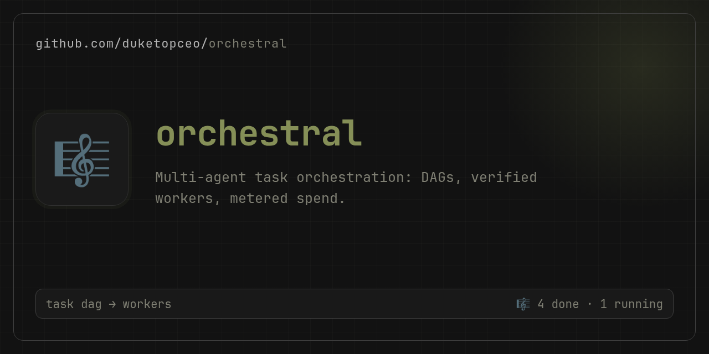

# orchestral

<p align="center">
  
</p>

Eval harness for testing orchestrator→worker model pairs over OpenRouter or
any OpenAI-compatible endpoint.

A big model plans and delegates. Small models write the code. We measure whether
cheap planners + cheap workers produce good output at tiny cost, or whether you
need a frontier orchestrator to squeeze quality out of budget workers.

## The core question

Does the quality of the final output depend more on:

- the **orchestrator** (planning, decomposition, assembly, error correction)?
- the **worker** (actual code generation)?
- or is there a sweet spot where a mid-tier planner gets frontier-quality results
  from budget workers?

## How it works

1. Define a task (e.g. "build a landing page for X") in a YAML spec
2. Pick orchestrator and worker model slugs
3. The harness runs each orchestrator × worker pairing through:
   - **Plan**: orchestrator decomposes the task into subtasks
   - **Delegate**: each subtask prompt goes to a worker model
   - **Assemble**: orchestrator merges worker outputs into a final artifact
   - **Validate**: structural checks (parses, non-empty, no placeholders)
   - **Judge** (optional): an LLM scores the artifact
   - **Retry**: failed subtasks go back to the worker (configurable limit)
4. Results land in `runs/` with the artifact, plan JSON, cost breakdown, and timing
5. Reports rank pairings by quality-per-dollar

## Install

```bash
pip install -e .            # from a clone
pip install "orchestral @ git+https://github.com/duketopceo/orchestral"  # or straight from git
pip install -e .[shots]     # optional: screenshot capture (playwright)
pip install -e .[dev]       # optional: ruff + mypy for development
```

Set your provider key (OpenRouter is the default):

```bash
export OPENROUTER_API_KEY=sk-or-...
```

Other providers work via `metadata` on the model config — see
[docs/providers.md](docs/providers.md).

## Quickstart

```bash
orchestral init                    # create runs/ + SQLite index
orchestral run --task landing-page-coffee \
    --orchestrator deepseek/deepseek-v4-flash-0731 \
    --worker z-ai/glm-5.3-flash --dry-run   # no API calls, sample data
orchestral run --task landing-page-coffee \
    --orchestrator deepseek/deepseek-v4-flash-0731 \
    --worker z-ai/glm-5.3-flash             # real run
orchestral report                  # table of stored runs
orchestral dashboard               # reports/dashboard.html
```

`python harness.py ...` works identically if you prefer not to install.

## Commands

| Command | What it does |
|---|---|
| `init` | Create the runs directory and SQLite index |
| `run` | One orchestrator × worker pairing on one task |
| `grid` | Every orchestrator × worker pairing on one task (`--orchestrators`, `--workers`, `--jobs`) |
| `batch` | One pairing across many tasks (`--batch-dir` or `--batch-tasks`, `--jobs`) |
| `ablate` | Sweep one knob for a pairing (`--sweep retry_limit=0,1,2` or `prompt_variant=terse,detailed`) |
| `history` | Per-model aggregates across all stored runs |
| `report` | List/compare runs (`--pairings`, `--leaderboard`, `--groups`, `--html`, `--sort`, `--json`) |
| `export` | CSV run/leaderboard export, Markdown run audit, JSONL trace (`--format`, `--run`, `--out`) |
| `prices` | Pricing drift check — provider-reported `api_cost_usd` vs configured rates (`--threshold`, `--json`) |
| `dashboard` | Static HTML dashboard with cost-vs-quality scatter |
| `shots` | Screenshot stored HTML artifacts (needs `[shots]` extra) |
| `tui` | Interactive terminal UI — browse/inspect/launch runs (needs `[tui]` extra) |
| `serve` | Local web observatory — same views in a browser, launch/cancel runs (localhost only) |
| `scrub` | Redact secrets/paths from `runs/` into `runs-pub/` + `manifest.json` |
| `calibrate` | Judge-vs-human agreement from a labels file (`--labels`, `--json`) |
| `audit` | Static task-spec audit — fail-open checks, structural-only graders, contamination risk (`--json`, `--strict`) — see [docs/task-audit.md](docs/task-audit.md) |

Shared run flags (on `run`, `grid`, `batch`, `ablate`): `--planner raw|ce-plan`,
`--judge <slug>`, `--no-judge-cache`, `--retry-limit N`, `--prompt-variant NAME`,
`--replicates N`, `--group NAME`, `--replicate I`, `--seed S`, `--verbose`,
`--dry-run`, `--json`.

`--replicates N` runs each cell N times under one `run_group` (auto-named when
`--group` is absent); replicate `i` records seed `S+i-1`. `report --groups`
aggregates cells with pass rate, score/cost mean±sd, p50/p95 latency, and
successes-per-dollar.

`calibrate --labels labels.yaml` measures how much to trust `--judge`: the
labels file is `labels: [{run_id, score, passed}]` over runs the judge
scored, and the report is score agreement (MAE, Pearson, Spearman) plus
verdict agreement (accuracy, Cohen's kappa, confusion counts). See
`labels.example.yaml`.

### TUI

`pip install 'orchestral[tui]'`, then `orchestral tui`. The TUI is a thin
observatory over the harness — it tails the same `events.jsonl` and
`runs/index.db` the CLI writes; it never re-runs benchmark logic.

Views (number keys switch): `1` **Live Run** — follows the newest in-flight
run: phase, per-worker status, event trace, running cost/tokens/elapsed;
`2` **Run History** — the run index, `/` to filter; `3` **Leaderboard** —
per-pairing pass rate, medians, failure rate, cost-per-pass, and a
`low-n` marker below 10 samples (`s` cycles the sort). `Enter` opens a run —
live view while it's `running`, otherwise the detail tabs (events, calls,
metrics, report, plan, manifest). `n` launches a run/batch on a background
worker; `x` cancels the job, `c` cancels the run you're watching (both
record `status=cancelled` between subtasks). `e` exports — the filtered run
list or leaderboard to CSV in `reports/`, a single run to a Markdown audit.
`?` shows the full key map.

Data underneath: `runs/…/{run_id}/events.jsonl` is the append-only event
stream (schema v2 — `sequence`, `run_id`, `worker_id`, lifecycle types like
`worker.started`), `manifest.json` the immutable run record (model IDs,
task/prompt/config SHA-256s, git commit), `metrics.json` the aggregate
rollup. `runs/index.db` powers the list and leaderboard queries.

### Web GUI

`orchestral serve --port 8787` (add `--open` to launch a browser) serves
the same observatory over HTTP on `127.0.0.1` — stdlib only, no extra
dependencies. Pages: an overview with the live-run banner, leaderboard,
and recent runs; `/runs` history with filtering; `/run/<id>` detail with
the same inspection tabs; `/run/<id>/live` tailing `events.jsonl` (~1s
polling); `/leaderboard`; and `/new`, a form that launches runs
(including `--dry-run` equivalents) on background threads. Cancel buttons
stop runs this `serve` process started — same mechanism and same limit
as the TUI.

Global flags (before the subcommand): `--runs-dir`, `--tasks-dir`, `--models-dir`.

## Task formats

Implemented task types: **HTML page generation**, **image generation**
(OpenRouter Images API), **video generation** (OpenRouter Videos API —
submit/poll/download; `--judge` is skipped for video runs), **multi-file
projects** (workers return a JSON file set, merged into a reproducible
`artifact.zip`; archives are never published by `scrub`), **code tasks**
(same file-set contract; hidden `metadata.tests` run via `python -Es -m
unittest` in a subprocess — score = fraction of tests passed, replicates
give pass@k), and **constraint tasks** (workers produce text under hard
constraints — word/char budgets, required and forbidden tokens, regex
patterns — the orchestrator picks the best candidate, deterministic
validators check every constraint), and **long-context needle** tasks (`metadata.document` haystack injected into each subtask; the answer must name the true token and no decoys), and **SQL analytics** (workers produce candidate queries, the orchestrator picks one, and the harness executes it read-only against a fixture SQLite database and compares to `metadata.reference_sql` — fully deterministic scoring), and **structured extraction** (workers return JSON per a declared `metadata.fields` schema, graded per-field against `metadata.expected` — deterministic, partial credit), and **API integration** (workers produce a JSON request plan, replayed over real loopback HTTP against a stub server built from `metadata.stub`; scored by which expected calls actually arrived).
Validation checks and the full schema are documented in
[docs/task-spec.md](docs/task-spec.md); model config fields in
[docs/model-config.md](docs/model-config.md).

## Structure

```
tasks/           task specs (YAML)
models/          orchestrator and worker model configs
prompts/         orchestrator prompt variants
runs/            output artifacts (ignored by git)
runs-pub/        scrubbed, publishable output of `scrub` (ignored by git)
reports/         generated reports/dashboards (ignored by git)
orchestral/      library modules (storage, logger, config, runner, providers)
harness.py       CLI entry point
tests/           stdlib unittest suite
```

## Storage

Eval artifacts are **kept local**, not committed to Git. GitHub only holds the
code, task specs, and model configs.

Each run is a folder:

```
runs/{orchestrator}/{task}/{worker}/{run_id}/
  run.json       # metadata, cost, score, status, latency, env, failure_reason
  manifest.json  # immutable run identity: exact model IDs, task/config/prompt
                 # content hashes, git commit, harness version, retry policy
  events.jsonl   # sequenced lifecycle + call events (schema v2), reasoning,
                 # tool calls, latency — the stream a live view tails
  debug.jsonl    # internal diagnostics: http retries, poll loops, provider
                 # decisions (never published by `scrub`)
  metrics.json   # derived per-phase/role aggregates (calls, tokens, cost,
                 # latency, error counts) written at run end
  plan.json      # orchestrator decomposition
  worker-*.json  # individual worker outputs
  artifact.*     # assembled final output (html, png, ...)
  screenshot.png # rendered capture for html artifacts (optional)
  cost.json      # per-call cost breakdown with pricing_source labels
  report.json    # validation and judge results
```

`runs/index.db` is an SQLite index for fast sorting and filtering — a `runs`
table plus a per-call `calls` table (tokens, cost, latency, `pricing_source`,
`error_category` per LLM call). `runs/debug.jsonl` at the root captures
failures that happen before a run directory exists (e.g. provider config).

Pass `--verbose` (`-v`) to any run command to echo events and debug records
to stderr live. Use `--group NAME --replicate N --seed S` to label runs for
replicate/variance analysis.

## Publishing results

`orchestral scrub` copies allowlisted run artifacts into `runs-pub/`, redacts
credentials/paths/endpoints, preserves binary files byte-for-byte, and writes a
`manifest.json` index. See [docs/publishing.md](docs/publishing.md).

## GitHub Action

To run evals in *another* repo, install orchestral from git inside your
workflow rather than copying this repo's workflow:

```yaml
- uses: actions/setup-python@v5
  with: {python-version: "3.11"}
- run: pip install "orchestral @ git+https://github.com/duketopceo/orchestral"
- run: orchestral run --task landing-page-coffee --orchestrator "$ORCH" --worker "$WORK"
  env:
    OPENROUTER_API_KEY: ${{ secrets.OPENROUTER_API_KEY }}
```

This repo's own `.github/workflows/orchestral.yml` dogfoods the harness on
internal PRs (skipped on forks, which can't see the secret). `.github/workflows/ci.yml`
runs tests, lint, and types on every PR with no secrets required.

## License

MIT
