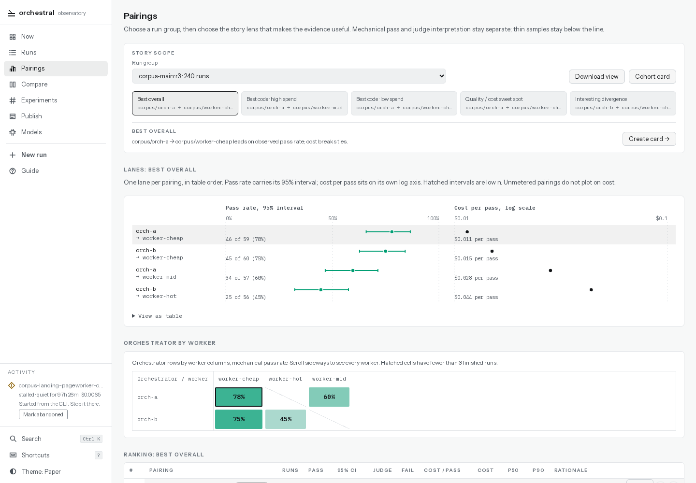

# orchestral

<p align="center">
  <picture>
    <source media="(prefers-color-scheme: dark)" srcset="docs/assets/lockup-dark.svg">
    
  </picture>
</p>

Eval harness for testing orchestrator→worker model pairs over OpenRouter or
any OpenAI-compatible endpoint.

A big model plans and delegates. Small models write the code. We measure whether
cheap planners + cheap workers produce good output at tiny cost, or whether you
need a frontier orchestrator to squeeze quality out of budget workers.

## The core question

Does the quality of the final output depend more on:

- the **orchestrator** (planning, decomposition, assembly, error correction)?
- the **worker** (actual code generation)?
- or is there a sweet spot where a mid-tier planner gets frontier-quality results
  from budget workers?

<p align="center">
  
</p>

## How it works

1. Define a task (e.g. "build a landing page for X") in a YAML spec
2. Pick orchestrator and worker model slugs
3. The harness runs each orchestrator × worker pairing through:
   - **Plan**: orchestrator decomposes the task into subtasks
   - **Delegate**: each subtask prompt goes to a worker model
   - **Assemble**: orchestrator merges worker outputs into a final artifact
   - **Validate**: structural checks (parses, non-empty, no placeholders)
   - **Judge** (optional): an LLM scores the artifact
   - **Retry**: failed subtasks go back to the worker (configurable limit)
4. Results land in `runs/` with the artifact, plan JSON, cost breakdown, and timing
5. Reports rank pairings by quality-per-dollar

## Install

Agents: [docs/agent-quickstart.md](docs/agent-quickstart.md) is a
self-contained walkthrough you can fetch and follow verbatim.

```bash
pip install -e .            # from a clone
pip install "orchestral @ git+https://github.com/duketopceo/orchestral"  # or straight from git
pip install -e .[shots]     # optional: screenshot capture (playwright)
pip install -e .[dev]       # optional: ruff + mypy + the [tui] extra
```

`.venv` in a clone is shared by every concurrent run, and `pip install -e .`
in it is a cross-run mutation. For gate work, build a throwaway venv per run:

```bash
scripts/bootstrap-venv.sh /tmp/my-venv   # installs .[dev,tui], same as CI
```

Set your provider key (OpenRouter is the default):

```bash
export OPENROUTER_API_KEY=sk-or-...
```

Other providers work via `metadata` on the model config, see
[docs/providers.md](docs/providers.md).

## Quickstart

```bash
orchestral init                    # create runs/ + SQLite index
orchestral run --task landing-page-coffee \
    --orchestrator deepseek/deepseek-v4-flash-0731 \
    --worker z-ai/glm-5.3-flash --dry-run   # no API calls, sample data
orchestral run --task landing-page-coffee \
    --orchestrator deepseek/deepseek-v4-flash-0731 \
    --worker z-ai/glm-5.3-flash             # real run
orchestral report                  # table of stored runs
orchestral dashboard               # reports/dashboard.html
```

`python harness.py ...` works identically if you prefer not to install.

## Commands

| Command | What it does |
|---|---|
| `init` | Create the runs directory and SQLite index |
| `validate` | Parse all task/model specs and check per-type metadata contracts (exit 1 on problems) |
| `doctor` | Preflight the isolated code runtime: env contract, SDK surface, `api.<domain>` DNS/TLS, and a real sandbox create/exec/destroy probe |
| `run` | One orchestrator × worker pairing on one task |
| `grid` | Every orchestrator × worker pairing on one task (`--orchestrators`, `--workers`, `--jobs`) |
| `batch` | One pairing across many tasks (`--batch-dir` or `--batch-tasks`, `--jobs`) |
| `recover` | Relaunch the slot an orphaned `running` run left behind: marks the corpse aborted, relaunches with the same task, pairing, group, replicate, and seed |
| `ablate` | Sweep one knob for a pairing (`--sweep retry_limit=0,1,2` or `prompt_variant=terse,detailed`) |
| `experiment` | Batched A/B driver: paired baseline/jev-assist arms per matrix cell, cost-scaled reps, spend + evidence gates (`--matrix`, `--budget`, `--batch-size`, `--jobs`) |
| `coverage` | Experiment ledger: matrix cells vs stored runs: done/pending/aborted + posted marks (`--matrix`, `--json`) |
| `publish-mark` | Check a cell or run off as published (`--target`, `--url`, `--clear`) |
| `fixtures` | Pinned-repo fixture registry for v3 tasks (`list`, `fetch`, `check`): see [docs/v3-task-family.md](docs/v3-task-family.md) |
| `history` | Per-model aggregates across all stored runs |
| `report` | List/compare runs (`--pairings`, `--leaderboard`, `--groups`, `--compare A,B`, `--contamination`, `--html`, `--sort`, `--json`) |
| `gate` | CI eval gate: exit 1 when a candidate run group regresses on any shared cell (`--baseline`, `--candidate`, `--fail-on`, `--min-shared`, `--max-cost-increase`) |
| `export` | CSV run/leaderboard export, Markdown run audit, JSONL trace, Inspect eval logs (`--format csv|md|jsonl|inspect`, `--run`, `--out`) |
| `dataset` | RL-ready JSONL dataset: one record per LLM call joined to run outcome and judge rewards |
| `holdout` | Generate a seeded holdout arm into a run-scoped directory (never into git) |
| `prices` | Pricing drift check: provider-reported `api_cost_usd` vs configured rates (`--threshold`, `--json`) |
| `dashboard` | Static HTML dashboard with cost-vs-quality scatter |
| `shots` | Screenshot stored HTML artifacts (needs `[shots]` extra) |
| `cards` | Batch-export publish-ready PNG cards (leaderboard + every group/pairing card) via playwright |
| `tui` | Interactive terminal UI: browse/inspect/launch runs (needs `[tui]` extra) |
| `serve` | Local web observatory: same views in a browser, launch/cancel runs (localhost only) |
| `sync` | Push observatory payloads + scrubbed run artifacts to the hosted mirror (`--push`, `--verify`), see [docs/hosted-observatory.md](docs/hosted-observatory.md) |
| `models` | Model catalog: sync the provider's full model list for the observatory catalog view |
| `scrub` | Redact secrets/paths from `runs/` into `runs-pub/` + `manifest.json`, withholding the answer key |
| `calibrate` | Judge-vs-human agreement; `--emit <group>` writes a label skeleton, `--labels` computes + persists (`--json`) |
| `judge` | Retroactively judge artifacts of finished runs (writes judge result into `report.json` + index score); `--pairwise` runs position-swapped head-to-head battles between pairings' same-task artifacts and prints Bradley-Terry ratings |
| `revalidate` | Replay mechanical validators on stored artifacts (no model calls): repairs `score`/`passes`/`checks` on report + index, stamps `report.revalidated` with old values |
| `review` | Frontier-model audit of run evidence: per-run `review.json` + `reports/review-*.md` (`--model`, `--group`, `--dry-run`) |
| `audit` | Static task-spec audit: fail-open checks, structural-only graders, contamination risk (`--json`, `--strict`), see [docs/task-audit.md](docs/task-audit.md) |
| `specaudit` | Decisions-engine audit of the task suite: lowball/sound/difficulty/adversarial per spec |
| `claimsaudit` | Decisions-engine audit of claims in `audit/claims.yaml` |
| `selfcheck` | Spec self-verification: replays each spec's own reference through its graders (`--execute` runs hidden tests against spec references; `--runs` flags wall/ceiling checks across stored runs) |
| `harbor` | Export task specs as self-contained Harbor packages (instruction + environment + verifier) |

Shared run flags (on `run`, `grid`, `batch`, `ablate`): `--planner raw|ce-plan`,
`--judge <slug>`, `--no-judge-cache`, `--retry-limit N`, `--prompt-variant NAME`,
`--replicates N`, `--group NAME`, `--replicate I`, `--seed S`, `--verbose`,
`--dry-run`, `--json`.

### A/B experiments

`harness.py experiment --matrix experiments/jev-ab.yaml --budget 12.00
--daily-cap 15.00 --seed 7 --jobs 2` runs every `(task, orchestrator,
worker)` cell on two arms, `baseline` and `jev` (`--jev-assist`), with
paired replicate indexes and interleaved arm order. Rep count is
cost-scaled: `ceil(cell_budget / estimated pair cost)` clamped to [5, 100],
priced from each cell's own billing history. Batches of `--batch-size`
replicates run between gates: live `calls`-table spend vs `--budget` and
`--daily-cap`, batch infra-error rate (>50% aborts the cell, persisted),
and the arm-difference 95% CI (half-width ≤ `--diff-eps` → early stop).
Interrupt and re-run to resume, `done`/`aborted` cells are skipped.
`--dry-run` prints the priced plan and writes nothing.

`harness.py coverage --matrix …` renders the ledger (state, per-arm
pass counts, difference CI, verdict, posted mark); `publish-mark` checks a
cell off once its result ships. The observatory's overview shows the same
table. Judge is constant across arms (the decisions engine), judge-score
deltas are self-referential and labeled as such; mechanical pass is the
declared primary axis. Matrices are committed under `experiments/`, see
[experiments/README.md](experiments/README.md).

Live code-task verification is fail-closed: hidden suites do not run unless an
isolated runtime is configured, and host subprocess execution is never a
fallback. Set `ORCHESTRAL_CODE_RUNTIME=isolated` to dispatch to the
E2B-compatible adapter (`pip install "orchestral[e2b]"`), self-hosted
CubeSandbox or hosted E2B, chosen by the SDK's own `E2B_DOMAIN`/`E2B_API_KEY`
contract; `ORCHESTRAL_CUBE_TEMPLATE` selects the sandbox template.
`scripts/cube-env.example.sh` documents the full env contract, copy it to
`scripts/cube-env.sh` (gitignored) and fill in real values. `harness.py
doctor` verifies the whole chain, env, SDK surface, `api.<domain>` DNS/TLS,
and a live create/exec/destroy probe, before any paid run; `--no-probe`
skips the sandbox boot.

Self-hosting keeps the worker fileset *and* the hidden verifier source on
owned infrastructure; hosted E2B discloses evaluation oracles to a third
party, do not point `E2B_DOMAIN` at a third-party endpoint for oracle-bearing
or holdout tasks. Sandboxes are requested with `allow_internet_access=False`
and a fixed guest env allowlist (control-plane credentials never enter the
guest), and are destroyed on every exit path once the adapter holds a sandbox
handle, a create call that allocates a VM but raises before returning a
handle can leave the sandbox until its configured timeout reaps it.

### Self-hosted CubeSandbox endpoints

- **SDK constraint:** CubeAPI serves only the E2B v1 REST surface, install
  with `pip install "orchestral[e2b]" "e2b<2"`. A default resolve picks v2.x,
  whose `/v2/sandboxes` calls get a 405.
- **Host shapes:** the SDK builds `api.<domain>` for the control plane and
  `<port>-<sandbox-id>.<domain>` for envd. Wildcard DNS for `*.<domain>` and a
  locally trusted CA are prerequisites.
- **Template:** create the sandbox template alias on the node with
  `cubemastercli tpl create-from-image`; `ORCHESTRAL_CUBE_TEMPLATE` selects it
  (default `code-interpreter`).
- **Auth:** on no-auth installs `E2B_API_KEY` is required-but-arbitrary, and
  the endpoint grants unauthenticated sandbox create/write/exec to any host
  that can reach `api.<domain>` or the API port directly (the control plane
  typically binds `0.0.0.0`, so the proxy route is not the only path in).
  Prefer enabling `CUBE_API_KEY` on the deployment (CubeAPI honors it as a
  simple shared key and `E2B_API_KEY` must match), and regardless, firewall
  the control-plane and envd ports to trusted interfaces, no-auth is only
  acceptable when nothing untrusted can reach them.
- **TLS:** `SSL_CERT_FILE` must *append* the local CA to the system bundle,
  not replace it, it applies process-wide (including model API calls), so
  prefer a narrowly-scoped CA.
- **Egress:** `allow_internet_access=False` is honored by hosted E2B but
  ignored by CubeAPI (verified: a guest reached pypi.org). On self-hosted
  installs egress denial must come from CubeEgress or the host firewall ,
  treat oracle-bearing tasks as needing that proven before running them.

`--replicates N` runs each cell N times under one `run_group` (auto-named when
`--group` is absent); replicate `i` records seed `S+i-1`. `report --groups`
aggregates cells with pass rate, score/cost mean±sd, p50/p95 latency, and
successes-per-dollar.

`review --model x-ai/grok-4.3` audits archived runs with a strong reviewer
model: each run gets a bounded evidence digest (meta, plan, report, cost
ledger, event/error summary, task spec) and a structured verdict ,
`run_quality` (clean/suspect/invalid), findings that must cite digest
evidence, and a suggested mechanical check. Results land as `review.json`
in the run dir; a corpus pass writes `reports/review-<ts>.md` ranking
systemic issues. Reviewer output is hypotheses, not verdicts, every
finding carries the evidence it claims. Runs already holding `review.json`
are skipped unless `--force`; `--dry-run` writes stubs for plumbing tests.

`calibrate` measures how much to trust `--judge`. Two flows:

- `calibrate --emit <group>` writes `reports/labels-<group>-<ts>.yaml` ,
  a skeleton over the group's *judged* finished runs (run_id, task_id,
  artifact pointer, blank `score`/`passed`). Label ≥30 and re-run:
- `calibrate --labels labels.yaml` joins human labels to judge verdicts
  (only `report.judge`, mechanical verdicts never stand in), reports
  score agreement (MAE, Pearson, Spearman) and verdict agreement
  (accuracy, Cohen's kappa, confusion counts) overall and per judge/task,
  and persists `reports/calibration-<ts>.json`. Cards and leaderboards
  read the latest persisted report: κ ≥ 0.7 over ≥30 pairs marks a judge
  "calibrated"; anything less renders "uncalibrated". See
  `labels.example.yaml`.

### TUI

`pip install 'orchestral[tui]'`, then `orchestral tui`. The TUI is a thin
observatory over the harness, it tails the same `events.jsonl` and
`runs/index.db` the CLI writes; it never re-runs benchmark logic.

Views (number keys switch): `1` **Live Run**, follows the newest in-flight
run: phase, per-worker status, event trace, running cost/tokens/elapsed;
`2` **Run History**, the run index, `/` to filter; `3` **Leaderboard** ,
per-pairing pass rate, medians, failure rate, cost-per-pass, and a
`low-n` marker below 10 samples (`s` cycles the sort). `Enter` opens a run ,
live view while it's `running`, otherwise the detail tabs (events, calls,
metrics, report, plan, manifest). `n` launches a run/batch on a background
worker; `x` cancels the job, `c` cancels the run you're watching (both
record `status=cancelled` between subtasks). `e` exports, the filtered run
list or leaderboard to CSV in `reports/`, a single run to a Markdown audit.
`?` shows the full key map.

Data underneath: `runs/…/{run_id}/events.jsonl` is the append-only event
stream (schema v2, `sequence`, `run_id`, `worker_id`, lifecycle types like
`worker.started`), `manifest.json` the immutable run record (model IDs,
task/prompt/config SHA-256s, git commit), `metrics.json` the aggregate
rollup. `runs/index.db` powers the list and leaderboard queries.

### Web GUI

`orchestral serve --port 8787` (add `--open` to launch a browser) serves
the same observatory over HTTP on `127.0.0.1`, stdlib only, no extra
dependencies. Views: **Now** (live runs, spend, what changed);
**Runs** (history with filtering); **Pairings** (per-pairing evidence
with mechanical-pass and judge-score lenses kept separate);
**Compare** (task-level side-by-side); **Experiment** (A/B matrices);
**Publish** (story cards and flagged runs); **Models** (the catalog);
**New** (launch runs, including `--dry-run` equivalents); **Guide**
(in-app reference). `Ctrl K` opens a command palette over all of it.
Cancel and mark-abandoned buttons stop runs this `serve` process
started, same mechanism and same limit as the TUI. `harness.py sync
--push` mirrors the read-only view to a hosted deployment - see
[docs/hosted-observatory.md](docs/hosted-observatory.md).

Global flags: `--runs-dir`, `--tasks-dir`, `--models-dir`. They work before
the subcommand (`orchestral --runs-dir X scrub`) and, for the commands that
re-declare them, after it (`orchestral scrub --runs-dir X`), the
subcommand-local spelling wins when both are given.

## Task formats

Implemented task types: **HTML page generation**, **image generation**
(OpenRouter Images API), **video generation** (OpenRouter Videos API ,
submit/poll/download; `--judge` is skipped for video runs), **multi-file
projects** (workers return a JSON file set, merged into a reproducible
`artifact.zip`; archives are never published by `scrub`), **code tasks**
(same file-set contract; hidden `metadata.tests` execute through the
isolated runtime's verifier runner, score = fraction of tests passed,
replicates give pass@k), and **constraint tasks** (workers produce text under hard
constraints, word/char budgets, required and forbidden tokens, regex
patterns, the orchestrator picks the best candidate, deterministic
validators check every constraint), and **long-context needle** tasks (`metadata.document` haystack injected into each subtask; the answer must name the true token and no decoys), and **SQL analytics** (workers produce candidate queries, the orchestrator picks one, and the harness executes it read-only against a fixture SQLite database and compares to `metadata.reference_sql`, fully deterministic scoring), and **structured extraction** (workers return JSON per a declared `metadata.fields` schema, graded per-field against `metadata.expected`, deterministic, partial credit), **API integration** (workers produce a JSON request plan, replayed over real loopback HTTP against a stub server built from `metadata.stub`; scored by which expected calls actually arrived), **bugfix** (`code` with a provided broken repo in `metadata.files`, repair, not generation), and **terminal** (Terminal-Bench-flavored: workers emit a shell-command plan replayed in a virtual shell over a seeded tmpdir, graded on final filesystem state).
Validation checks and the full schema are documented in
[docs/task-spec.md](docs/task-spec.md); model config fields in
[docs/model-config.md](docs/model-config.md).

## Structure

```
tasks/           task specs (YAML)
models/          orchestrator and worker model configs
prompts/         orchestrator prompt variants
runs/            output artifacts (ignored by git)
runs-pub/        scrubbed, publishable output of `scrub` (ignored by git)
reports/         generated reports/dashboards (ignored by git)
orchestral/      library modules (storage, logger, config, runner, providers)
harness.py       CLI entry point
tests/           stdlib unittest suite
```

## Storage

Eval artifacts are **kept local**, not committed to Git. GitHub only holds the
code, task specs, and model configs.

Each run is a folder:

```
runs/{orchestrator}/{task}/{worker}/{run_id}/
  run.json       # metadata, cost, score, status, latency, env, failure_reason
  manifest.json  # immutable run identity: exact model IDs, task/config/prompt
                 # content hashes, git commit, harness version, retry policy
  events.jsonl   # sequenced lifecycle + call events (schema v2), reasoning,
                 # tool calls, latency, the stream a live view tails
  debug.jsonl    # internal diagnostics: http retries, poll loops, provider
                 # decisions (never published by `scrub`)
  metrics.json   # derived per-phase/role aggregates (calls, tokens, cost,
                 # latency, error counts) written at run end
  plan.json      # orchestrator decomposition
  worker-*.json  # individual worker outputs
  artifact.*     # assembled final output (html, png, ...)
  screenshot.png # rendered capture for html artifacts (optional)
  cost.json      # per-call cost breakdown with pricing_source labels
  report.json    # validation and judge results
```

`runs/index.db` is an SQLite index for fast sorting and filtering, a `runs`
table plus a per-call `calls` table (tokens, cost, latency, `pricing_source`,
`error_category` per LLM call). `runs/debug.jsonl` at the root captures
failures that happen before a run directory exists (e.g. provider config).

Pass `--verbose` (`-v`) to any run command to echo events and debug records
to stderr live. Use `--group NAME --replicate N --seed S` to label runs for
replicate/variance analysis.

## Publishing results

`orchestral scrub` copies allowlisted run artifacts into `runs-pub/`, redacts
credentials/paths/endpoints, preserves binary files byte-for-byte, and writes a
`manifest.json` index. It also withholds the answer key: graded expected values,
the reference solution, and `llm_call` message bodies do not survive a publish,
so a published run is a result artifact and not a re-runnable benchmark. See
[docs/publishing.md](docs/publishing.md).

Two publish surfaces sit on top of that: `orchestral cards` exports
publish-ready PNG cards (leaderboard, per-group, per-pairing) through
playwright, and `orchestral sync --push` mirrors the observatory
(payloads + scrubbed artifacts) to a hosted read-only deployment -
`sync --verify` reports drift either way. Setup and limits live in
[docs/hosted-observatory.md](docs/hosted-observatory.md).

## GitHub Action

To run evals in *another* repo, install orchestral from git inside your
workflow rather than copying this repo's workflow:

```yaml
- uses: actions/setup-python@v5
  with: {python-version: "3.11"}
- run: pip install "orchestral @ git+https://github.com/duketopceo/orchestral"
- run: orchestral run --task landing-page-coffee --orchestrator "$ORCH" --worker "$WORK"
  env:
    OPENROUTER_API_KEY: ${{ secrets.OPENROUTER_API_KEY }}
```

This repo's own `.github/workflows/orchestral.yml` dogfoods the harness on
internal PRs (skipped on forks, which can't see the secret). `.github/workflows/ci.yml`
runs tests, lint, and types on every PR with no secrets required.

## License

MIT
