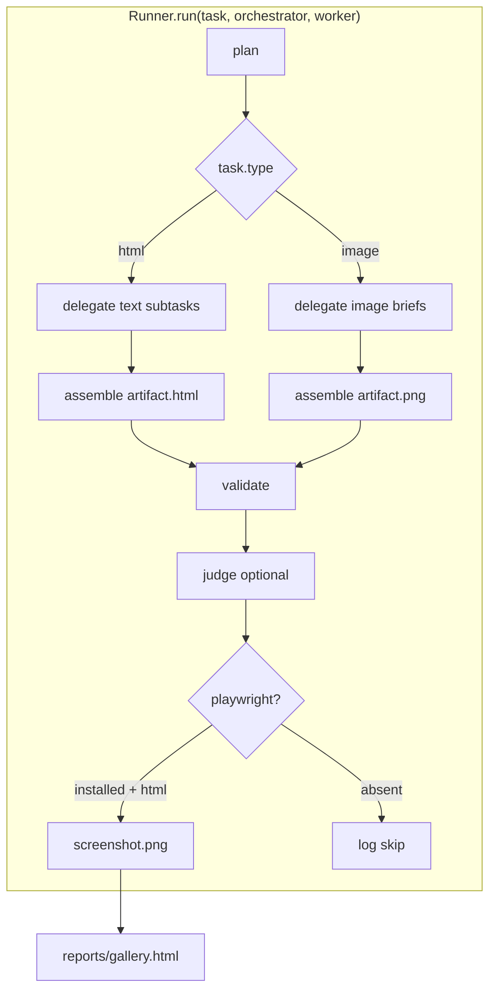

# v0.2 Media Tasks and Gallery - Plan

## Goal Capsule

- **Objective:** Complete the remaining v0.2 roadmap items — an image-generation task type, Playwright screenshot capture for HTML artifacts, a visual comparison gallery, and a 5×10 default model grid — so `orchestral` can answer its core question (does orchestrator or worker quality dominate?) across a second modality with visual evidence.
- **Authority:** `ROADMAP.md` v0.2 checklist is the product source. `AGENTS.md` stack constraint (Python 3.11+, pydantic, pyyaml, httpx, rich) governs dependencies; Playwright is added only as an optional extra because the roadmap names it.
- **Execution profile:** One branch, atomic commits per unit. Dry-run paths must keep working without an API key or browser install.
- **Stop conditions:** Any change that requires committing eval artifacts, adding a non-roadmap dependency, or breaking `--dry-run`.
- **Tail ownership:** This plan ends at a reviewed, committed, pushed PR with CI decided; merge is the user's call.

---

## Product Contract

### Summary

Extend the eval harness beyond HTML text artifacts: workers can generate images via OpenRouter's dedicated Images API, HTML artifacts get screenshotted for visual judgment, a gallery page compares pairings at a glance, and the default model config reaches the 5 orchestrator × 10 worker grid the roadmap targets.

### Problem Frame

The harness currently proves cost/pass differences only for HTML pages and only through structural checks plus an optional text judge. A human cannot eyeball fifty landing pages from a table, and image tasks cannot run at all. The v0.2 milestone goal — "answer the core question with enough data points to be meaningful" — needs both the second task type and visual comparison tooling.

### Requirements

**Image task type**

- R1. A task spec with `type: image` runs the same plan → delegate → assemble → validate loop, with delegation producing a generated image instead of text.
- R2. Image generation uses OpenRouter's dedicated Images API (`POST /api/v1/images`), which standardizes model, prompt, aspect_ratio, and output_format across providers and returns base64 image bytes.
- R3. The image artifact is written to the run directory as `artifact.png` (or the negotiated output format) and recorded in run metadata.
- R4. Image calls participate in cost accounting: per-call records land in `cost.json`/`events.jsonl`; when token usage is absent from the response, cost falls back to a configured per-image price on the model config.
- R5. At least two example image task specs exist under `tasks/`.
- R6. `--dry-run` exercises the image path without network calls, writing a deterministic placeholder artifact.

**Screenshots**

- R7. HTML artifacts can be screenshotted to `screenshot.png` inside each run directory.
- R8. Capture is available both automatically at end-of-run (when the optional dependency is installed) and retroactively via a `shots` subcommand that walks existing run directories.
- R9. Runs and report generation never fail because Playwright or browsers are missing; missing capability degrades to a logged skip.

**Gallery**

- R10. `report --html` (or the dashboard) emits a gallery page that renders one cell per orchestrator × worker pairing for a task, showing the screenshot (or a sandboxed artifact iframe when no screenshot exists), pass/fail, score, and cost.

**Model grid**

- R11. `models/default.yaml` carries 5 orchestrator-role and 10 worker-role entries so a bare `grid` invocation covers the roadmap's 5×10 matrix.

### Scope Boundaries

- **Deferred for later (v0.3):** retry-limit ablation, orchestrator prompt ablation beyond raw/ce-plan, cost-per-quality scatter plot, video task type.
- **Deferred to follow-up work:** publishing scrubbed image runs to `runs-pub/` (privacy scrubber currently handles text artifacts only), streaming image generation, multi-image (`n > 1`) delegation.
- **Outside this product's identity:** a hosted/shared run store; `runs/` stays local-only per `AGENTS.md`.

### Success Criteria

- `harness.py run --task <image-task> --dry-run` completes and writes `artifact.png` plus cost records.
- `harness.py shots` produces `screenshot.png` for stored HTML runs when Playwright is installed, and skips cleanly when it is not.
- The gallery page renders pairings with thumbnails for a task with multiple runs.
- `grid` with no model args resolves to 5 orchestrators × 10 workers.

---

## Planning Contract

### Key Technical Decisions

- KTD1. **Dedicated Images API over chat-completions modalities.** `POST /api/v1/images` gives a unified request shape (prompt, aspect_ratio, output_format) and capability discovery across 30+ image models; chat-completions image output is provider-fragmented. (session-settled: user-directed — chosen over chat `modalities` param: the roadmap's multimodal intent is served by the endpoint OpenRouter built for it.)
- KTD2. **Playwright as an optional extra, lazy-imported.** `pyproject.toml` gains a `shots` extra (`playwright`); `orchestral/shots.py` imports it inside the call path so the base install and dry-runs never require a browser. (session-settled: user-directed — chosen over mandatory dependency: `AGENTS.md` restricts the core stack, and the roadmap names Playwright.)
- KTD3. **Per-image pricing field on ModelConfig.** `price_per_image: float = 0.0` is added; image call costs use it when the API response carries no token usage. Token-priced fields remain for chat calls.
- KTD4. **Screenshots live in the run directory.** `runs/{orch}/{task}/{worker}/{run_id}/screenshot.png` keeps the run folder self-contained; the gallery and report reference it relative to the run dir.
- KTD5. **Gallery reuses the existing reporter.** `reporter.py` gains a gallery generator emitting `reports/gallery.html`; iframe `srcdoc` remains the fallback for unscaptured artifacts so the page works without Playwright.
- KTD6. **Image worker flow mirrors text workers.** The orchestrator plans and assembles a final image brief; the worker call goes through `client.images()` instead of `client.chat()`. No new runner pipeline — the `task.type` branch selects the delegate/assemble behavior.

### High-Level Technical Design

### Assumptions

- Tests use stdlib `unittest` under `tests/`; adding pytest would violate the `AGENTS.md` dependency constraint.
- Image model slugs in `models/default.yaml` are forward-looking (consistent with existing fictional-dated slugs like `deepseek/deepseek-v4-flash-0731`); implementer picks cheap image models by the same convention.
- The Images API response shape is `{ "data": [{"b64_json": ...}] }` per OpenRouter docs; usage/pricing fields may be absent, hence KTD3.
- Batch/grid parallelism applies unchanged to image tasks.

---

## Implementation Units

### U1. OpenRouter Images API client support

- **Goal:** `OpenRouterClient` can generate images and return bytes plus usage.
- **Requirements:** R2, R4
- **Files:** `orchestral/openrouter.py`, `orchestral/config.py`, `orchestral/costs.py`, `tests/test_openrouter_images.py` (new)
- **Approach:**
  1. Add `images(model, prompt, aspect_ratio=None, output_format="png")` to `OpenRouterClient` posting to `/images` with the same auth headers and Retry-After retry policy as `chat`.
  2. Decode `data[0].b64_json` to bytes; surface `usage`/`latency_ms` in the same dict shape `chat` returns.
  3. Add `price_per_image: float = 0.0` to `ModelConfig` and `to_dict`.
  4. Add a `compute_image_cost(model_cfg, n=1)` helper in `costs.py` returning `price_per_image * n` when no token usage is present.
- **Patterns to follow:** `chat()` retry loop and `_retry_after_seconds` in `orchestral/openrouter.py`.
- **Test scenarios:**
  - Happy path: mocked httpx response with `b64_json` returns decoded bytes and latency.
  - Retry path: a 429 with `Retry-After` header retries then succeeds.
  - Non-retryable: a 400 raises `OpenRouterError` immediately.
  - Cost: `price_per_image=0.02` on the config yields $0.02 record when usage is empty.
- **Verification:** New tests pass; `chat` behavior unchanged.

### U2. Image task type end-to-end

- **Goal:** `type: image` tasks run the full loop with a PNG artifact.
- **Requirements:** R1, R3, R5, R6
- **Dependencies:** U1
- **Files:** `orchestral/runner.py`, `orchestral/planners.py`, `orchestral/config.py`, `tasks/image-hero.yaml` (new), `tasks/image-logo.yaml` (new), `tests/test_image_tasks.py` (new)
- **Approach:**
  1. In `Runner.run`, branch on `task.type == "image"`: plan stays the same; delegate calls `client.images()` with the subtask description as prompt; assemble selects/refines the best brief and generates the final image via the orchestrator's image model or reuses the best worker output.
  2. Write `artifact.png` via `_artifact_ext("image")` (already maps to `.png` — switch `write_text` to `write_bytes` on that branch).
  3. `_validate` gains image checks: `non_empty` (nonzero bytes), `png_signature` (first 8 bytes match PNG magic). Task `validation:` entries map by name as with HTML checks.
  4. Dry-run fake: deterministic 1×1 PNG bytes; `_fake_output` gains an `image` phase.
  5. Two example task specs exercising `validation: [non_empty, png_signature]`.
- **Patterns to follow:** the `delegate`/`assemble_*` split and `_llm_call` cost plumbing in `orchestral/planners.py`.
- **Test scenarios:**
  - Happy path: dry-run image task finishes, `artifact.png` exists with PNG magic, `cost.json` lists an image-phase record.
  - Validation failure: a run whose artifact lacks PNG magic reports `passes=False` with a `png_signature` check failure.
  - Retry: worker image call raising once then succeeding respects `retry_limit` (same loop as text workers).
- **Verification:** `harness.py run --task image-hero --dry-run` finishes `passes=True`; report lists the run.

### U3. Screenshot capture

- **Goal:** HTML artifacts get a `screenshot.png` per run, on-demand and retroactively.
- **Requirements:** R7, R8, R9
- **Dependencies:** none (parallel-safe; gallery consumes it in U4)
- **Files:** `orchestral/shots.py` (new), `harness.py`, `pyproject.toml`, `tests/test_shots.py` (new)
- **Approach:**
  1. `orchestral/shots.py` exposes `capture_html(html_path, out_png, width=1280, height=900)` that lazy-imports `playwright.sync_api`, renders `file://` artifact, and writes a PNG; raises a typed `ScreenshotUnavailable` when playwright or browsers are missing.
  2. `Runner` calls it after validation when `task.type == "html"`, swallowing `ScreenshotUnavailable` into a logged `screenshot_skipped` event.
  3. New `shots` subcommand iterates `RunStore.list_runs()`, finds `artifact.html`, and captures missing/outdated screenshots; `--all` re-captures existing.
  4. `pyproject.toml` gains `[project.optional-dependencies] shots = ["playwright>=1.40"]`.
- **Execution note:** This is mostly packaging/integration; prefer smoke verification (run `shots` on stored dry-run artifacts) over unit coverage of browser internals.
- **Patterns to follow:** subcommand wiring in `harness.py`; storage traversal in `reporter.py`.
- **Test scenarios:**
  - Happy path (when playwright+browsers present): `shots` on a run with `artifact.html` produces a nonzero `screenshot.png`.
  - Degradation: with playwright uninstalled, `shots` reports skipped captures and exits 0; runner logs `screenshot_skipped` and still finishes.
  - Idempotence: second `shots` run skips up-to-date screenshots unless `--all`.
- **Verification:** `harness.py shots` on existing dry-run runs; runner dry-run completes unchanged without playwright.

### U4. Visual comparison gallery

- **Goal:** A static gallery page comparing pairings visually per task.
- **Requirements:** R10
- **Dependencies:** U3 (screenshots make it useful; iframe fallback keeps it working without)
- **Files:** `orchestral/reporter.py`, `tests/test_gallery.py` (new)
- **Approach:**
  1. `generate_gallery(runs_dir, reports_dir, task_id=None)` emits `reports/gallery.html`: rows = orchestrators, columns = workers (or one card per pairing when >1 task), each card showing `screenshot.png` when present else a sandboxed `iframe srcdoc` of `artifact.html`, plus pass badge, score, and cost.
  2. `report --html` and `dashboard` generate the gallery alongside existing pages; index/dashboard link to it.
  3. Copy or reference screenshots into `reports/` so the page is self-contained under `reports_dir`.
- **Patterns to follow:** existing `STYLE` block and `_esc` helpers in `reporter.py`.
- **Test scenarios:**
  - Happy path: gallery HTML contains one card per finished run with pass/cost labels.
  - Fallback: a run without `screenshot.png` renders an `iframe` cell, not a broken image.
  - Empty store: gallery page renders with a "no runs" notice rather than crashing.
- **Verification:** `report --html` emits `gallery.html` opening without missing-asset errors on stored runs.

### U5. Expand default model grid to 5×10

- **Goal:** `models/default.yaml` defines 5 orchestrator-role and 10 worker-role models.
- **Requirements:** R11
- **Files:** `models/default.yaml`
- **Approach:**
  1. Add 2 orchestrator entries (cheap-mid tier consistent with existing slugs, e.g. `qwen/qwen3.5-max` class) and 5 worker entries (cheap flash/coder class), each with `retry_limit`.
  2. Keep per-model prices plausible for cost math; mark image-capable workers via `metadata: {modalities: [image]}` for U2 task selection.
- **Test scenarios:**
  - Config parses; `load_models()` returns 5 orchestrators + 10 workers.
  - `grid --dry-run` with no args produces 15→50 pairings (5×10) without error.
- **Verification:** `harness.py grid --dry-run` runs the full 50-pairing matrix.

---

## Verification Contract

| Gate | Command | Pass signal |
|------|---------|-------------|
| Compile | `python3 -m compileall orchestral harness.py scripts` | clean |
| Smoke | `python3 harness.py init && python3 harness.py run --task landing-page-coffee --orchestrator deepseek/deepseek-v4-flash-0731 --worker z-ai/glm-5.3-flash --dry-run` | run finishes, `passes=True` |
| Image smoke | `python3 harness.py run --task image-hero --orchestrator  --worker  --dry-run` | `artifact.png` + cost record |
| Shots | `python3 harness.py shots` | `screenshot.png` written or clean skip log |
| Report | `python3 harness.py report --html` | `index.html`, `dashboard.html`, `gallery.html` generated |
| Unit tests | `python3 -m unittest discover -s tests -v` | all pass (stdlib unittest; no new dep, per AGENTS.md stack constraint) |

## Definition of Done

- All five units committed on one feature branch; each unit's test scenarios are implemented and passing.
- `--dry-run` works with no `OPENROUTER_API_KEY` and no Playwright install for every command.
- `models/default.yaml` yields a 5×10 bare `grid`.
- No eval artifacts (`runs/`, `reports/`) committed; no new hard dependency beyond the optional `shots` extra.
- `ROADMAP.md` v0.2 boxes ticked for shipped items; abandoned-attempt code removed from the diff.

## Sources & Research

- OpenRouter Images API: `POST /api/v1/images` (model, prompt, aspect_ratio, output_format; `b64_json` response), model/capability discovery at `/api/v1/images/models` — openrouter.ai/docs/api/api-reference/images.
- `AGENTS.md` stack constraint and storage model; `ROADMAP.md` v0.2 checklist (origin of R1–R11).
