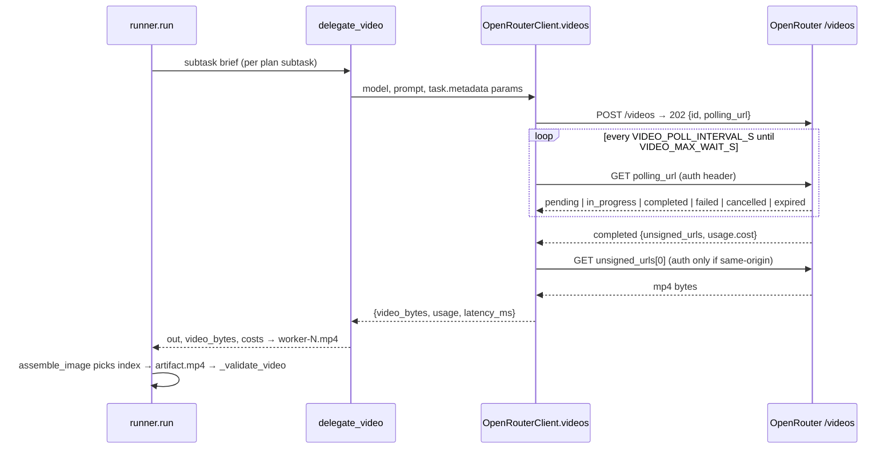

## Goal Capsule

- **Objective:** A user can define a `type: video` task, point it at a video-capable worker model, and get a validated `artifact.mp4` plus cost/trace in `runs/` — cost, latency, and completion-reliability comparison across pairings. Quality ranking of video output is deferred with judging (KTD5).
- **Means:** Mirror the image-task path end to end: `client.videos()` wraps OpenRouter's async submit→poll→download flow, `delegate_video` plugs into the existing per-subtask worker loop, and validation adds an `mp4_signature` check (KTD1–KTD5).
- **Authority:** ROADMAP.md v0.3 unchecked item is the scope source; AGENTS.md constraints (stdlib unittest, `pyyaml`/`httpx`/`rich` only, no committed runs/keys) are binding; OpenRouter video docs are the external contract.
- **Stop conditions:** no paid video generation during this work — verification is dry-run + mocked HTTP; no live `grid`/`ablate` over video models.
- **Execution:** `ce-work` implements U1–U5 on a feature branch; LFG ships the PR.

## Product Contract

### Summary

Add the video task type the roadmap deferred at v0.3 ("when OpenRouter supports it reliably" — it now does, via a dedicated async API). A video task delegates a generation brief to each subtask's worker, the orchestrator picks a winner by subtask index (same as images — it judges prompts, not pixels), and the run stores `artifact.mp4`.

### Problem Frame

The harness answers "which orchestrator→worker pairing produces the best output per dollar" for HTML and images. Video is the remaining named task type and the only unchecked feature box on the roadmap. Without it the tool can't evaluate the fastest-moving modality — the one where per-call cost differences between models are largest.

### Requirements

- R1. A `type: video` task runs through the standard plan→delegate→assemble→validate loop and produces `runs/.../artifact.mp4` plus per-subtask `worker-N.mp4` files.
- R2. Video generation calls OpenRouter's async API: submit to `POST /videos`, poll the returned `polling_url` to a terminal status, download from `unsigned_urls[0]`. The `Authorization` header goes on submit and poll; on the download leg it is sent only when the content URL's host matches the configured API origin — `unsigned_urls` may point off-origin (docs show third-party storage hosts), and the SSRF guard alone must never carry the bearer key to a foreign host.
- R3. Video cost lands in `cost.json`/`run.json` from the API's authoritative `usage.cost`, with a configured per-second fallback when the API reports none.
- R4. Validation supports `non_empty` and a new `mp4_signature` check (ISO BMFF `ftyp` box); unknown check names still fail closed.
- R5. `grid` filters video tasks to configured workers declaring `modalities: ["video"]`, matching the image-task filter in `_configured_workers`. `batch`/`ablate` keep the existing explicit `--worker` behavior unchanged — ad-hoc workers carry no modality metadata and are never filtered, same as image tasks.
- R6. Video generation is OpenRouter-only — a non-OpenRouter provider fails fast with a clear unsupported-capability error, same as images.
- R7. Dry-run video runs are deterministic and spend nothing: fake bytes pass `mp4_signature` without being a playable clip.
- R8. No new dependencies; stdlib unittest; `runs/` never committed (AGENTS.md).

### Success Criteria

- `orchestral run --task <video-task> --orchestrator <slug> --worker <video-slug> --dry-run` finishes, writes `artifact.mp4`, and passes validation.
- `python -m unittest discover -s tests`, `ruff check`, `mypy orchestral harness.py` all green, including new video tests with no network.
- ROADMAP v0.3 video box checked; README/docs describe the type accurately.

### Scope Boundaries

- **In:** text-to-video generation, model-config-driven video workers, validation, cost, gallery embed for `artifact.mp4`, docs.
- **Deferred to follow-up work:** LLM judging of video artifacts (no video-input judge path exists in `judge_artifact`; a video run with `--judge` logs `judge_skipped` and records no score); image-to-video (`frame_images`) and reference-to-video (`input_references`) inputs; webhook callbacks (polling covers the harness's batch shape); publishing scrubbed video examples (same run-data dependency as the deferred v1.0 results item).
- **Out:** multi-file projects and `api` task types (separate roadmap items); video editing; provider-specific passthrough options beyond the documented request fields.

---

## Planning Contract

### Key Technical Decisions

- KTD1. **`videos()` blocks inside the client.** `OpenRouterClient.videos(model, prompt, duration, resolution, aspect_ratio, generate_audio, seed)` owns the whole async lifecycle — submit, poll `polling_url` every `VIDEO_POLL_INTERVAL_S` (30s, per OpenRouter guidance) until `completed`/`failed`/`cancelled`/`expired` or `VIDEO_MAX_WAIT_S` (~10min), then download bytes. Callers see one synchronous call shaped like `images()`. Webhooks are deferred — a CLI batch tool has no inbound listener. Terminal statuses (`failed`/`cancelled`/`expired`) raise a distinctly-typed non-retryable error: the runner's `retry_limit` loop resubmits billable jobs, so only transient failures (network, timeout, empty output) may consume retry attempts.
- KTD2. **Cost is API-authoritative.** The poll response carries `usage.cost` (per-video-second SKUs upstream); when present it wins, else fall back to `duration × metadata-driven price` via a new `compute_video_cost` helper and a `price_per_video_second` field on `ModelConfig` (mirrors `price_per_image`). (session-settled-adjacent: matches the existing image-cost pattern — chosen over token math, which video SKUs don't expose.)
- KTD3. **Media-type dispatch generalizes `is_image`.** `runner.run()` keys on `task.type`; the image path's per-subtask artifact files, assemble-by-index selection (`assemble_image` is already content-agnostic — it reads `subtask_id`/`prompt` only), and validation dispatch extend to `video`. No parallel pipeline.
- KTD4. **`mp4_signature` = ISO BMFF `ftyp` box check** (`artifact[4:8] == b"ftyp"`), plus shared `non_empty`. It proves container shape without decoding — no codec validation, which would need a dependency AGENTS.md forbids.
- KTD5. **No video judging this phase — a scope choice, not a dependency limit.** OpenRouter chat does accept `video_url` content parts (base64 `data:video/mp4`) on video-capable judge models, and frame extraction/ffmpeg is not required; the deferral is deliberate because video-input judging cost, size limits, and judge-model coverage are unverified. A video run with `--judge` logs a `judge_skipped` event (same surface as the oversized-image skip) and records `score: null`. Follow-up path: extend `judge_artifact` with a `video_url` content-part branch for judges declaring a video-capability metadata flag, reusing the judge cache and size-cap skip.
- KTD6. **Video worker slugs are verified at implementation** against `GET /api/v1/videos/models` (`supported_durations`/`supported_resolutions`/`pricing_skus`). Candidates from the docs: `google/veo-3.1`, `google/veo-3.1-lite`, `minimax/hailuo-3`, `alibaba/wan-2.7`. Entries land in `models/default.yaml` with `modalities: [video]`; anything unverifiable ships `~`-disabled rather than wrong.

### High-Level Technical Design

### Assumptions

- "Next phase" means the video task type — the only unchecked feature item on ROADMAP; multi-file/API types stay deferred.
- Video judging, image-to-video inputs, and webhooks are deferrable without hollowing out the feature.
- At least two video worker slugs will verify against `/videos/models` at implementation time; if none do, model entries ship `~`-disabled and the task still lands.
- Dry-run fake bytes only need to satisfy `mp4_signature` (a minimal `ftyp` box), not play.

### Open Questions

None blocking. Execution-time unknowns recorded for the implementer:

- Which candidate slugs actually appear in `GET /videos/models`, and what `supported_durations`/`pricing_skus` they expose (KTD6).
- Whether `unsigned_urls` content URLs resolve off the OpenRouter origin — the conditional-auth rule in R2 covers both answers, so no decision waits on it.
- Whether `usage.cost` is present on every completed job and on failed jobs (partial billing); the KTD2 fallback covers absence.
- Whether `polling_url` ever arrives relative (docs show absolute URLs, but the client resolves relative paths against `base_url` defensively).

---

## Implementation Units

### U1. `client.videos()` — async submit→poll→download

**Goal:** One synchronous-looking call that owns the OpenRouter video job lifecycle.
**Requirements:** R2, R6.
**Files:** `orchestral/openrouter.py`, `tests/test_openrouter_videos.py`
**Approach:**

1. `videos(model=, prompt=, duration=, resolution=, aspect_ratio=, generate_audio=, seed=)` posts only non-None optional params to `/videos`; a `provider != "openrouter"` client raises the same unsupported-capability error shape `images()` uses. A relative `polling_url` resolves against the client base URL.
2. Poll `GET polling_url` on `VIDEO_POLL_INTERVAL_S` (30) up to `VIDEO_MAX_WAIT_S` (600); `completed` → read `unsigned_urls[0]`; `failed`/`cancelled`/`expired` → raise a distinctly-typed terminal error carrying the response's `error` field (KTD1 — never retried by the worker loop); deadline → raise a transient/timeout error. Transient poll GET failures (network/5xx) retry inside the poll loop with a small bound — they must not resubmit the job.
3. `completed` with empty/missing `unsigned_urls` falls back to `GET /videos/{job_id}/content?index=0` before the job is considered undownloadable.
4. Download reuses the `_download` SSRF guard (https, non-private host, no redirects) with a larger `_MAX_VIDEO_BYTES` cap (~100MB) and a timeout sized for the cap rather than the shared 120s client default; `Authorization` rides only when the resolved content host matches the API origin (R2).
5. Return shape mirrors `images()`: `video_bytes`, `usage` (preserve the raw `usage.cost`), `latency_ms`, `id`, `raw_response`.
6. Constants are module-level so tests can patch the interval to zero.

**Patterns to follow:** `images()` for endpoint/provider gating; `_post_with_retry` for the POST; `_download` for the content fetch.
**Test scenarios:**

- Happy path: mocked POST returns `{id, polling_url, status: "pending"}`; first GET returns `in_progress`, second `completed` with `unsigned_urls` and `usage.cost`; download returns mp4 bytes → `video_bytes` populated, cost preserved.
- `failed` status with `error: "Content policy violation"` → the terminal, non-retryable error naming the error — distinct from a timeout's error type.
- Exhausted `VIDEO_MAX_WAIT_S` (patched low) → timeout error; job not silently dropped.
- `completed` with absent `unsigned_urls` → falls back to `GET /videos/{id}/content?index=0` and still returns bytes.
- Download URL on a non-API host → fetched without `Authorization`; API-host URL → header present (assert the header difference in the mock).
- Non-OpenRouter provider → the chat-only unsupported error, before any HTTP call.
- Download URL pointing at `http://` or a private host → refused (reuses `_download` guards).
- `submit` 400 → non-retryable `OpenRouterError`, exactly one POST.
- A transient 5xx mid-poll retries inside the loop and still completes — no second `POST /videos`.

**Verification:** new tests pass; no real HTTP in the suite.

### U2. Video cost accounting + model config

**Goal:** `price_per_video_second` lands on `ModelConfig`, `compute_video_cost` prefers API `usage.cost`, and `models/default.yaml` carries verified video workers.
**Requirements:** R3, R5.
**Dependencies:** U1.
**Files:** `orchestral/config.py`, `orchestral/costs.py`, `models/default.yaml`, `harness.py`, `tests/test_video_tasks.py`
**Approach:**

1. `ModelConfig.price_per_video_second: float = 0.0`, included in `to_dict` and the `metadata` comment/docs.
2. `compute_video_cost(model_cfg, api_cost=None, duration_s=None, n=1)`: `usage.cost` when the API reported it; else `price_per_video_second × duration`; else 0 — mirrors `compute_image_cost`'s fallback shape.
3. `models/default.yaml`: add video workers with `role: worker`, `metadata.modalities: [video]`, `price_per_video_second` from each model's `pricing_skus` (KTD6 verification).
4. `harness.py` eligibility filter: video tasks keep only `supports("video")` workers (R5) — extends the `task.type == "image"` branch.

**Patterns to follow:** `compute_image_cost`; the `metadata.modalities` filter in `harness.py`.
**Test scenarios:**

- `compute_video_cost` with `api_cost=0.25` returns it untouched; without it, `duration × price_per_video_second`; with neither, 0.
- `load_models` accepts `price_per_video_second`; a `modalities: [video]` worker is selected for a video task and excluded from an html task pool (and vice versa: text workers excluded from video pools).

**Verification:** tests green; `orchestral run --task landing-page-coffee ... --dry-run` unchanged.

### U3. Runner + planner video path

**Goal:** `delegate_video`, per-subtask `worker-N.mp4`, assemble-by-index, `artifact.mp4`, and `_validate_video`.
**Requirements:** R1, R4, R7.
**Dependencies:** U1, U2.
**Files:** `orchestral/planners.py`, `orchestral/runner.py`, `tests/test_video_tasks.py`
**Approach:**

1. `delegate_video` mirrors `delegate_image`: dry-run returns deterministic `TINY_MP4` bytes (minimal `ftyp` box) + fallback-priced fake cost; live calls `client.videos(**params)` where params come from `task.metadata` (`duration`, `resolution`, `aspect_ratio`, `generate_audio`, `seed`) — thread `task` through as the image path threads `subtask`.
2. Runner: `task.type == "video"` takes the media branch — `worker-N.mp4` per subtask, `assemble_image` reused for index selection (rename-free; it already ignores media content), `artifact.mp4` written as bytes.
3. `_validate_video(task, bytes)`: `non_empty` + `mp4_signature` via `ftyp` check; default set `{"non_empty", "mp4_signature"}` when `task.validation` is empty.
4. Judge step: when `task.type == "video"` and `judge` is set, log `judge_skipped` (reason: video judging deferred, KTD5) instead of calling `_judge_with_cache`.
5. `delegate_video` writes a field-limited completion record — job id, `usage`, byte counts — and never logs `raw_response`, `polling_url`, or content URLs (any query-embedded credentials they carry must not reach `events.jsonl`, which the scrub allowlist publishes).
6. The runner's worker retry loop skips retries for U1's terminal-status error type; transient errors retry as today.

**Patterns to follow:** the image path end to end; `judge_skipped` logging in `judge_artifact`.
**Test scenarios:**

- Dry-run `runner.run` on a `type: video` task produces `artifact.mp4` passing `mp4_signature`, `status: finished`, non-zero cost from the fallback price.
- `_validate_video` accepts bytes with an `ftyp` box; rejects `b"not-a-video"` and empty bytes; unknown check names fail closed.
- Live-path unit test with injected mock client: `videos()` called per subtask, `worker-0.mp4` written, assemble index selects the artifact.
- Video task + judge set → `judge_skipped` event logged, `report.json` has `score: null`, run still finishes.
- A terminal-status (`failed`) video job raises the non-retryable error: with `retry_limit: 2` the mock's `videos()` is called exactly once, and the run marks `failed` without resubmitting billable jobs.
- The worker completion event/record for a video subtask contains job id, usage, and byte counts — and does not contain `raw_response`, `polling_url`, or any content URL.
- `videos()` raising mid-run marks the run `failed` (existing exception path), not stuck.

**Verification:** `python -m unittest discover -s tests` green; dry-run smoke on the new task.

### U4. Video task spec + gallery/report surface

**Goal:** A shippable `tasks/video-clip.yaml` and a gallery that renders `artifact.mp4` inline.
**Requirements:** R1, R7.
**Dependencies:** U3.
**Files:** `tasks/video-clip.yaml`, `orchestral/reporter.py`, `tests/test_gallery.py` (or `test_video_tasks.py`)
**Approach:**

1. `tasks/video-clip.yaml`: `id: video-clip` (must match the Verification Contract command), `type: video`, a short text-to-video prompt (e.g. coffee-steam loop), `validation: [non_empty, mp4_signature]`, `metadata: {duration: 5, resolution: "720p", aspect_ratio: "16:9"}`.
2. Gallery: where `reports/gallery.html` currently uses screenshot thumbnails/iframe fallback for HTML artifacts, add a `<video controls preload="metadata">` embed when the run's artifact is `.mp4`.
3. Scrub already handles `.mp4` (in `BINARY_EXTS`) and `artifact.*`/`worker-*` prefixes — verify, don't change.

**Test scenarios:**

- Task spec loads via `load_task` with `type: video` and the documented metadata keys.
- Gallery emits a `<video` tag pointing at the run's `artifact.mp4` for a video run; HTML runs unchanged.

**Verification:** `orchestral report --html` / `dashboard` still render; gallery unit covers the new branch.

### U5. Docs + roadmap closeout

**Goal:** A stranger can write a video task spec and a video model entry from the docs alone; ROADMAP reflects reality.
**Requirements:** R6, R8.
**Dependencies:** U1–U4.
**Files:** `docs/task-spec.md`, `docs/model-config.md`, `docs/publishing.md`, `README.md`, `ROADMAP.md`
**Approach:**

1. `task-spec.md`: `type: video` documented — metadata params (`duration`, `resolution`, `aspect_ratio`, `generate_audio`, `seed`), validation catalog gains `mp4_signature`, judge-skip behavior, OpenRouter-only note, full example spec.
2. `model-config.md`: `price_per_video_second`, `modalities: [video]`, how `usage.cost` overrides the configured price.
3. `publishing.md`: `.mp4` confirmed under binary passthrough; note that video `events.jsonl` carries prompts but no video payload (unlike the image judge, nothing logs media bytes).
4. `README.md`: task-format section lists video as implemented; the async/poll nature and `--judge` caveat stated in one line each.
5. `ROADMAP.md`: check the v0.3 video box.

**Test scenarios:**

- Test expectation: none — docs unit; every command shown is run once against the real CLI before commit.

**Verification:** fresh-reader pass — README alone reaches a dry-run video task.

---

## Verification Contract

| Gate | Command |
|---|---|
| Unit tests | `.venv/bin/python -m unittest discover -s tests` |
| Lint | `.venv/bin/ruff check .` |
| Types | `.venv/bin/mypy orchestral harness.py` |
| Compile | `.venv/bin/python -m compileall orchestral harness.py` |
| Dry-run smoke (html) | `python harness.py run --task landing-page-coffee --orchestrator deepseek/deepseek-v4-flash-0731 --worker z-ai/glm-5.3-flash --dry-run` |
| Dry-run smoke (video) | `python harness.py run --task video-clip --orchestrator deepseek/deepseek-v4-flash-0731 --worker <verified-video-slug> --dry-run` |
| Report surface | `python harness.py report --html` and `dashboard` render |
| Live smoke (manual, post-merge — not CI) | One bounded real generation — cheapest verified video model, ~4s, lowest tier — confirming submit→poll→download and `usage.cost` against the actual API; results noted in the PR. Mocked gates alone cannot prove the external contract, so the ROADMAP checkbox carries this caveat until the smoke lands. |

## Definition of Done

- All units landed; the full suite is green including the new video tests, with zero network access.
- `ruff` and `mypy` clean under committed config.
- A video dry-run produces `artifact.mp4` that passes `mp4_signature`; live-path code is exercised only through injected mocks.
- `runs/` artifacts stay gitignored; no secrets or key-shaped literals in the diff (test inputs assembled at runtime where they must look key-shaped).
- No API credential is ever sent to a non-OpenRouter host (R2), and no job/polling/content URL reaches `events.jsonl` or `worker-*.json`.
- ROADMAP v0.3 video box checked with a caveat marker until the manual live smoke in the Verification Contract runs post-merge; docs accurate; no dead-end experiment code in the diff.
