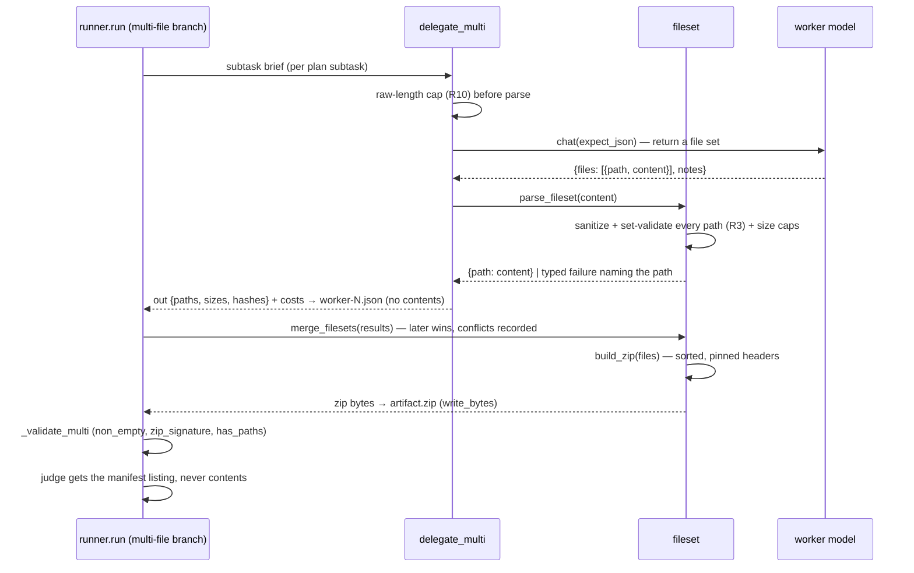

## Goal Capsule

- **Objective:** A user can define a `type: multi-file` task, point it at a text worker, and get a validated `artifact.zip` containing the requested project files plus cost/trace in `runs/` — so the harness can compare pairings on multi-artifact work, not just single documents.
- **Means:** Workers return a JSON file-set (`{files: [{path, content}]}`); a deterministic merge by path replaces LLM assembly; a new `fileset` module sanitizes paths, enforces resource caps, and builds byte-reproducible zips; validation adds `zip_signature` and `has_paths`; file *contents* never reach plain-text traces (KTD1–KTD8).
- **Authority:** README's planned-task-types list (`multi-file projects, API integrations`) is the scope source; AGENTS.md constraints (stdlib unittest, `pyyaml`/`httpx`/`rich` only, no committed runs/keys) are binding; `_artifact_ext` already reserves `multi-file → .zip` (`orchestral/runner.py:587-588`).
- **Stop conditions:** no new dependencies (zipfile is stdlib); no paid live runs required for verification — dry-run + mocked HTTP suffice; no published example data this phase.
- **Execution:** `ce-work` implements U1–U5 on a feature branch stacked on `feat/video-task-type`; LFG ships the PR.

## Product Contract

### Summary

Add the multi-file task type the README lists as planned. A multi-file task delegates a brief per subtask; each worker returns a set of files rather than a document; the runner merges the sets deterministically by path and stores `artifact.zip`. Assembly is a merge rule, not an LLM call, so the artifact is reproducible and the orchestrator's cost stays at plan time.

### Problem Frame

The harness compares pairings on single-artifact work (HTML page, image, video). Real delegation work usually produces *several* files that must agree with each other — a page plus its stylesheet plus its script. Nothing in the harness exercises that, so the pairing comparison says nothing about the failure mode that matters most there: workers that produce individually-plausible files that do not fit together. Without a multi-file type the tool cannot answer its own core question for anything bigger than one file.

### Requirements

- R1. A `type: multi-file` task runs through the standard plan→delegate→assemble→validate loop and produces `runs/.../artifact.zip`; per-subtask traces record the file set's **paths, sizes, and hashes — never contents**.
- R2. Worker output is a JSON file-set: `{"files": [{"path": "...", "content": "..."}], "notes": "..."}`. Parsing is tolerant (code fences, extra prose) via the existing `_extract_json`; a response that yields no usable files is a worker failure, not an empty artifact.
- R3. Every path is sanitized before it can enter an archive, and the file set is validated as a *set*: separators normalized (`\` → `/`) before any other check; relative only; no empty/`.`/`..` segment; no drive letter, UNC prefix, or colon; no reserved Windows device name; no character from the control set or `<>"|?*`; no segment starting or ending with a dot or space; per-path and total-path length caps; canonical (case-folded) names unique; no path that is a prefix of another; no directory entries. **Spelling is canonicalized, not rejected** (percent escapes decoded to a fixed point, backslashes normalized, leading `./` dropped, case-folded) so a worker's `Index.HTML` lands as `index.html`; anything that cannot be reduced to a safe relative path fails that subtask loudly, naming the path — never silently dropped, renamed, or truncated. (Revised during implementation: the original wording said "never renamed", but rejecting `Index.html` would waste real runs, so canonicalization is the documented contract instead.)
- R4. Assembly is a deterministic merge by path across subtask results — sorted output, later subtask wins on conflict, and every conflict (path + subtask ids only) is recorded in `report.json`. No LLM assembly call.
- R5. The zip is byte-reproducible across calls, runs, and platforms: fixed entry order, fixed `date_time`, `create_system`, `create_version`, `extract_version`, `flag_bits`, fixed `compresslevel`, and `external_attr` carrying `S_IFREG` so no entry can be read as a symlink.
- R6. Validation supports `non_empty`, a new `zip_signature` (validated with `zipfile.is_zipfile`, not a four-byte prefix match), and a new `has_paths` requiring every `task.metadata.expected_paths` entry to be present **as a non-empty regular file** (not a directory entry, not zero bytes). Unknown check names still fail closed; a mixed known/unknown list is not treated as satisfied by the known names alone.
- R7. Dry-run multi-file runs are deterministic and spend nothing: a fake file set derived from `metadata.expected_paths` produces a `zip_signature`-valid archive with the declared paths.
- R8. Cost is token-based like HTML tasks — no new pricing field, no new provider surface; multi-file works on any chat provider.
- R9. File contents never reach a plain-text published surface: `worker-N.json` and `events.jsonl` carry paths/sizes/hashes only, and the judge sees a manifest listing, not file bodies. `scrub` skips `.zip` artifacts by default (contents are not redactable inside an archive) and records the omission in `manifest.json` with a warning.
- R10. Resource caps are enforced **before** parsing and while building: a raw-response byte cap checked before `json.loads`, plus file-count, per-file, total-uncompressed, and output-zip caps.
- R11. No new dependencies; stdlib unittest; `runs/` never committed (AGENTS.md).

### Success Criteria

- `python harness.py run --task multi-file-site --orchestrator <slug> --worker <slug> --dry-run` finishes, writes `artifact.zip`, and passes validation.
- Two dry-runs of the same task produce byte-identical `artifact.zip`.
- `python -m unittest discover -s tests`, `ruff check`, `mypy orchestral harness.py` all green, including new multi-file tests with no network.
- `README.md`/`docs/task-spec.md` describe the type and its validation catalog accurately; ROADMAP reflects it.

### Scope Boundaries

- **In:** text-worker file-set production, path sanitization and set validation, resource caps, deterministic merge and zip, validation (`zip_signature`, `has_paths`), content-free tracing, scrub policy for archives, gallery/run-card file listing, docs, a shipped example task.
- **Deferred to follow-up work:** inner-file redaction in `scrub` (archive extraction plus per-file redaction and a deterministic re-zip — a privacy feature in its own right, and the gate on publishing multi-file results); binary file payloads inside a file set (base64 entries); per-file or content-aware judging (the manifest listing is what this phase judges); dependency-install/run verification of the produced project.
- **Out:** the `api` task type (separate roadmap item); extracting untrusted archives on the harness side (the harness only ever writes them); running or executing produced code; publishing multi-file run data.

---

## Planning Contract

### Key Technical Decisions

- KTD1. **Workers return a file set as JSON, not a bundle of fenced blocks.** `{"files": [...]}` parses with the existing `_extract_json` (fences and prose already tolerated), is unambiguous about paths, and needs no new output-format convention. Fenced-block conventions (`=== path ===`) were rejected: they collide with code content that itself contains fences.
- KTD2. **Assembly is a deterministic merge, not an LLM call.** The plan already decomposes the work; re-asking a model to merge file sets adds cost, latency, and non-determinism to a step with a mechanical correct answer. Later-subtask-wins with conflicts recorded was chosen over "first wins" or "fail on conflict" so a run still produces a comparable artifact while the conflict stays visible.
- KTD3. **A new `orchestral/fileset.py` module owns the contract.** Parsing, sanitization, set validation, merge, and zip building are pure functions over data with no runner coupling — they are the security-sensitive core (R3/R10) and belong where they can be tested exhaustively and reused by the dry-run path. Extending `planners.py` in place was rejected: sanitization rules would be buried in an LLM-call helper.
- KTD4. **Reproducible zips are a requirement, not a nicety.** `zipfile` writes the current mtime and platform-specific header fields by default, so identical file sets would produce different bytes, breaking the judge cache key (`sha256` of the payload, `orchestral/runner.py:456`) and making scrubbed diffs noisy. Every header field that varies is pinned (R5).
- KTD5. **Validation checks the container and the contract, not the code.** `zip_signature` proves the archive is readable; `has_paths` proves the requested files exist as real, non-empty files. Compiling, linting, or rendering the produced project would require toolchains AGENTS.md forbids and would make the verdict machine-dependent. `has_paths` was preferred over a file-count check because it is task-specific and cheap to declare.
- KTD6. **File contents are kept out of plain-text traces by design, not by redaction.** `scrub`'s regex pass cannot redact arbitrary generated code, so the only reliable control is not writing contents to `worker-N.json`, `events.jsonl`, or the judge prompt (R9). Paths, sizes, and hashes are enough for a run trace; the archive itself is the artifact. This is why the per-subtask record shape changes rather than reusing the HTML "store the completion" shape.
- KTD7. **Archives are not published by default.** Even with KTD6, a zip is opaque to the scrubber. Skipping `.zip` by default with a manifest omission entry and a warning was chosen over best-effort inner redaction, which is a larger feature with its own failure modes (re-zipping, determinism, binary members). `privacy.py` needs real changes for this — it currently copies `.zip` verbatim because it is in `BINARY_EXTS` (`orchestral/privacy.py:66-72`, `:113-117`) — so U4 owns a `_scrub_dir`/manifest change rather than a config tweak.
- KTD8. **The modality filter needs no change.** `_eligible_workers` already routes any non-image/non-video task to the text pool (`harness.py:47-55`), which is the right pool here. Model configs stay untouched; `_artifact_ext`'s `multi-file → .zip` mapping becomes live rather than reserved.
- KTD9. **`delegate_multi` bypasses `_llm_call`, like the media delegates do.** `_llm_call`'s dry-run fake output and its completion logging both assume a single text artifact (`orchestral/planners.py:241-244`, `:153-169`). `delegate_multi` calls `client.chat` directly and logs a summarized completion (`file_count`, `total_bytes`, `paths`), matching how `delegate_image`/`delegate_video` already bypass it — no change to the shared helper, and no path by which raw contents reach the event log.

### High-Level Technical Design



### Assumptions

- "Next phase" means the multi-file task type — the first item on README's planned-task-types list, and fully verifiable offline (unlike the deferred video judging, which needs paid video inputs to verify meaningfully).
- Text workers can be asked for a JSON file set without prompt-variant changes; the existing `expect_json` system-prompt suffix covers the instruction.
- A file set small enough to ride in one completion (a page plus a stylesheet plus a script) is the target shape; the caps in R10 encode that assumption numerically.
- Stacking on `feat/video-task-type` is acceptable because that branch's PR is open and this work reuses its media-dispatch shape; the PR retargets to `main` once the video PR lands.

### Open Questions

None blocking. Execution-time unknowns recorded for the implementer:

- Whether workers reliably emit the `{"files": [...]}` shape without a prompt-variant tweak — the tolerant parse plus the failure rule in R2 covers it either way; a variant can follow if live runs show drift.
- Whether the gallery should show file names or only a count — names are more useful and are already sanitized, but the card may get crowded; the implementer may fall back to a count.
- Whether `has_paths` should also fail on unexpected files. Left out deliberately: extra files are usually harmless, and failing on them would punish a worker for adding a README.

---

## Implementation Units

### U1. `orchestral/fileset.py` — contract, sanitization, caps, reproducible zip

**Goal:** Pure functions that turn model output into a safe, bounded, deterministic archive.
**Requirements:** R2, R3, R4, R5, R10.
**Files:** `orchestral/fileset.py`, `tests/test_fileset.py`
**Approach:**

1. `parse_fileset(content: str) -> dict[str, str]`: reject `len(content) > MAX_WORKER_RESPONSE_BYTES` **before** parsing; then `_extract_json`-tolerant parse; accept `{"files": [{"path", "content"}]}` and a bare `{path: content}` map; coerce non-string content via `str`; enforce file-count, per-file, and total-uncompressed caps; ignore entries without a usable path.
2. `sanitize_path(path: str) -> str`: normalize `\` → `/` first, strip `./`, then apply the full R3 rule set (absolute/UNC/drive/colon, empty/`.`/`..` segments, reserved Windows device names, control characters and `<>"|?*`, leading/trailing dot or space, per-path and total-path length caps) and return the canonical (case-folded) form, raising a typed error that names the offending path.
3. `validate_fileset(files) -> None`: set-level rules — canonical names unique, no path a prefix of another, no directory entries.
4. `merge_filesets(file_sets) -> tuple[dict[str, str], list[dict]]`: later-wins merge with one conflict record per overwritten path (`path`, `winner_subtask`, `loser_subtask`) — paths only, never contents.
5. `build_zip(files: dict[str, str]) -> bytes`: sorted names, pinned `date_time`/`create_system`/`create_version`/`extract_version`/`flag_bits`, fixed `compresslevel`, `external_attr = (0o100644 << 16)`, `BytesIO` output, and a refusal when the projected output would exceed `MAX_ZIP_OUTPUT_BYTES`.
6. `summarize_fileset(files) -> dict`: `paths`, `sizes`, and per-file `sha256` — the only shape allowed into traces (R9).
7. Caps as module constants so tests can patch them: `MAX_WORKER_RESPONSE_BYTES = 1_000_000`, `MAX_FILES_PER_SET = 50`, `MAX_FILE_CONTENT_BYTES = 500_000`, `MAX_TOTAL_UNCOMPRESSED_BYTES = 2_000_000`, `MAX_PATH_LENGTH = 256`, `MAX_TOTAL_PATH_BYTES = 4096`, `MAX_ZIP_OUTPUT_BYTES = 2_000_000`.

**Patterns to follow:** `_extract_json` in `orchestral/planners.py`; the typed-error style in `orchestral/openrouter.py`.
**Test scenarios:**

- `parse_fileset` accepts the documented shape, a fenced JSON block, and a bare path→content map; returns `{}` for prose with no JSON; rejects an over-cap raw response before parsing.
- `sanitize_path` accepts `index.html`, `assets/site.css`; rejects `/etc/passwd`, `../../etc/passwd`, `C:\evil.txt`, `..\..\evil.txt`, `\\server\share\x`, `CON`, `nul.txt`, `a//b`, `a/./b`, `""`, `"a "`, `".hidden."`-style trailing-dot/space cases, a segment containing `:`/`<`/`*`/control char/NUL, an over-length path — each naming the offending path.
- `validate_fileset` rejects `Index.HTML` + `index.html` (canonical collision), `foo` + `foo/bar` (prefix), and a `dir/` entry; accepts a disjoint set.
- `merge_filesets` unions disjoint sets, lets the later subtask win on a shared path, and records exactly one conflict entry naming that path — with no content fields anywhere in the record.
- `build_zip` output is byte-identical across two calls with the same input in different insertion orders; `zipfile.is_zipfile` passes; `namelist()` is sorted; no directory entries; every `ZipInfo` has `S_IFREG` set and no symlink bits.
- Caps: over-count, over-per-file, and over-total file sets each raise the typed error.
- `summarize_fileset` returns paths/sizes/hashes and no content.

**Verification:** new tests pass; no network; no filesystem writes outside `tmp`.

### U2. Runner + planner multi-file path

**Goal:** `delegate_multi`, a real runner branch (`write_bytes`), deterministic merge, `artifact.zip`, `_validate_multi`.
**Requirements:** R1, R2, R6, R7, R8, R9.
**Dependencies:** U1.
**Files:** `orchestral/planners.py`, `orchestral/runner.py`, `tests/test_multi_file_tasks.py`
**Approach:**

1. `delegate_multi` bypasses `_llm_call` (KTD9): dry-run builds a deterministic fake file set from `task.metadata.expected_paths` (default `index.html` + `style.css`) with fallback-priced fake cost; live calls `client.chat(..., expect_json=True)` directly, parses via `parse_fileset`, and raises a worker error when nothing usable comes back (R2). Both paths log a summarized completion (`file_count`, `total_bytes`, `paths`) — never the raw completion.
2. Per-subtask record: `out` carries `subtask_id`, `notes`, and `summarize_fileset(...)` output (paths/sizes/hashes). The file set's contents stay in memory and go only into the archive.
3. Runner gets an explicit `task.type == "multi-file"` branch **between** the media branch and the HTML `else` branch (`orchestral/runner.py:260-309`), because that `else` path calls `assemble_ce`/`assemble_raw` and writes with `write_text` — a multi-file task routed there would write `artifact.zip` as text and run HTML validation. The branch merges with `merge_filesets`, builds the zip, and writes it with `write_bytes`.
4. The worker retry/break condition must recognize the new record shape: `out.get("content")` (`orchestral/runner.py:235`) is false for multi-file, so the branch checks the file-set summary instead; otherwise every subtask retries to exhaustion and fails.
5. `_validate_multi(task, artifact_bytes)`: `non_empty`; `zip_signature` via `zipfile.is_zipfile(BytesIO(...))`; `has_paths` requiring each `metadata.expected_paths` entry to exist as a non-empty regular file (not a directory entry, not zero bytes); default set `{"non_empty", "zip_signature"}`; a list mixing known and unknown checks must not pass on the known names alone.
6. Judge: call `_judge_with_cache` with `artifact_bytes=None` and `artifact_text` = the **manifest listing** (paths + sizes), never contents. The judge prompt currently wraps text in a ` ```html ` block and truncates to 2000 chars (`orchestral/judge.py:66-69`) — for multi-file the artifact section should be a neutral file-listing block so the judge is not told a file list is HTML.
7. `report.json` records `merge_conflicts` (paths and subtask ids) and the file manifest; it never records file contents.

**Patterns to follow:** `delegate_image`/`delegate_video` for direct-client delegation and field-limited logging; the media branch for byte-artifact writing; `_validate_image`/`_validate_video` for validation shape.
**Test scenarios:**

- Dry-run `runner.run` on a `type: multi-file` task writes `artifact.zip` that `zipfile.is_zipfile` accepts, whose `namelist()` includes the declared `expected_paths`, finishes with `passes: true`, and records non-zero token cost — and the artifact was written as bytes, not text.
- `_validate_multi` passes an archive containing every `expected_paths` entry; fails when one is missing, when the entry is a zero-byte file, and when the entry is a directory entry; fails `b"not-a-zip"`, fails empty bytes, and fails a validation list that mixes a known and an unknown check name.
- Live-path unit test with an injected mock client returning a two-file set per subtask: `artifact.zip` contains the union; a conflicting path resolves to the later subtask with exactly one `merge_conflicts` entry in `report.json`.
- A worker returning prose (no parseable file set) fails the subtask and marks the run `failed` — not an empty artifact that passes `non_empty`.
- A worker returning an unsafe path (`../escape.txt`, `C:\evil.txt`, `CON`) fails the run with the offending path named in the event log, and no entry for it appears in any archive.
- Trace check: after a live-path run, `worker-0.json` and `events.jsonl` contain the paths and sizes but **none** of the file bodies (assert a distinctive content string from the mock is absent from both).
- Judge set + multi-file task: the judge receives the manifest listing, `report.json` carries no file contents, and the run finishes with a deterministic artifact hash.
- Two dry-runs of the same task produce byte-identical `artifact.zip`.

**Verification:** `python -m unittest discover -s tests` green; dry-run smoke on the new task; HTML, image, and video dry-runs unchanged.

### U3. Multi-file task spec + report surface

**Goal:** A shippable `tasks/multi-file-site.yaml` and report surfaces that show what a zip run contains.
**Requirements:** R1, R7.
**Dependencies:** U2.
**Files:** `tasks/multi-file-site.yaml`, `orchestral/reporter.py`, `tests/test_gallery.py`
**Approach:**

1. `tasks/multi-file-site.yaml`: `id: multi-file-site` (must match the Verification Contract command), `type: multi-file`, a small static-site brief, `validation: [non_empty, zip_signature, has_paths]`, `metadata: {expected_paths: [index.html, style.css]}`.
2. `_gallery_card` (`orchestral/reporter.py:245-259`) gains a `.zip` branch that copies the archive into `shots/` and lists its (sanitized) member names; `_run_card` (`:75-79`) currently renders a zip as `<binary artifact: …>` and should show the same listing instead.
3. `_find_artifact` already probes `.zip` — verify rather than change.

**Test scenarios:**

- The task spec loads via `load_task` with `type: multi-file` and its `expected_paths` metadata intact.
- Gallery and run cards list the archive's member names for a zip run; HTML/image/video cards unchanged.
- `harness.py report --html` and `dashboard` still render with a multi-file run present.

**Verification:** gallery unit covers the new branches; `report --html` run once against real output.

### U4. Scrub policy for archive artifacts

**Goal:** Publishing cannot ship an unredactable archive by accident.
**Requirements:** R9.
**Dependencies:** U2.
**Files:** `orchestral/privacy.py`, `tests/test_privacy.py`
**Approach:**

1. `_scrub_dir`/`_scrub_file` gain an archive skip: a `.zip` artifact is omitted from the output, and the omission is returned to the caller. This is a real change to their signatures — today `.zip` is in `BINARY_EXTS` and is copied verbatim (`orchestral/privacy.py:66-72`, `:113-117`).
2. `scrub_run`/`scrub_all` thread the omissions into the manifest as a per-run `scrub_omissions` list with a reason, and print one warning naming the run and the limitation (contents are not redactable inside an archive; multi-file run data should not be published until inner-file redaction exists).
3. Non-archive binary handling (images, video) is unchanged; text redaction in the same run is unchanged.
4. `docs/publishing.md` records the policy and the opt-in path as future work — no flag this phase.

**Test scenarios:**

- A run with `artifact.zip` scrubs without the zip in the output, with the skip recorded in `manifest.json` and one warning emitted.
- A run with `artifact.png` still copies the image verbatim (no regression), and its manifest entry has no omission.
- Redaction of text files in the same run still applies (the skip is scoped to the archive).
- A run with no archive artifact produces no omission entry and no warning.

**Verification:** privacy tests green; `python harness.py scrub` run once against a real multi-file run and the manifest inspected.

### U5. Docs + roadmap closeout

**Goal:** A stranger can write a multi-file task from the docs alone.
**Requirements:** R6, R11.
**Dependencies:** U1–U4.
**Files:** `docs/task-spec.md`, `docs/publishing.md`, `README.md`, `ROADMAP.md`
**Approach:**

1. `task-spec.md`: `type: multi-file` documented — the file-set contract, `expected_paths` metadata, the merge rule, the path rules a worker must satisfy, validation catalog gains `zip_signature` and `has_paths`, plus a full example spec.
2. `publishing.md`: archives are skipped by default and why (inner files are not redactable); what the manifest records; the note that multi-file traces carry paths, not contents.
3. `README.md`: task-format section lists multi-file as implemented, with the deterministic-merge behavior and the zip-publish caveat in one line each.
4. `ROADMAP.md`: add a `v1.1 — More task types` section with the multi-file box checked and the `api` type left unchecked.

**Test scenarios:**

- Test expectation: none — docs unit; every command shown is run once against the real CLI before commit.

**Verification:** fresh-reader pass — README alone reaches a dry-run multi-file task.

---

## Verification Contract

| Gate | Command |
|---|---|
| Unit tests | `.venv/bin/python -m unittest discover -s tests` |
| Lint | `.venv/bin/ruff check .` |
| Types | `.venv/bin/mypy orchestral harness.py` |
| Compile | `.venv/bin/python -m compileall orchestral harness.py` |
| Dry-run smoke (html) | `python harness.py run --task landing-page-coffee --orchestrator deepseek/deepseek-v4-flash-0731 --worker z-ai/glm-5.3-flash --dry-run` |
| Dry-run smoke (multi-file) | `python harness.py run --task multi-file-site --orchestrator deepseek/deepseek-v4-flash-0731 --worker z-ai/glm-5.3-flash --dry-run` |
| Determinism | Two dry-runs of the same task produce byte-identical `artifact.zip` |
| Trace hygiene | `grep` a distinctive mock content string across the run dir: present in `artifact.zip` only, absent from `worker-*.json` and `events.jsonl` |
| Scrub policy | `python harness.py scrub` on a store containing a multi-file run; manifest shows `scrub_omissions` and the archive is absent from the output |
| Report surface | `python harness.py report --html` and `dashboard` render |

## Definition of Done

- All units landed; the full suite is green including the new multi-file tests, with zero network access.
- `ruff` and `mypy` clean under committed config.
- A multi-file dry-run produces `artifact.zip` that passes `zip_signature` and `has_paths`; two runs are byte-identical.
- No unsafe path can reach an archive: absolute, UNC, drive-letter, traversal, reserved-name, control-character, over-length, case-colliding, and prefix-colliding paths all fail loudly (R3).
- Resource caps are enforced before parsing and while building, with tests proving each cap fires (R10).
- File contents appear only inside `artifact.zip` — never in `worker-*.json`, `events.jsonl`, `report.json`, or the judge prompt (R9).
- `scrub` never publishes an archive by default, and the omission is visible in the manifest.
- `runs/` artifacts stay gitignored; no secrets or key-shaped literals in the diff (test inputs assembled at runtime where they must look key-shaped).
- HTML, image, and video paths behave exactly as before — the multi-file branch is additive.
- ROADMAP and docs reflect the shipped behavior; no dead-end experiment code in the diff.
