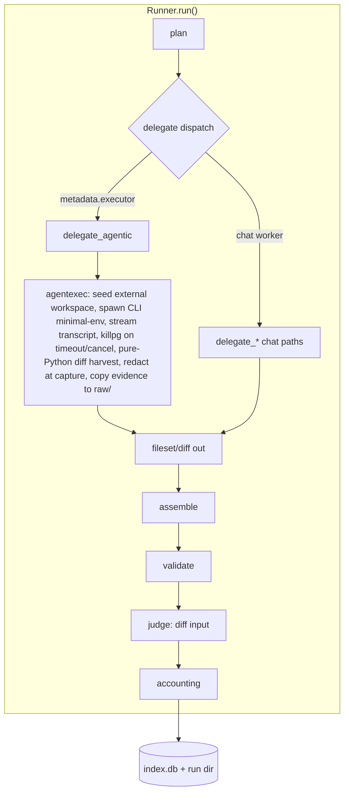
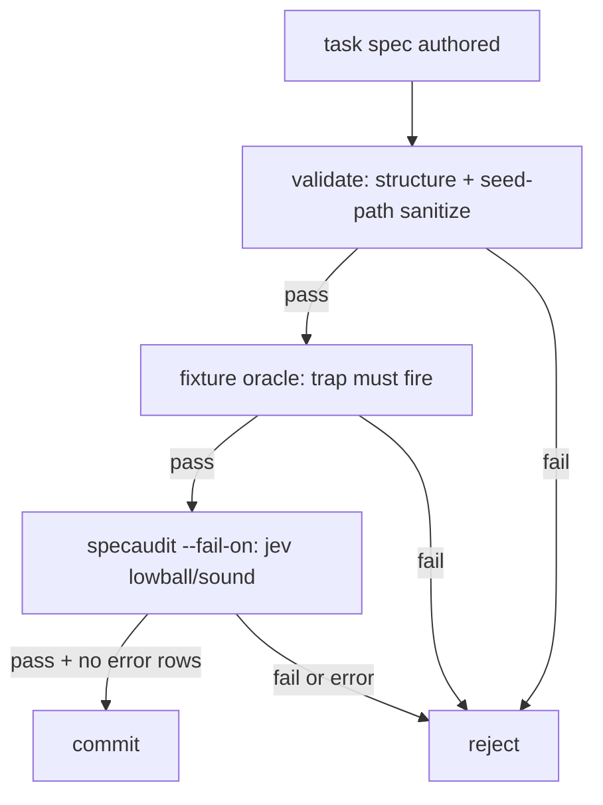

# Agentic Workers, Judge Calibration, and Verdict Badges - Plan

## Goal Capsule

- **Objective:** Pairing results on the leaderboard are worth believing — every cell is replicated, judged by a calibrated decisions engine, badged with honest uncertainty, and the suite exercises real capability including agent-CLI workers — so published claims survive the project's own audit.
- **Means:** Executor-module composition over existing artifact contracts (KTD1–KTD6), judge-by-default with a unified inconclusive rule (KTD7–KTD8), shared stats-layer verdict badges (KTD9), a fail-closed spec gate (KTD10), and a persisted calibration program (KTD11).
- **Authority:** Product behavior decided by the Requirements below; implementation mechanism by the KTDs they cite; units override neither. `AGENTS.md` stack rules (stdlib + pyyaml/httpx/rich, RunStore, EventLogger, thin observatory) govern throughout.
- **Stop conditions:** Any unit that cannot satisfy its test scenarios, requires a non-stdlib runtime dependency, or forces the observatory to duplicate harness logic stops and escalates rather than shipping a workaround.
- **Execution profile:** Feature-bearing units implement test-first where the contract is testable before the mechanism (executor core, badge math, fixture oracle, calibration fixes). Executor and runner units land on `feat/review-terminal-tasks` as atomic commits.

---

## Product Contract

### Summary

Three coupled upgrades. First, the worker role learns to run external coding-agent CLIs (opencode first) as contained subprocesses whose workspace diffs flow through the existing fileset/patch validators — real agentic capability, graded by the same mechanical gates. Second, jev stops being opt-in: every run is judged by default, judge no-answer becomes a single exempt `judge_inconclusive` state, and a real calibration program turns the idle `calibrate.py` machinery into a provenance signal the UI can display. Third, the leaderboard and cards stop implying precision they lack: Wilson-CI-lower-bound verdict badges, one pass-rate denominator, unmetered-worker cost rules, and a fail-closed spec gate chain guard the suite's expansion into terminal, multi-language, and agentic task families — all feeding a rep≥3 data-collection protocol that produces publishable evidence instead of anecdotes.

### Problem Frame

The rep-3 grid just proved the measurement works: gemma-orchestrates/glm-executes leads at 64% over ~39 finished runs per cell — real differentiation in *ranking direction* across cells. Note the honesty frame the rest of this plan demands: that same cell earns an `unreliable` badge under KTD9 (Wilson lower CI ≈ 48% < 50%), and rep-3-level cells are `thin` by construction — the badges will truthfully disclaim exactly the evidence that motivates this phase, which is the point: ranking direction is a signal to investigate at n≥15, not a certification to publish at n=3. But four gaps block the "publishable evidence" goal. Chat-API workers are the only worker kind, so the suite cannot measure the agent-CLI tools the ecosystem actually runs (the user's stated direction: "opencode plus orchestrator plus workers"). The judge is opt-in, uncalibrated, and treats "no answer" three different ways. Leaderboard cells still mix denominators and let an unmetered or n=1 pairing look decisive. And the spec-expansion gate has holes: `specaudit` never fails closed, fixture seed paths are unsanitized, and no deterministic oracle proves a fixture's trap actually fires. The claims battery already rules `publishable-as-rankings` and `suite-breadth-honest` dead — this phase is the remediation.

### Requirements

**Agentic worker executor**

- R1. The harness can run an external coding-agent CLI as a run's worker, producing an artifact in the task type's existing shape — unified diff or fileset — so existing validators, assembly, and judging apply unchanged.
- R2. Each executor attempt runs contained: a fresh workspace seeded from the task fixture **outside the repository tree** (a repo-local workspace lets the agent read task oracles, harness source, and ancestor CLI config), a minimal declared environment, an attempt timeout, and process-group termination on timeout or cancellation.
- R3. Every attempt captures the CLI event transcript and workspace diff as run evidence copied back under `run_dir/raw/`; transcripts and workspaces never publish. Executor artifact bodies (the harvested diff) publish under the same contract as chat output — redacted at capture — and executor `llm_call` `completion` fields carry usage/milestones only, never transcript text.
- R4. Executor calls record cost through the existing ledger with an explicit `pricing_source` (`cli_reported`, `flat_estimate`, `unmetered`, or `none` for dry-run events); unmetered workers yield no `cost_per_pass` advantage and cannot bypass `--daily-cap` (flat estimate applies).
- R5. CLI, web API, and TUI launches expose identical executor and judge fields, with the same validation, preflight (binary presence + version probe), and failure behavior.
- R6. Agentic execution is opt-in at two levels: a launch-context opt-in (`--allow-agent-exec` for CLI/TUI, server-start flag/env for the observatory — never a per-request form field, since the unauthenticated localhost API makes it CSRF-triggerable) and a per-task `metadata.requires_executor` declaration; docs carry the containment-not-sandbox honesty note.
- R7. Grid launches pair executor workers only with task types their capability declaration covers; executor failures classify into named taxonomy categories with a per-category retry policy, never `unknown`.

**Judge axis**

- R8. Runs judge artifacts by default via the decisions-engine judge (`~typesafe/jev-latest`); `--no-judge` opts out and `--judge` still overrides.
- R9. A judge that produces no answer — parse failure, null verdict, or exception — records `judge_inconclusive` and never decides a run's verdict; all three paths share this one rule.
- R10. Calibration joins human labels only to runs with real judge verdicts, records which judge produced each verdict, emits a label skeleton for humans, and persists results to `reports/calibration-<ts>.json`.
- R11. Every surface showing judge numbers also shows provenance: judge model, judged coverage, and calibration state (κ and pair count, or "uncalibrated").

**Leaderboard honesty**

- R12. Pairing aggregates carry Wilson CI, judged coverage, and judge-model provenance computed in `orchestral/stats.py` — one computation shared by CLI report, `/api/pairings`, cards, and TUI.
- R13. Pairings render verdict badges from CI lower bounds — `thin` (n < minimum), `unreliable` (mechanical lower CI < 50%), `judge-approved` (judge-pass lower CI ≥ 50%), `uncalibrated`, `mixed-verdict` — and no badge hides a row.
- R14. All surfaces use the finished-runs denominator for pass rate and the same low-sample threshold; README and design docs that state otherwise are corrected.

**Benchmark expansion**

- R15. The spec gate fails closed in sequence: `harness.py validate` (now sanitizing `metadata.files`/`metadata.fs` seed keys), a deterministic fixture oracle, then `specaudit --fail-on` where error rows count as failures.
- R16. New spec families ship — an expanded terminal suite (~+5 specs), multi-language repair tasks (~+2 per language), and agentic-worker task fixtures (~+3) — each verified to diverge on its trap answer before commit. A small held-out arm (specs never published to `runs-pub` or the public suite, used only for the contamination check) closes the `no held-out or novel-task check` caveat the claims battery records.
- R17. `specaudit` gains a spec subset selector (`--tasks`) and `--fail-on` thresholds so the gate can run per-commit instead of paying a full-suite audit.

**Data program**

- R18. The rep≥3 program follows the evidence-v2 protocol — new `run_group` labels, same cell shapes, explicit spend ceiling, delta report, review pass — with per-pairing scoped cost estimates and per-cell spend re-checks in grid loops. The program schedules the human labeling step: `calibrate --emit` on each new group produces the skeleton, the user labels ≥30 pairs (coverage target per task family, not suite-wide pooling), and calibration re-runs before claims are written.
- R19. New methodological claims land in `audit/claims.yaml` when made, and `harness.py audit` re-runs before any results are published.

### Key Decisions

- **Agentic workers are in this phase.** (session-settled: user-directed — "opencode plus orchestrator plus workers"; chosen over deferring to a later milestone.) `Governs R1–R7`
- **Calibration rides inside the data program, not after it.** (session-settled: user-approved — "jev will play a huge part in every part of this"; labels emit alongside collection rather than post-hoc.) `Governs R10–R11, R18`
- **Verdict badges ship in this phase.** (session-settled: user-approved — thresholds answered as CI-lower-bound badges over hard gates.) `Governs R12–R14`
- **Executor output is the existing artifact shape, not a new one.** The workspace diff becomes the subtask's fileset/diff; no new consumer contract. `Governs R1, R3`

### Success Criteria

- A stub CLI on PATH completes a full `harness.py run` producing a graded diff artifact, transcript under `run_dir/raw/`, ledger cost, and judge verdict — with zero code changes outside the executor path.
- `harness.py calibrate` on a labeled subset reports κ with a pair count and writes `reports/calibration-<ts>.json`; cards show "calibrated κ=…" or "uncalibrated" accordingly.
- `/api/pairings`, `harness.py report`, and the TUI render identical badge verdicts for the same store.
- The spec gate chain rejects a deliberately vacuous spec (trap that doesn't fire) and a spec with an escaping seed path — both fail closed.
- A rep≥3 grid on the expanded suite lands within its declared spend ceiling and produces a delta report the claims audit survives.

### Scope Boundaries

**In scope:** file-shaped task types for the executor (`code`, `bugfix`, `swe-patch`, `multi-file`, `html`); opencode as first adapter; stdlib containment; per-subtask workspace reseed; badges as display state; calibration provenance (κ) display; spec gate chain; rep≥3 protocol.

**Deferred for later** (real work, next phase): agentic orchestrators; shared-workspace persistent-session mode (a `sweep` variant once per-subtask reseed is proven); additional CLI adapters (codex, goose, aider — the contract leaves room); Docker/microVM isolation tier; stale-`running` run reaper; video judging.

**Outside this product's identity:** unsandboxed agentic execution as a default; publishing transcripts or workspaces; an MCP server wrapping the harness (the CLI + localhost API already is the tool surface); merging mechanical and judge axes into one score.

### Open Questions

- **Multi-language grading toolchain** — when `go`/`cargo`/`javac` are absent, multi-language tasks degrade to static + reference checks; whether CI installs toolchains is a per-runner decision. Deferred to U8 implementation.
- **Agentic `retry_limit` semantics** — default recommendation is force `retry_limit=0` (a 10-minute agent run re-bills entirely); confirm against observed failure classes after first real grid. Deferred.
- **Judge input for agentic runs** — the workspace diff (chosen); the decisions `state` cap truncates at `artifact[:8000]`, so U3 records `judge_input_truncated` on the result rather than pretending the whole diff is judged — diffs over 8KB yield partial-evidence verdicts and badge provenance discloses it. When `review.py` later gains transcript-tail review, the tail must pass through capture-time redaction/`scrub_text` before the reviewer API call — recorded here so the deferred work inherits the requirement. Deferred.

---

## Planning Contract

### Key Technical Decisions

- KTD1. **Executor output = existing artifact shapes — with an executor-scoped canonical variant.** The agent's workspace diff becomes the subtask's fileset/diff output; `merge_filesets`, `_validate_code`, `_validate_patch`, `check_code_quality`, and the judge path apply unchanged. Every downstream consumer already speaks these shapes; a new shape would multiply the change into all of them. One bounded exception: `parse_fileset`/`build_zip`'s canonical contract (`sanitize_path` — case-fold + dot-segment rejection) cannot express case-mixed or dotfile paths, which executor artifacts legitimately produce. Executor-produced filesets traverse a case-preserving canonical variant + `metadata.allow_hidden` dotfile policy (bounded blast radius — the variant applies only where the fileset's provenance is executor; chat-worker filesets keep the folding contract whose dedup semantics depend on it). `Governs R1, R3`
- KTD2. **`orchestral/agentexec.py` owns execution.** Workspace seed/reseed, spawn, stream capture, timeout/kill, diff harvest, adapter registry — a pure module mirroring `codeexec.py`'s shape and its "containment, not a security sandbox" honesty contract. `runner.py` stays a dispatcher; no subprocess logic inlines into it. **Workspaces live outside the repo** (`tempfile.mkdtemp(prefix="orchestral-agent-")` or a configured `work_dir`): a workspace under `run_dir/raw/` gives the agent read reach of `tasks/*.yaml` oracles, `orchestral/` source, sibling attempt evidence, and ancestor `opencode.json` config discovery (which walks cwd → filesystem root). Transcript + harvested diff copy back into `run_dir/raw/` post-attempt — evidence locality without the reach. **Diff harvest is pure Python** (`os.walk` + `lstat` + `difflib.unified_diff`), never `git diff` inside the workspace: agent-controlled `.git/hooks`, `.git/config` (`core.fsmonitor`, `core.pager`, `diff.external`), and `.gitattributes` textconv drivers all execute inside the *runner's* process with the full env — strictly less contained than the agent itself. Symlinks/FIFOs/binaries are explicit `workspace` failures, never followed or silently dropped. `Governs R2, R3`
- KTD3. **Dispatch on `worker.metadata.executor`, the adapter key — executor is not a Provider.** The field holds the adapter name (e.g. `"opencode"`); any declared value marks the worker as executor-routed — `ADAPTERS[worker.metadata.executor]` resolves the adapter and `delegate_agentic` is selected inside the existing delegate dispatch. `provider_for` is typed `-> Provider` (chat/images/videos/close) and an executor cannot satisfy that protocol, so the seam is: `_resolve_clients` **skips client construction** for executor workers, and `provider_key` gains an explicit executor branch returning an identity tuple (e.g. `("executor", adapter_name, adapter_env_key)`) for manifest/`run.started` provenance — every unconditional `provider_key` call site (manifest providers, `run.started` payload, `_check_provider_envs`) branches on it. Adapters declare env needs, run command, transcript surface, and config pinning — Terminal-Bench's `AbstractInstalledAgent` contract is the prior art; adapter "install commands" are documentation for manual setup, never executed host-side. Worker slug convention `agent:<cli>+<model>` keeps leaderboard cells distinct from the same model run as a chat worker. `Governs R1, R5, R7`
- KTD4. **Evidence copied to `raw/`; events see milestones; capture-time redaction.** Transcripts and harvested diffs are written/copied under `run_dir/raw/` post-attempt (`privacy.py` already omits `raw/`); the external workspace is cleaned up per the retention policy. `events.jsonl` and `worker.progress` carry normalized milestones only (files touched, tool-call counts, attempt index, redaction counts) — never transcript text. Agent bytes already reach published surfaces through the artifact contract (swe-patch diffs land in `worker-*.json` and `artifact.diff`; judge prompts log artifact text into `events.jsonl` `llm_call.input` and send it to the judge API), so the executor redacts **at capture time**: declared env values (literal-value redaction, before bytes hit disk) plus `privacy.scrub_text` on the diff before it leaves the module. `Governs R3`
- KTD5. **Process-group lifecycle.** Spawn with `start_new_session=True`; capture the pgid once at spawn (it equals `proc.pid`) and signal only while the group is confirmed live — post-reap `getpgid` can hit a recycled PGID owned by an unrelated process. Timeout and cancel both `os.killpg` SIGTERM → grace → SIGKILL, then reap; liveness checks are group-level (`os.killpg(pgid, 0)`), not child-level, so grandchildren outliving the CLI are still caught. A descendant that calls `setsid()` escapes the group — a documented containment limit, covered by the post-kill group probe test. `cancel_event` threads `Runner` → delegate → executor wait loop; a `_check_cancelled` runs inside the attempt loop; `except RunCancelled: raise` precedes the generic retry handler — this fixes a latent bug where a cancelled delegate is respawned by the retry path. `Governs R2`
- KTD6. **One cost contract, four pricing sources.** Executor invocations emit `llm_call`-shaped events with `pricing_source` ∈ {`cli_reported`, `flat_estimate`, `unmetered`, `none` (dry-run)} — `_CALL_EVENT_TYPES`, `live_totals`, `build_metrics`, `calls_pricing_summary`, and the timeline payload need no new event type. `unmetered` ⇒ `cost_per_pass = None` (sorts last, never ranks #1 free). `flat_estimate` is charged when the CLI reports nothing, so `spend_today` covers executor runs. The ledger flushes to `cost.json` + `meta.total_cost_usd` on success, cancel, and failure exits alike — today only the success path persists. `Governs R4`
- KTD7. **One judge-no-answer rule.** Parse failure, `noul=None`, and judge exception all record `judge_inconclusive` on the judge axis — advisory only, never a run-level outcome. Today `parse_failed` returns `passed=False` and gates the run while `noul=None` doesn't; under KTD14's mechanical-only `passes` the "gate" disappears entirely — `judge_inconclusive`, `judge.passed=False`, and judge errors all live on the judge axis and cannot touch the mechanical verdict. `Governs R9`
- KTD8. **Judge by default.** `DEFAULT_JUDGE = "~typesafe/jev-latest"`, `--no-judge` opt-out mirroring `--no-judge-cache`; `Provider.decide()` joins the protocol (ends the `type: ignore` seam); the `~` slug overloading (disabled-model marker vs decisions-engine marker) gets documented in `docs/model-config.md`. `Governs R8`
- KTD9. **Badges compute in `stats.py` on finished runs — with explicitly plumbed judge/calibration inputs.** `_wilson` lifts from `web/state.py` into `stats.py`; `PairingAggregate` gains `pass_ci`, `judged`, `judge_models`, `failed`. `pairing_leaderboard` today receives only `RunMeta` — judge verdicts live in `report.json`/`judge_cache`, calibration in `reports/`, and "unmetered" in `calls.pricing_source` — so the signature gains caller-supplied maps (`store` or pre-joined verdict/calibration data) shared by all four consumers; no surface recomputes. `judged` counts runs with an actual verdict on the judge axis — `judge_inconclusive` (`passed=None`) is judged-but-verdictless and counts toward `mixed-verdict`, not `judged`. Calibration lookup is per judge slug (latest persisted `calibration-*.json` for that slug). `unmetered` is detected via the cell's `calls.pricing_source` (or worker metadata when no calls exist), never inferred from `cost_total == 0` — a zero-cost metered pairing is not unmetered. Badge rules — independent flags that may co-occur on one row: `thin` when n < `MIN_LEADERBOARD_SAMPLES`; `unreliable` when mechanical lower CI < 50%; `infra-fragile` when `failed / n` exceeds ~25% (the pass-of-finished skew the claims battery documents — the finished-runs denominator measures *verdicts*, not reliability, and needs this companion signal); `judge-approved` when judge-pass lower CI ≥ 50% **and** the judge is calibrated (an approval badge beside `uncalibrated` recreates the trust-without-evidence signal this phase removes — per KTD11 provenance, not thresholds); `uncalibrated` when no persisted calibration clears κ ≥ 0.7 over ≥ 30 pairs; `mixed-verdict` when judged coverage < 100%. The finished-runs denominator applies to **both** aggregates — `pairing_leaderboard` and `aggregate()`/`CellAggregate` (`--groups`, `--compare` deltas, group cards read it too, and `groups_payload` already recomputes finished). Rows are never hidden — badges are display state. `Governs R12–R14`
- KTD10. **Spec gate fails closed in three stages — and at the runtime write boundary.** `validate` applies the case-preserving traversal check to `metadata.files`/`metadata.fs` seed keys, and the same check enforces inside `materialize`/the terminal `fs` seed loop at run time (the `build_zip` defense-in-depth precedent — `harness.py run` never calls `validate`, so a spec run directly still escapes today); a deterministic fixture oracle runs where one exists (swe-patch: patched fixture passes, unpatched fails; bugfix: fixture tests fail; code: suite collection sanity; terminal: replay sanity) — for the ~10 task types with no deterministic oracle (html/image/video/extract/sql/needle/api/constraint/multi-file/pipeline), `--fixture-check` **skips-and-reports `oracle: n/a`**, never fails and never silently claims coverage: the stage's output distinguishes "oracle passed" from "no oracle exists" so the fail-closed claim stays honest about how much of the suite it actually gates; `specaudit --fail-on` exits non-zero on threshold breaches *and* error rows — a gate that passes on API failure is worse than none. `Governs R15, R17`
- KTD11. **Calibration drives provenance, not thresholds.** κ ≥ 0.7 over ≥ 30 labeled pairs marks the judge "calibrated" wherever judge numbers render; below that everything carries "uncalibrated". Per-slice κ (per task type) is computed but not gated. Results persist to `reports/calibration-<ts>.json` like `spec-audit.json`/`claims-audit.json`. If κ lands below 0.7 once labels exist, the remediation path is rubric iteration → judge-model swap → threshold revisit, in that order — a below-threshold κ is a measurement result to act on, not a state to badge around. `Governs R10, R11`
- KTD12. **Two-level trust boundary, launch-context opt-in.** Executor dispatch requires `worker.metadata.executor` ∧ `task.metadata.requires_executor` ∧ a launch-context opt-in: `--allow-agent-exec` on CLI/TUI, and a **server-start** flag/env (`harness.py serve --allow-agent-exec` or `ORCHESTRAL_ALLOW_AGENT_EXEC`) for the observatory — never a per-request field, because `POST /api/run` is an unauthenticated urlencoded form endpoint and any web page the user visits could CSRF an arbitrary-code launch. Half-states fail explicitly: executor worker + undeclared task → `executor_preflight`; executor task + chat worker → launch-validation error naming the requirement. Independent of this feature, POST routes gain `Origin`/`Host` validation. `Governs R5, R6`
- KTD13. **Minimal spawn env + dedicated credential + pinned CLI config.** Spawn env is `{PATH, HOME=<scratch>, XDG_CONFIG_HOME=<scratch>, XDG_DATA_HOME=<scratch>, TMPDIR=<scratch>, TERM=dumb, LANG, **adapter-declared keys}` — scratch dirs under the workspace so the CLI's file-based config/auth discovery finds nothing of the user's. The adapter contract declares a config surface that disables project-config auto-load (`OPENCODE_DISABLE_PROJECT_CONFIG=1` or equivalent pinning); adapter install commands are documentation for manual setup, never executed host-side. The injected credential is a **dedicated executor key** (`ORCHESTRAL_AGENT_API_KEY`), never the harness's `OPENROUTER_API_KEY`, and it is provisioned with its own provider-side spend limit — the ledger records `flat_estimate` guesses, so real executor spend must be hard-bounded at the source. Docs state the filesystem is open — what containment covers is env scope and config auto-load. `Governs R2, R4, R6`
- KTD14. **`passes` is mechanical-only; the judge never writes the stored verdict.** Today `passes = mechanical ∧ judge` folds the quality axis into the stored verdict — making judge-by-default's uncalibrated gate a silent verdict-mutator and manufacturing the v2/v3 semantic split `claims.yaml` documents. Under this contract `passes` is always the mechanical verdict alone (comparable across every era including v2), `judge.passed` stays a separate stored axis, and "gating" lives only in the aggregate: the `judge-approved` badge requires a calibrated judge plus judge-pass lower CI (KTD9). The asymmetry survives — judge rejection can never rescue or erase a mechanical verdict — but an uncalibrated or flaky judge can never corrupt the mechanical record either, and pre-calibration data remains fully valid evidence. `Governs R8, R9, R12`

### High-Level Technical Design

Run flow with the executor branch — the diff lands in the existing delegate shape, so everything downstream is untouched:



Spec gate chain — each stage fails closed:



Badge computation — one computation in `stats.py`, three render surfaces:

```mermaid
flowchart TB
  IDX[(index.db)] --> AGG[pairing_leaderboard: pass_ci, judged, judge_models, badges]
  AGG --> CLI[report leaderboard]
  AGG --> API[/api/pairings + cards]
  AGG --> TUI[TUI board]
  CAL[reports/calibration-*.json] --> AGG
```

### Risks & Dependencies

| Risk | Mitigation |
|---|---|
| Agent CLI is arbitrary code execution with user privileges — the highest-risk surface in the repo | Two-level opt-in (KTD12); containment posture with honest docs (KTD2); minimal spawn env + pinned CLI config + dedicated credential (KTD13) |
| Workspace inside the repo lets the agent read task oracles, harness source, sibling evidence, and ancestor CLI config | Workspaces outside the repo via `mkdtemp`; evidence copied back to `raw/`; post-run `git status` repo-mutation tripwire (KTD2, U3) |
| The filesystem is still open — the agent can read oracles by absolute path with no write-side trace | `executor.oracle_probe` transcript scan (detected-not-prevented, honestly disclosed); `executor.repo_mutation` write tripwire (U3) |
| `raw/` evidence is agent-writable — the recorded agent can rewrite its own transcript | Transcript sha256 in `manifest.json`; honesty note states evidence is not tamper-evident (U2) |
| `git` operations inside an agent-writable tree execute agent-controlled hooks/config/textconv drivers in the *runner's* process | Pure-Python harvest (`os.walk`/`lstat`/`difflib`), no `git` in the workspace (KTD2) |
| `POST /api/run` is an unauthenticated form endpoint — a per-request `allow_agent_exec` field is CSRF-triggerable from any web page | Opt-in is server-start only; `Origin`/`Host` validation on POST routes (KTD12, U4) |
| Declared env keys are exfiltratable by agent code through the diff; the harness's provider key is the worst thing to inject | Dedicated `ORCHESTRAL_AGENT_API_KEY`; literal-value redaction at capture before bytes hit disk (KTD13, KTD4) |
| Agent bytes already reach published surfaces (`worker-*.json`, `artifact.diff`, `events.jsonl` judge input) and the judge API | Capture-time redaction + `scrub_text` on diffs; content-free `out` shape; milestone-only `completion` (KTD4, U3) |
| Judge prompt injection through the harvested diff inflates `judge-approved` credibility | Injection-flag milestone; badge provenance discloses "judge read agent-controlled content" on executor pairings (U3, U7) |
| Timeout/cancel orphans the CLI's own subprocess tree; a `setsid()` descendant escapes the group | `start_new_session` + `os.killpg` TERM→grace→KILL→reap with group-level liveness; pgid captured at spawn to avoid the reuse race; setsid escape is a documented limit with a probe test (KTD5, U2) |
| `+++ b/../x` or absolute/`..` seed keys write outside the temp dir (pre-existing, amplified by executor diffs) | `apply_unified_diff`/`materialize` path sanitization + `validate` seed-key checks (KTD10, U8) |
| `sanitize_path` case-folds (`Main.java`→`main.java`) and rejects all dotfiles — wrong semantics for executor artifacts | Case-preserving traversal check + `metadata.allow_hidden` dotfile policy for executor paths (U2, U8) |
| Unmetered executor runs blind the spend guard and poison `cost_per_pass`; spend really lands on the CLI's external account, not the ledger | `flat_estimate` fallback + `cost_per_pass=None` + exit-path ledger flush (KTD6, U1); dedicated `ORCHESTRAL_AGENT_API_KEY` provisioned with its own provider-side spend limit so real spend is hard-bounded at the source (KTD13); docs state the cap covers ledgered cost only |
| Judge flakiness becomes a default-run failure once judging is always on | Mechanical-only `passes` (KTD14) + `judge_inconclusive` on the judge axis (KTD7) — the judge can never write the stored verdict |
| `grid --jobs N` spawns N heavyweight agent process trees | `jobs=1` caution documented for executor pools (U4); per-run workspace isolation already holds |
| Agent CLI flag/JSONL schemas drift across versions | Version probe recorded in manifest (KTD3); adapter contract isolates per-CLI parsing |
| Dry-run rows inflate spend meters and grid estimates | Meter exclusion for dry-run rows (U1) |
| A spec's trap never fires — vacuous benchmark items ship | Deterministic fixture oracle in the gate chain (KTD10, U8) |
| Wall-clock unbudgeted: ~10-min agent attempts × expanded suite × pairings under `jobs=1` stretches the agentic program across days | Program declares an elapsed-time budget alongside spend; executor cells run last and can be truncated at a stated floor (U9) |
| Single human labeler with no inter-rater check — κ may reflect the spec author's shared assumptions, not judge quality | Labeler caveat recorded on calibration provenance; per-slice κ surfaces where agreement concentrates (KTD11, U6) |

**External dependencies:** the opencode CLI installed for dev/manual testing (CI uses the stub fixture); OpenRouter decisions-endpoint stability for jev (the inconclusive rule bounds the blast radius). `git` remains a manifest-only dependency (`_git_sha` + the repo-mutation tripwire) — the diff harvest itself is pure Python.

### Sequencing

| Phase | Units | Gate |
|---|---|---|
| A — Groundwork | U1 | cancel swallow, exit-path cost, metering fixes land first — the executor's correctness depends on them |
| B — Agentic worker | U2, U3, U4 | U4's surface parity ships **with** U3, not after — the parity rule |
| C — Judge axis | U5, U6, U7 | U5 first; U6 needs U5's judge-model provenance; U7 needs both |
| D — Suite + program | U8, U9 | U9 consumes everything — it is the program the rest exists to feed |

Phases B and C parallelize cleanly once U1 lands; D depends on both.

---

## Implementation Units

### U1. Cancel propagation, exit-path accounting, and metering hygiene

**Goal:** Fix the groundwork bugs every later unit stands on: cancelled delegates respawning, failed/cancelled runs recording zero cost, dry runs polluting spend meters, and `run --replicates` estimating one cell.
**Requirements:** R4, R18
**Dependencies:** none
**Files:**
- `orchestral/runner.py` — `except RunCancelled: raise` before the generic retry handler (~line 488); `_check_cancelled` inside the attempt loop; `cancel_event` threaded to delegates; ledger flush on cancelled/failed exits
- `orchestral/planners.py` — delegate signatures accept the cancel event (or runner passes it via kwargs convention already in use)
- `orchestral/storage.py` — `spend_today`/`mean_run_cost` exclude dry-run rows (mechanism: dry-run marker queryable in the index — config JSON extract or appended column per `_RUN_COLUMNS_V2` precedent)
- `orchestral/taxonomy.py` — executor categories: `executor_preflight`, `executor_exit`, `executor_timeout`, `executor_no_output`, `spawn_failed`, `workspace`; `subprocess.TimeoutExpired`/`CalledProcessError` classify correctly; per-category retry policy (preflight never retries)
- `harness.py` — `cmd_run` re-checks `_budget_check` after `_resolve_replicates` with real n
- `tests/test_runner_cancel.py` (new or extend existing cancel tests), `tests/test_spend_guard.py`, `tests/test_taxonomy.py`

**Approach:** Each fix is small and independently testable. The `RunCancelled` fix is two lines but must land before the executor exists — a respawning cancelled agent is the worst version of this bug. Delegate signatures take `cancel_event` as a trailing optional kwarg so existing call sites/tests don't churn. Cost flushing moves the ledger-write into a shared finally-path the three exits share.

**Patterns to follow:** `runner.py:857-910` exit paths; `_CALL_EVENT_TYPES` precedent for type-level changes; `_RUN_COLUMNS_V2` for the index migration.

**Test scenarios:**
- Cancel set mid-attempt: fake delegate raises `RunCancelled` → run records `status="cancelled"`, is not retried, and `failure_reason` is not `exception:unknown`
- Cancel between attempts: `cancel_event.set()` after attempt 1 fails → attempt 2 never spawns
- Failed run persists cost: delegate raises after `record_call` rows land → `meta.total_cost_usd > 0` and `cost.json` exists on the failed run dir
- Cancelled run persists cost: same assertion on the cancel exit path
- `spend_today`/`mean_run_cost` ignore a dry-run row but count a real row started today
- `run --replicates 10 --max-cost 0.05` aborts with the 10× estimate, not 1×
- `subprocess.TimeoutExpired` classifies to `executor_timeout`; `CalledProcessError` to `executor_exit`; preflight categories never retry

**Verification:** Targeted tests green; a manual cancel on a live run via the web registry produces `cancelled` status and persisted cost.

### U2. Executor core — `orchestral/agentexec.py`

**Goal:** A pure module that seeds a workspace, spawns a coding-agent CLI under containment, captures transcript + diff, and terminates the whole process group — testable end-to-end with a stub executable, no Runner involved.
**Requirements:** R1, R2, R3, R6
**Dependencies:** U1 (taxonomy categories, cancel-event convention)
**Files:**
- `orchestral/agentexec.py` — new module: `AgentAdapter` contract (env needs, install/run command templates, transcript surface), `opencode` adapter, `seed_workspace`, `spawn_agent`, `harvest_diff`, `preflight`
- `tests/test_agentexec.py` — stub-CLI fixture (a script on PATH that writes a known file + emits canned JSONL) driving every path

**Approach:** Workspace = `tempfile.mkdtemp(prefix="orchestral-agent-")` (or configured `work_dir`), seeded by `materialize`-equivalent logic with every fixture path run through the case-preserving traversal check (absolute/`..` seed keys currently escape — see Appendix). Spawn: `subprocess.Popen` with `start_new_session=True`, env = the KTD13 minimal set (scratch `HOME`/`XDG_*`/`TMPDIR` under the workspace — the CLI's file-based config/auth discovery finds nothing), prompt delivered via stdin or a prompt file where the CLI supports it (argv is visible in `ps` and lands in error echoes), pgid captured once at spawn. Stdout/stderr streamed to a transcript while the wait loop polls `cancel_event` + deadline **and a per-attempt byte cap** (every other untrusted byte flow in the repo is capped — an unbounded transcript is a disk-fill DoS); on breach the attempt terminates via the kill path and classifies `workspace` with a truncation marker appended — explicit failure, never silent truncation. Exit path does `os.killpg` SIGTERM → grace → SIGKILL → reap with group-level liveness (`os.killpg(pgid, 0)`). Diff harvest is **pure Python**: `os.walk` + `lstat` (symlinks/FIFOs/binaries → explicit `workspace` failures, never followed or silently dropped), byte-compare against the seed snapshot, `difflib.unified_diff` — no `git` inside the workspace (agent-controlled hooks/config/textconv drivers would execute in the runner's process with the full env). Capture-time redaction: declared env values (literal, before bytes hit disk) + `privacy.scrub_text` on the diff; transcript + diff copy back to `run_dir/raw/` post-attempt and the transcript's sha256 lands in `manifest.json` when the stream closes (`raw/` evidence is not tamper-evident — the agent being recorded could rewrite it; the hash makes later modification detectable, and the honesty note says so). `preflight` = `shutil.which` + version probe + adapter's declared env keys + adapter config surface pinning (KTD13). Harvest paths use a **case-preserving** traversal check (`sanitize_path` lowercases — `Main.java` → `main.java` breaks toolchains) with an explicit dotfile policy: dotfiles in the artifact are rejected unless the task declares `metadata.allow_hidden`, and their presence is recorded as a milestone (agent-created `.git/hooks` or `.env` is evidence, not silent drops). Retained attempt evidence is capped per run (transcript + diff, not whole workspaces, unless debugging demands it — disk cost is documented).

**Technical design (directional):**

```text
adapter = ADAPTERS[worker.metadata.executor]       # e.g. "opencode"
preflight(adapter)                                  # which() + version + env keys + config pinning
ws   = tempfile.mkdtemp(prefix="orchestral-agent-")
seed = seed_workspace(fixture, ws)                  # paths traversal-checked; snapshot taken
proc = Popen(adapter.cmd(prompt_file), cwd=ws, env=minimal_env(adapter),
             stdin=prompt, start_new_session=True)  # pgid = proc.pid, captured now
transcript = stream_to(proc, ws/"transcript", deadline, cancel_event)
code = wait_or_killpg(proc, pgid, timeout, cancel_event)   # TERM→grace→KILL→reap, group liveness
diff = harvest_diff(seed_snapshot, ws, excludes=HARVEST_EXCLUDES)  # lstat; symlinks fail
diff = redact(diff, declared_env_values) + scrub_text(diff)
copy(transcript, diff) → run_dir/raw/worker-{i}-attempt-{k}/
return ExecutorResult(diff=diff, transcript_path=..., exit=code, usage=adapter.parse_usage(transcript))
```

**Patterns to follow:** `codeexec.py` (containment shape, timeout, env strip), `fileset.py:104-145` (traversal rules — case-preserving variant for harvest), `privacy.py:87-93` (`raw/` placement), `planners.py:694-697` (content-free `out` shape).

**Test scenarios:**
- Happy path: stub CLI writes `out.py` → harvested diff parses under `patch._parse_diff`, new-file hunks intact, transcript + diff exist under `raw/`, external workspace cleaned
- Timeout: stub sleeps past cap → SIGTERM→KILL, `executor_timeout`, group liveness probe asserts dead (including a grandchild spawned by the stub)
- setsid escape: stub daemonizes a grandchild → post-kill group probe reports the survivor and the run records the documented-limit milestone (no silent pass)
- PGID race: child exits before kill fires → signal path suppresses `ProcessLookupError` and never signals a recycled PGID
- Cancel mid-run: `cancel_event.set()` during wait → killed, `RunCancelled` propagates
- Reseed: attempt 2's workspace lacks attempt 1's edits (fresh `mkdtemp` + pristine fixture)
- Env hygiene: spawned env contains exactly the minimal set + declared keys (assert `OPENROUTER_API_KEY` and `HOME=/home/...` absent; scratch `HOME` set); CLI config discovery disabled
- Redaction: stub echoes a declared env value into a file → harvested diff contains the redaction marker, not the value; milestone records the count
- Harvest excludes: `.git/`, `node_modules/`, `__pycache__` never appear in the diff
- Symlink/FIFO/binary in workspace → explicit `workspace` failure, contents never followed or read
- Over-cap harvest (50+ files) → explicit `workspace` failure, not truncated output
- Transcript byte-cap breach → attempt killed, `workspace` failure with truncation marker (never silent truncation)
- Transcript sha256 lands in `manifest.json`; a post-run modification of `raw/` evidence is detectable
- Seed escape: fixture with `../escape` or `/abs` key → traversal check rejects before write
- Case preservation: `Main.java` in the artifact keeps its case in the diff
- Dotfile policy: stub writes `.env` → rejected unless `metadata.allow_hidden`; presence recorded as milestone
- Missing binary → `executor_preflight` failure with the binary name in the message
- No `git` invoked inside the workspace (assert via PATH-stripped spawn of harvest, or instrumentation)

**Verification:** All stub-driven paths green with zero real CLI invocations; module has no `orchestral.runner` import; `python3 harness.py run --dry-run` unaffected.

### U3. Runner + provider-seam integration — `delegate_agentic`

**Goal:** The runner treats an executor-marked worker as a first-class delegate that returns existing artifact shapes, with correct cost events, judge input, retry semantics, and manifest provenance.
**Requirements:** R1, R2, R3, R4, R7
**Dependencies:** U1, U2
**Files:**
- `orchestral/runner.py` — dispatch branch on `worker.metadata.executor`; `_resolve_clients` executor provider kind (before `provider_for`); judge input = harvested diff
- `orchestral/planners.py` — `delegate_agentic` (or the runner-side equivalent matching dispatch conventions)
- `orchestral/providers.py` — executor provider kind in `provider_key`/`provider_for` so `ProviderConfigError` can't fire
- `orchestral/logger.py` — `llm_call`-shaped executor events with `pricing_source` + `metadata.executor` marker (no new event type)
- `orchestral/manifest.py` — `worker_executor`, CLI name + version-probe output, argv hash (replaces meaningless `worker_prompt_hash` for executors)
- `orchestral/metrics.py`, `orchestral/web/state.py` — confirm `build_metrics`/`timeline_payload` see executor cost via the `llm_call` shape (no change expected; verify)
- `tests/test_agentic_runner.py` (new) — Runner-level integration with stub CLI + `_FakeClient` orchestrator

**Approach:** `delegate_agentic` returns `(out, files_or_diff, costs)` in the exact tuple shapes the chat delegates return, so `merge_filesets`, `_validate_*`, and assembly are untouched — with `out` following `delegate_multi`'s content-free shape (paths/sizes/hashes), since `worker-*.json` and `artifact.diff` are published surfaces and executor `llm_call` `completion` fields carry usage/milestones only (R3). Dispatch enforces the KTD12 conjunction: `worker.metadata.executor` ∧ `task.metadata.requires_executor` ∧ launch-context opt-in, with half-states failing explicitly. Executor calls log as `llm_call` events with `pricing_source ∈ {cli_reported, flat_estimate, unmetered}` — `calls_pricing_summary` groups them for free. Error strings on executor events are bounded and redacted (argv/env can ride `str(exc)`). Dry-run returns the task's reference oracle (`metadata.patch`/reference fileset) and an `llm_call` event with `pricing_source="none"` — never spawns. Executor workers default `retry_limit=0`; the preflight category never retries. Judge receives the diff text — truncated at the decisions `state` cap (`artifact[:8000]`), so the judge result records `judge_input_truncated: true` (input bytes vs cap) whenever a diff exceeds it; badge provenance and calibration readers can then see partial-evidence verdicts. Executor-run judge verdicts consume agent-controlled text, so a `judge` milestone flags instruction-shaped diff lines and `judge-approved` badge provenance on executor pairings discloses "judge read agent-controlled content" (paired with U7). Two tripwires close the loop on the open filesystem: a post-run `git status --porcelain` in the repo emits `executor.repo_mutation` if the agent wrote outside its workspace, and a transcript scan for repo/`tasks/` path references emits `executor.oracle_probe` — oracle reads are detected-not-prevented and the honesty note says so.

**Patterns to follow:** `delegate_patch` dry-run oracle (`planners.py:1182-1205`), `runner.py:300-313` dispatch chain, `_subtask_produced_output` contract (executor output must populate a recognized key).

**Test scenarios:**
- End-to-end: `_FakeClient` orchestrator + stub-CLI worker → `meta.passes` reflects real validation on the harvested diff; `report.json` complete
- Provider seam: `metadata.executor` worker does not raise `ProviderConfigError`; manifest records executor + version + argv hash
- Cost shapes: `calls` row has `pricing_source` and tokens when the adapter reports usage, `flat_estimate` when it doesn't, `unmetered` when declared
- Unmetered pairing: `cost_per_pass is None` and sorts last in `pairing_leaderboard`
- Dry-run: never spawns (assert via injected spawn), returns reference patch, `pricing_source="none"` event
- Judge input: `report.judge` judged the diff text, not the transcript; a diff containing "verdict: pass"-shaped lines records the injection-flag milestone
- Retry: `retry_limit=1` + first-attempt failure → attempt 2 sees a pristine reseeded workspace
- Empty output (agent exits 0, no diff) → `executor_no_output` retry then failure per policy
- Cancel during agent wait → `cancelled` status, process group dead, cost persisted
- `worker-*.json` and `out` contain no agent file bodies (content-free shape); `llm_call` `completion` has usage/milestones only
- `scrub_run` over an executor run dir → no transcript bytes and no declared-env values in any published file
- Repo tripwire: agent writing outside its workspace (simulated) → `executor.repo_mutation` warning event
- Half-state dispatch: executor worker + undeclared task → `executor_preflight`; executor task + chat worker → launch-validation error

**Verification:** Stub end-to-end run is green in CI; a real `harness.py run --task <agentic-spec> --worker agent:opencode+... --allow-agent-exec` produces a graded artifact (manual, dev-only).

### U4. Launch-surface parity, eligibility, and spend scope

**Goal:** CLI, web, and TUI launch executor and judge options identically; grids never pair executors with unservable tasks; spend checks scope to the pairing and re-check per cell.
**Requirements:** R5, R6, R7, R18
**Dependencies:** U3, U5 (the parity test asserts `DEFAULT_JUDGE` prefill — the constant U5 introduces)
**Files:**
- `harness.py` — `--allow-agent-exec` flag; `serve --allow-agent-exec`/`ORCHESTRAL_ALLOW_AGENT_EXEC` server-start opt-in; `_check_provider_envs` executor branch (adapter env keys + binary probe); `_eligible_workers` capability filter; grid/batch per-cell `spend_today` re-check; scoped `mean_run_cost` in `_budget_check`
- `orchestral/web/state.py` — `LAUNCH_FIELDS` judge/executor selection fields (not the opt-in itself); launch preflight parity (`shutil.which` probe); `JobRegistry` rejects executor launches unless the serving process opted in at start; `/api/models` exposes executor/modalities metadata; **judge slug resolution parity** — `_model_from_arg`-equivalent fallback in `JobRegistry._execute` so `~typesafe/jev-latest` resolves instead of silently becoming `None` (unjudged run)
- `orchestral/web/server.py` — field validation for the new keys; `Origin`/`Host` validation on POST routes
- `orchestral/tui/screens.py`, `orchestral/tui/app.py` — LaunchScreen fields + execute-path preflight parity; same judge-slug fallback in `_execute` (the `~` slug must also be *selectable* — `judges = [m.slug for m in self._all_models()]` can't offer a slug `load_models` skips)
- `orchestral/config.py` or a shared resolver — lift `_model_from_arg`'s ad-hoc `ModelConfig` construction out of `harness.py` so all three launch paths resolve unconfigured/`~` slugs identically
- `ui/app.js` — launch form fields for executor + judge default display
- `tests/test_serve.py`, `tests/test_launch_parity.py` (new), `tests/test_spend_guard.py`

**Approach:** One capability declaration — `metadata.capabilities` on the worker model — feeds `_eligible_workers` so grids can't pair an executor with image/video/api tasks. The launch parity test enumerates the field sets across the three surfaces and fails when they diverge — the same test shape that guards API drift today. `_budget_check` uses `mean_run_cost(orchestrator=…, worker=…)` with global fallback; sequential grid cells re-check `spend_today` between launches to bound in-flight overshoot.

**Test scenarios:**
- `POST /api/run` accepts executor fields, 400s on unknown keys (existing contract preserved)
- Observatory launched without `--allow-agent-exec` → executor launch rejected with a message naming the flag; the opt-in is not settable via `POST` (no `allow_agent_exec` form field)
- POST with a foreign `Origin`/`Host` header → rejected (CSRF guard on all POST routes)
- Missing CLI binary → preflight failure at launch validation (web + TUI + CLI identical message)
- Grid default pool excludes executor workers on an `image` task; includes them on a `code` task
- Scoped estimate: pairing with high historical cost estimates higher than the global mean
- Per-cell re-check: grid aborts mid-matrix when `spend_today` crosses the cap
- TUI launch form shows judge prefilled to `DEFAULT_JUDGE` and executor fields for executor workers
- Web-launched and TUI-launched runs with judge `~typesafe/jev-latest` actually resolve a judge (not `None`) — the parity test asserts `spec['judge']` produces a resolvable `ModelConfig` on all three paths, not just identical field sets
- `/api/models` response includes `executor`/`capabilities` metadata

**Verification:** Parity test green; a web-launched executor run behaves identically to a CLI-launched one.

### U5. Judge-by-default and the unified inconclusive rule

**Goal:** Every run is judged unless explicitly opted out; a judge that produces no answer is `judge_inconclusive` and never decides a verdict — one rule for all three no-answer paths.
**Requirements:** R8, R9, R11
**Dependencies:** U1 (cost/exit plumbing)
**Files:**
- `harness.py` — `DEFAULT_JUDGE` constant, `--judge` default behavior, `--no-judge` flag
- `orchestral/judge.py` — inconclusive normalization across `parse_failed`, `noul=None`, and exception paths; `judge_model` on every result
- `orchestral/runner.py` — the judge result stops feeding `meta.passes` entirely (the `failure_reason="judge"` path removed — KTD14); `judge_inconclusive` records on the judge axis only; `_judge_with_cache` writes no cache entry for inconclusive results (the existing `parse_failed` cache-skip rule extends to all three no-answer paths — a cached inconclusive would freeze a transient API flake for that artifact hash until `--force`)
- `orchestral/providers.py` — `decide()` on the `Provider` protocol (drops the `type: ignore` seam)
- `docs/model-config.md` — `~` slug overloading documented
- `tests/test_judge_backfill.py`, `tests/test_judge_gate.py` (new)

**Approach:** Normalize at the `judge_artifact` boundary: every no-answer outcome produces `{passed: None, inconclusive: true}`. Under KTD14, the judge result never mutates `meta.passes` — the stored verdict is mechanical-only; `report.judge` stays the separate axis and `judge.passed=False` (a real rejection) is recorded there rather than gating the run. This removes the current `failure_reason="judge"` path: judge rejection and judge flake can no longer mark a mechanically-passing run failed — certification lives in the `judge-approved` badge at aggregate time. The default flips `--judge` from opt-in to opt-out; historical unjudged runs stay as they are (backfill exists). `decide()` joins `chat`/`images`/`videos` in the `Provider` protocol — only `OpenRouterClient` implements it; other providers raise `NotImplementedError` honestly.

**Test scenarios:**
- Default run invokes the judge; `--no-judge` doesn't; `--judge other` overrides
- `parse_failed` chat-judge response → `judge_inconclusive`, `meta.passes` = mechanical verdict, `report.judge` records the inconclusive result
- `noul=None` decisions response → same inconclusive path
- Judge exception → same inconclusive path
- Inconclusive result (any path) → no `judge_cache` row written; a retry on the same artifact hash re-calls the judge rather than replaying the inconclusive
- A real judge rejection (`judge.passed=False`) → recorded on the judge axis; `meta.passes` stays mechanical — the run is mechanically-passed/judge-rejected, and aggregate badges reflect both
- Mechanical failure + judge pass → `meta.passes` is False; the judge axis can never rescue a mechanical failure (asymmetry preserved)
- `judge_model` recorded on every `report.judge` (needed by U6 pair joins)
- Type check passes with `decide` in the protocol; non-OpenRouter providers raise `NotImplementedError`

**Verification:** Gate semantics tests green; a real jev-judged run and a `--no-judge` run both record correctly.

### U6. Calibration program

**Goal:** Turn the idle calibration machinery into a working program: judge-only pair joins, per-judge breakdowns, a label skeleton emitter, and persisted results that feed badge provenance.
**Requirements:** R10, R11
**Dependencies:** U5 (`judge_model` on results)
**Files:**
- `orchestral/calibrate.py` — `collect_pairs` requires real `report.judge` verdicts (drops the mechanical fallback), carries `judge_model`; per-judge and per-task-type agreement slices
- `harness.py` — `calibrate --emit <group>` writes a `labels.yaml` skeleton (run_id, task_id, artifact pointer, blank verdict); results persist to `reports/calibration-<ts>.json`
- `orchestral/web/state.py`, `ui/app.js` — calibration provenance surfaced where judge numbers render
- `harness.py`, `orchestral/tui/screens.py` — judge model, judged coverage, and calibration state rendered on the CLI report/leaderboard and TUI board too (R11 covers all four surfaces, not just web)
- `tests/test_calibrate.py` — extend for judge-only pairs, skeleton emit, persistence

**Approach:** The fallback at `calibrate.py:77-79` currently counts mechanical verdicts as judge agreement — that inflates κ and must go. Persisted results follow the `spec-audit.json`/`claims-audit.json` convention and carry judge slug, labels-file hash, pair count, and metrics; badge logic in U7 reads the latest calibration file for the "calibrated/uncalibrated" provenance state. Cohen's κ is the headline agreement metric (binary rubrics collapse the other coefficients); confusion matrix and per-type slices ride along.

**Test scenarios:**
- A run with no `report.judge` is excluded from pairs (not silently paired against mechanical `passes`)
- Two judges in the corpus → `judge_model` slices agreement per judge
- `--emit` skeleton lists finished runs with artifact paths and blank verdicts
- Persisted JSON carries judge slug, labels hash, pair count, κ, and timestamp
- A labels file with <30 pairs or κ < 0.7 → downstream reads "uncalibrated"
- Confusion matrix present for binary verdicts

**Verification:** `harness.py calibrate --labels labels.example.yaml` runs end-to-end on existing judged runs and writes the report file.

### U7. Verdict badges and shared CI

**Goal:** One badge computation in `stats.py` rendered identically on CLI leaderboard, `/api/pairings`, cards, and TUI — Wilson CI lower bounds, one denominator, unmetered handled.
**Requirements:** R12, R13, R14
**Dependencies:** U5 (judge provenance), U6 (calibration provenance source)
**Files:**
- `orchestral/stats.py` — `_wilson` lifted in; `PairingAggregate` gains `pass_ci`, `judged`, `judge_models`, `badges`; `pairing_leaderboard` signature gains caller-supplied judge-verdict/calibration inputs (store handle or pre-joined maps — RunMeta alone carries no judge fields, verdicts live in `report.json`/`judge_cache`, calibration in `reports/`); finished-runs denominator in **both** `pairing_leaderboard` and `aggregate()`/`CellAggregate` (`passed/n` over all runs is the same defect in both; `--groups`, `--compare` deltas, and group cards read `CellAggregate.pass_rate`)
- `orchestral/web/state.py` — `pairings_payload`/`card_payload` consume aggregate badges instead of recomputing (supplies the judge/calibration join for the shared call)
- `harness.py` — `_print_leaderboard` renders badges + CI; `--groups`/`--compare` consume the corrected `CellAggregate.pass_rate`
- `orchestral/tui/screens.py` — board badges; `LeaderboardScreen.min_samples` consumes `MIN_LEADERBOARD_SAMPLES` (hardcoded `10` today — a live code divergence doc edits can't fix)
- `ui/app.js`, `ui/app.css` — badge chips on leaderboard + cards
- `README.md`, `docs/tui-observability-design.md` — low-n threshold sync (docs say 10; `MIN_LEADERBOARD_SAMPLES` is 3; TUI screen defaults 10 — three values to converge)
- `tests/test_observatory.py`, `tests/test_serve.py`, `tests/test_badges.py` (new)

**Approach:** Badge rules per KTD9, all display-state: `thin`, `unreliable`, `judge-approved`, `uncalibrated`, `mixed-verdict`. The denominator decision is finished-runs throughout (a cancelled run is no verdict) — `passed/n` counting all runs is the inconsistency to settle in favor of finished, in both aggregate functions, matching the CI semantics. The judge/calibration join is the same one `web/state.py` performs today (report.json read via `RunMeta.run_dir`, judge_cache fallback) — lifted into a shared helper so the CLI and TUI don't re-derive it. Docs sync: README:129's "below 10" claim, the design doc's `n < 10`, and `LeaderboardScreen`'s `min_samples=10` all converge on `MIN_LEADERBOARD_SAMPLES`.

**Test scenarios:**
- n=4 at 75% pass → `thin` absent (n ≥ 3); Wilson lower CI ≈ 30% < 50% → `unreliable` present
- n=15 at 80% → lower CI ≈ 55% ≥ 50% → `unreliable` absent
- Judge-pass lower CI ≥ 50% with calibration ≥ κ → `judge-approved` + calibrated provenance
- Judge-pass lower CI ≥ 50% WITHOUT calibration → `uncalibrated` only, never `judge-approved` (the two may co-occur on other badges; `judge-approved` gates on the calibrated state)
- 50% judged coverage → `mixed-verdict`
- `failed / n` > 25% → `infra-fragile` alongside whatever pass badges apply
- No calibration file → `uncalibrated` badge on judge numbers
- Unmetered pairing → `cost_per_pass=None`, sorts last, badge unaffected
- CLI/API/TUI produce identical badge sets AND identical judge-model/coverage/calibration provenance for the same store fixture (cross-surface assertion, not just badge sets)
- Cancelled+running runs excluded from the pass denominator; `infra-fragile` counts only `status=failed` rows over all cell runs
- Executor pairing → `judge-approved` (if earned) carries the "judge read agent-controlled content" provenance disclosure

**Verification:** Cross-surface badge-equality test green; visual check of the leaderboard chips.

### U8. Spec gate chain and benchmark expansion

**Goal:** Every spec passes a fail-closed three-stage gate; the suite gains terminal, multi-language, and agentic task families verified to diverge on their traps.
**Requirements:** R15, R16, R17
**Dependencies:** U5 (specaudit uses the judge path); U2 only for the `tasks/agentic-*.yaml` family — the terminal and multi-language families and U9's first program run do not wait on the executor core
**Files:**
- `harness.py` — `validate` applies the case-preserving traversal check to `metadata.files`/`metadata.fs` keys; `specaudit --fail-on` + `--tasks` subset; `specaudit --fixture-check` deterministic stage — **`--judge` becomes conditional** (required only when the jev audit stage runs; `--fixture-check` alone is deterministic and needs no decisions slug)
- `orchestral/codeexec.py`, `orchestral/patch.py`, `orchestral/fileset.py` — fixture-oracle helpers (patched→pass / unpatched→fail); `apply_unified_diff` sanitizes `---`/`+++` paths (a `+++ b/../escape.py` diff writes outside the temp dir today — pre-existing hole the executor amplifies); `materialize` and the terminal `fs` seed loop gain the same **runtime** canonical check (the `build_zip` defense-in-depth precedent — `harness.py run` never calls `validate`, so the write boundary must enforce it too); binary/pure-rename diff lines fail explicitly instead of silently dropping; `fileset.py` gains the executor-scoped canonical variant (case-preserving + `metadata.allow_hidden`) behind executor provenance — chat-worker filesets keep the folding contract (KTD1)
- `orchestral/privacy.py` — `scrub`/`scrub_all` exclusion mechanism for held-out runs (`--exclude-task`/`--exclude-group` filter or a spec marker `scrub_all` consults; note the `runs/{orch}/{task}/{worker}/` path shape leaks held-out task ids via directory names regardless of file-level scrubbing — the exclusion must filter at the run level, not the file level)
- `tasks/terminal-*.yaml` — expanded terminal suite
- `tasks/<lang>-*.yaml` — multi-language repair tasks (go/rust/java text-graded or toolchain-graded per availability)
- `tasks/agentic-*.yaml` — agentic task fixtures (`metadata.requires_executor` declaration, `metadata.allow_hidden` where fixtures legitimately ship dotfiles)
- `tasks/heldout/` (or equivalent marking) — the held-out arm: specs excluded from `runs-pub`/the public suite and used only for the contamination check
- `docs/task-spec.md` — new type sections + check tables; the executor section is the named carrier of the containment-not-sandbox honesty note (R6, KTD13)
- `tests/test_specgate.py` (new), `tests/test_terminal.py`, `tests/test_swe_patch.py`

**Approach:** The oracle is deterministic and cheap — `apply_unified_diff` + `run_unittest_suite` already exist; the gate composes them: swe-patch requires patched-pass AND unpatched-fail; bugfix requires fixture-fails; code requires suite-collection sanity (with a `metadata.reference_files` option for true verification). `validate` gains the seed-path check that closes the write-escape. New specs follow the SQL-suite precedent — each trap verified to diverge before commit — then `specaudit` scores them.

**Test scenarios:**
- Spec with `metadata.files` key `/etc/passwd` or `../x` → `validate` rejects
- swe-patch spec whose patch doesn't fix the tests → oracle rejects; spec whose unpatched fixture already passes → rejected as vacuous
- `specaudit --fail-on` exits 1 on a lowball row AND on an error row (API down simulated)
- `--fixture-check` on an html/sql/extract spec → reports `oracle: n/a` (distinct from pass/fail) and does not block the suite; on swe-patch/bugfix/code/terminal it enforces
- `--fixture-check` alone requires no `--judge` slug; `--judge` is required only when the jev audit stage runs
- `--tasks a,b` audits only the named specs
- New terminal specs replay cleanly under the virtual shell and diverge on wrong commands
- An executor-shaped spec (e.g. `metadata.requires_executor` semantics expected) launched without the declaration fails launch validation; `validate` rejects an `agentic-*` spec missing `metadata.requires_executor`; fixture dotfiles only pass `validate` when `metadata.allow_hidden` is declared
- Diff with `+++ b/../escape.py` → `apply_unified_diff` rejects with `PatchError` before any write; `materialize` rejects non-canonical keys at runtime even when `validate` was never run; a `metadata.fs` key escaping root fails the same way in the terminal seed loop
- Binary/pure-rename diff lines → explicit failure, not silent drop
- Multi-language spec with missing toolchain → degrades to static/reference checks with `executed: false` honest reporting
- Executor-provenance fileset carrying `Main.java`/`.env` survives `parse_fileset`→`build_zip` under the canonical variant; the same fileset from a chat worker keeps the folding contract
- `scrub`/`scrub_all` with held-out specs present → held-out run dirs absent from `runs-pub` entirely (path-level exclusion, no task-id leak); public specs publish normally

**Verification:** Gate chain rejects seeded-bad fixtures in tests; new specs pass `validate` + oracle + `specaudit` (real jev run on the new files, cheap).

### U9. Rep≥3 data program

**Goal:** The collection protocol that turns the expanded suite + executor + judge default into publishable evidence — declared spend ceilings, scoped estimates, delta reports, review passes, and claims updates.
**Requirements:** R18, R19
**Dependencies:** U4 (spend scope), U5, U7, U8
**Files:**
- `docs/publishing.md` or new `docs/data-program.md` — the protocol (group naming, replicate floors, spend ceilings, delta-report shape, review loop)
- `audit/claims.yaml` — new claims for this phase's assertions (executor coverage, calibrated-judge claims, expanded-suite breadth)
- `harness.py` — per-cell spend re-check consumed from U4; no new commands expected
- `reports/` — delta reports produced by the program (output, not code)

**Approach:** Evidence-v2 protocol verbatim: new `run_group` labels, same cell shapes for comparability, n≥3 floor, declared ceiling with actual-vs-estimate recorded, `report --compare` delta, `review` pass, `audit` re-run before publishing. Three additions this phase: (a) **the labeling step is scheduled** — `calibrate --emit` on each new group produces the skeleton, the user labels ≥30 pairs targeting per-task-family coverage, and `calibrate` re-runs before claims are written (without this step every surface reads "uncalibrated" forever and the calibrated-judge objective is unreachable); (b) **the held-out check** — after the public-suite grid, the same pairings run once over the `tasks/heldout/` arm so the delta report can state a contamination-control result instead of the audit's current "no held-out or novel-task check performed"; (c) **verdict-semantics discipline on deltas** — under KTD14 `passes` is mechanical-only in every era, so `report --compare` deltas join like-for-like mechanical verdicts even across v2-era groups, and the judge axis reports separately; the delta names its baseline group and never mixes judge-gated stored verdicts (pre-KTD14 groups) against mechanical-only ones. The program's first run is the expanded suite × existing pairings × rep3, then executor-pairing cells once U3 lands.

**Test scenarios:**
- Test expectation: none — this unit is protocol + documentation; its verification is the program running, not unit tests. (Non-feature-bearing per the test-scenario rules.)
- Verification check: a dry-run grid under the program's declared ceiling aborts correctly when the estimate exceeds it

**Verification:** A completed grid group with a delta report whose conclusions the claims audit does not reject.

---

## Verification Contract

| Gate | Command | Applies to |
|---|---|---|
| Tests | `python -m unittest discover -s tests` | every unit; CI parity |
| Lint | `ruff check .` | every commit |
| Types | `mypy orchestral harness.py` | every commit |
| Compile | `python3 -m compileall orchestral harness.py` | every commit |
| Spec self-consistency | `python3 harness.py init && python3 harness.py validate` | U8, and any spec change |
| Dry-run smoke | `python3 harness.py run --task <spec> --orchestrator <o> --worker <w> --dry-run` | U3, U8 |
| Executor stub run | stub-CLI end-to-end test in `tests/test_agentic_runner.py` | U2, U3 (CI — never a real CLI) |
| Spec gate | `python3 harness.py validate` + `specaudit --fixture-check --fail-on` | U8, per-commit on spec changes |
| Calibration smoke | `python3 harness.py calibrate --labels labels.example.yaml` | U6 |
| Report | `python3 harness.py report --html` | end of each phase |

Repo rules that always apply: stdlib unittest (no pytest), MagicMock/fake clients (no live API calls in tests), `runs/`/`reports/` never committed, `RunStore`/`EventLogger` for storage, thin observatory (badges render, they don't recompute).

## Definition of Done

Global:
- All verification-contract gates green on the branch; 456-test baseline plus new tests passing.
- No unit left dead code from abandoned approaches — executor paths not taken are removed, not commented out.
- `docs/task-spec.md`, `docs/model-config.md`, README claims, and `audit/claims.yaml` reflect shipped behavior — no stale thresholds or unchecked boxes pretending to be done.
- A rep≥3 grid on the expanded suite produced a delta report, and `harness.py audit` does not reject the claims it makes.

Per-unit: each unit's test scenarios green + its Verification line satisfied; U4's parity test is the contract that the three launch surfaces stay honest going forward.

---

## Appendix

### Prior art grounding the executor design

| Source | What we take |
|---|---|
| SWE-bench (MIT) | Artifact contract: worker emits a patch, graded out-of-context by a separate verifier stage (FAIL_TO_PASS + PASS_TO_PASS) |
| Terminal-Bench → Harbor | `AbstractInstalledAgent` adapter shape; agent/verifier split (our `raw/` + judge separation) |
| OSWorld | Declarative task spec + reusable state-getter registry (our validator check-name sets) |
| Agent CLI headless modes | `opencode run --format json`, `codex exec --json`, `claude --print --output-format json` — all expose machine-readable transcripts |
| Judge-calibration prior art | Cohen's κ as the headline agreement metric (binary rubrics collapse the others); per-slice κ; confusion matrix; target ≳ 0.7 |
| CursorBench (closed) | Design signal only: execution grading for verifiable tasks + judge for underspecified ones — the split our two axes already implement |

### Known pre-existing issues this plan fixes en route

- `RunCancelled` swallowed by the generic retry handler → cancelled delegates respawn (U1)
- Failed/cancelled runs never persist cost → spend guard blind spots (U1)
- `metadata.files`/`metadata.fs` seed keys unsanitized → absolute/`..` paths escape workspaces (U8)
- `apply_unified_diff`/`materialize` never sanitize `---`/`+++` paths → a `+++ b/../x` diff writes outside the temp dir; binary/pure-rename diff lines silently drop (U8)
- `sanitize_path` lowercases paths and rejects all leading-dot segments → breaks case-sensitive fixtures and makes legitimate dotfiles inexpressible (U2/U8 case-preserving variant + `allow_hidden`)
- `POST /api/run` has no auth or `Origin`/`Host` check — local-service CSRF surface independent of this feature (U4)
- `specaudit` never fails closed and audits the whole tree (U8)
- `collect_pairs` counts mechanical verdicts as judge agreement (U6)
- `parse_failed` gates a run while `noul=None` and exceptions don't — three rules for "no answer" (U5)
- `_wilson`/CI lives only in `web/state.py` — CLI and TUI have no interval (U7)
- README/design docs claim low-n threshold of 10 vs code's 3 (U7)
- `spend_today`/`mean_run_cost` count dry-run rows (U1)
- `run --replicates N` estimates budget as 1 cell (U1)
