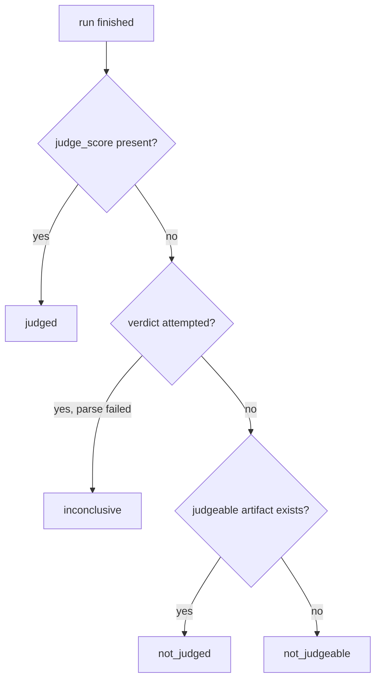

# feat: Observatory explainability, data viz, and mainstream-model evidence

## Summary

Make the observatory self-explanatory for a mixed audience — every page answers "what am I looking at" without tribal knowledge — while adding the data viz and model coverage the current leaderboard lacks. The corpus has 1,085 runs but only 10 carry judge verdicts, and the leaderboard is dominated by `gemma-4-31b-it`/`glm-5.3-flash` pairings nobody outside this repo recognizes.

## Problem Frame

User review of the dashboard surfaced concrete failures: cards are "good ish" but don't explain themselves; `code-expr-parser` means nothing to a stranger; 1,075 runs show an unjudged state with no reason given; run groups carry names like `rep-20260918-151333-f6db99` and `anchor-deepseek-explicit` with no visible scheme; the run-detail timeline column wastes most of its width. Meanwhile the evidence itself skews to obscure models — the leaderboard can't answer "which models work best" for models people actually use.

## Requirements

**Explainability**

- R1. Every task gains a human-readable `title` and one-line `blurb` in its spec; all UI surfaces render these instead of (or alongside) the raw slug.
- R2. Every unjudged run states *why* — one of a small closed set of judge states — on run rows, run detail, and cards.
- R3. A persistent explainer defines the two axes (mechanical pass vs judge quality), the naming scheme (`<type>-<slug>` tasks, experiment `run_group`, hash `run_id`), and what a "pairing" is — reachable from every page, not just a landing blurb.
- R4. Run groups support an optional `label`/`description` surfaced wherever the raw group name appears; legacy groups get a documented naming convention going forward.

**Density and viz**

- R5. Run detail reclaims the timeline column's empty space; per-phase cost/token/time becomes a compact visual, not a sparse list.
- R6. The leaderboard gains a mechanical-vs-judge scatter; the overview gains a task-type outcome matrix and a cost-vs-outcome view. All rendered with inline SVG/CSS — no new dependencies (repo stack constraint).

**Cards**

- R7. Cards carry a one-line axis legend so a screenshot stands alone for a reader who has never seen the dashboard.
- R8. Cards render an explicit unjudged state instead of implying judge data that doesn't exist.

**Evidence coverage**

- R9. A bounded batch of evals runs mainstream pairings — selected from OpenRouter's real-usage rankings, all within the grok-4.7 price ceiling — judged by jev.
- R10. `models/default.yaml` gains pricing for every newly-run model so cost fields are populated, not `$0`.
- R11. A jev backfill judges the existing corpus where judgeable artifacts exist, capped by the spend guard; runs that can't be judged get a distinct unjudgeable state rather than looking merely unjudged.

## Key Technical Decisions

- **Judge state is a closed taxonomy, not a boolean-plus-null.** `judged`, `not_judged` (never attempted), `inconclusive` (verdict couldn't be parsed), `not_judgeable` (no artifact/executor output to score). `state.py` derives it; UI renders a one-line reason per state. Rationale: "why are some not judged" has four different honest answers today, and the UI currently collapses them.
- **Task explainability lives in the spec files, not a sidecar.** `title`/`blurb` fields on `tasks/*.yaml` keep a single source of truth and let `harness.py validate` enforce their presence. Rationale: a parallel catalog file is a second inventory that drifts (same failure class as the per-cell pairing bug we just fixed).
- **Viz stays dependency-free.** Inline SVG + CSS custom properties only — the repo's stack rule (Python + pyyaml/httpx/rich, optional textual/playwright) forbids charting libraries, and the dashboard is already vanilla JS.
- **New runs use text-native tasks only for non-multimodal workers.** The usage-ranked lineup (GPT-5.6 Luna, Gemini 3.8 Flash, Hy4, MiMo-V2.5, Nemotron) is text/code-class; image-*/video tasks stay on veo/gemini pairings. Rationale: multimodal-capable models in the lineup can opt in per-pairing, but the batch doesn't fail-soft by silently skipping task types.
- **The batch is small and replicated, not broad and thin.** ~4-6 pairings × a task subset × 2-3 replicates beats 20 pairings × 1 run — the leaderboard already learned the low-sample lesson (`low_sample` partition exists because of it).
- **Backfill is bounded by waves and `--limit`, not the spend guard.** `judge` carries `--limit`/`--jobs` but no `--daily-cap`/`--max-cost` (those live on run-launching commands); the $50/month provider cap on the eval key is the hard backstop. Waves prioritize recent/high-signal groups rather than paying to re-judge superseded experiment batches verbatim.

## High-Level Technical Design

Judge-state derivation (drives R2, R8, R11):

Each state maps to one UI sentence (e.g. "not judged — judge wasn't run for this pairing" / "not judgeable — no artifact survives"). `card_payload` and run payloads emit the state + reason string; rendering is uniform.

## Implementation Units

### U1. Explainable task specs and payload plumbing

- **Goal:** Tasks carry human-facing text; the API layer serves it everywhere.
- **Requirements:** R1, R4 (spec side)
- **Files:** `tasks/*.yaml` (all 22), `orchestral/config.py` (TaskSpec fields + validation), `docs/task-spec.md`, `orchestral/web/state.py`, `tests/test_config.py`, `tests/test_web_state.py`
- **Approach:** Add `title` (short, e.g. "Expression parser") and `blurb` (one line, e.g. "Write a recursive-descent math parser — no eval()") to TaskSpec; `harness.py validate` warns (not fails) when missing so third-party specs don't break. `card_payload`/`run` payloads emit `task_title`/`task_blurb`; `task_rows` carry them. Run-group `label`/`description` live in a root `groups.yaml` (`name`/`label`/`description` entries), parsed and validated like `tasks/` and `models/` — the repo's flat spec-file convention.
- **Patterns to follow:** existing `TaskSpec` field parsing in `orchestral/config.py`; `validate`'s warning-not-fail convention.
- **Test scenarios:**
  - Spec with `title`/`blurb` parses; fields reach `card_payload` `task_rows`.
  - Spec without them still validates (warning only) and renders with the slug as fallback.
  - `groups.yaml` entry surfaces `label` on the group card payload; missing group falls back to raw name.
- **Verification:** `validate` passes on the repo's own specs; a seeded run's payload shows the title.

### U2. In-context explainability UI

- **Goal:** Every page explains itself; nothing requires reading docs.
- **Requirements:** R2, R3, R4 (display side)
- **Dependencies:** U1
- **Files:** `ui/app.js`, `ui/app.css`, `orchestral/web/state.py` (judge-state derivation)
- **Approach:** Render task titles next to slugs on runs/leaderboard/detail. Judge-state chip on run rows and detail with the one-line reason (taxonomy per HTD). A compact `#/about` page covering the two axes, pairing concept, and naming scheme, linked from the header nav — plus a small inline legend strip on the leaderboard (the page strangers land on). Group label replaces the raw `rep-2026…` name wherever a label exists.
- **Patterns to follow:** existing chip/status rendering (`statusChip`, `judgeChip` in `ui/app.js`); `page-sub` subtitle convention.
- **Test scenarios:**
  - `judge_state` derivation: scored run → `judged`; never-attempted with artifact → `not_judged`; parse-failed verdict → `inconclusive`; missing artifact → `not_judgeable`.
  - Payload emits the reason string for each state.
- **Verification:** Screenshot pass on runs/detail/leaderboard shows titles, reason chips, and the legend; about page renders.

### U3. Run-detail density

- **Goal:** The timeline column stops wasting half the viewport; per-phase economics become visual.
- **Requirements:** R5
- **Files:** `ui/app.js` (`viewRun`, `timelineHtml`), `ui/app.css` (`.detail-grid`, `.timeline`)
- **Approach:** Replace the left-column node list with a horizontal phase ribbon across the top of the detail area — each phase a proportional-width segment showing events/cost/time — feeding into the tabbed panel below at full width. Keep the live-pulse indicator for running runs.
- **Patterns to follow:** the existing `tl-*` classes and `dot-run pulse` live indicator; the hero rail pattern from cards for phase coloring.
- **Test scenarios:**
  - Payload unchanged (timeline data already exists); rendering handles 1-phase and 6-phase runs, zero-cost phases, and a mid-run live phase.
- **Verification:** Screenshot of a finished run shows no dead column; a live run still shows the pulsing phase.

### U4. Data viz: scatter, matrix, cost view

- **Goal:** The two headline questions — "which pairings are good" and "where does spend buy passes" — get visual answers.
- **Requirements:** R6
- **Dependencies:** none (payloads already emit the needed fields)
- **Files:** `ui/app.js` (leaderboard + overview renderers), `ui/app.css`, `orchestral/web/state.py` (overview payload additions if needed), `tests/test_web_state.py`
- **Approach:** Leaderboard: mech-pass-rate × judge-score scatter (x = mechanical, y = judge, size = cost, color = sample-size trust). Overview: task-type × outcome matrix (rows = type, cols = mech pass / judge approved / n, cells as colored tiles) and a pairing cost-vs-pass bar pair. All inline SVG computed from existing payload rows; honor `low_sample` by dimming under-n points rather than hiding them.
- **Patterns to follow:** the card's CSS-var axis bars; `low_sample` partition already in `leaderboard_rows`.
- **Test scenarios:**
  - Payload provides per-pairing mech rate + judge mean + cost + n (extend if gaps).
  - Empty-data render: zero pairings → empty state, not a broken SVG.
  - Under-n pairings render dimmed, not sorted above full-n ones.
- **Verification:** Screenshot pass; scatter/matrix visible on the live dashboard with real data.

### U5. Card self-explanation and unjudged states

- **Goal:** A card screenshot alone explains the axes and never implies missing judge data.
- **Requirements:** R7, R8
- **Dependencies:** U1, U2 (taxonomy + titles)
- **Files:** `ui/app.js` (`renderCard`), `ui/app.css` (`.xcard` additions)
- **Approach:** Add a compact legend line inside the card (e.g. "mechanical = deterministic checks · judge = jev quality score"). Unjudged pairing/group cards show the judge hero in a `not_judged` state with the reason instead of a misleading number. Task titles in compare tables.
- **Patterns to follow:** the existing rail/hero/finding-chip structure from the grok-4.7 redesign.
- **Test scenarios:**
  - Card payload for an unjudged set carries `judge_state`; render falls back cleanly.
  - 1200×675 invariant still holds — `scrollHeight == clientHeight` on group and pairing cards with the legend added.
- **Verification:** Regenerate `reports/cards/`; legend + honest judge state visible in PNGs.

### U6. Mainstream-model eval batch

- **Goal:** The leaderboard covers models people actually use, judged by jev, within the price ceiling.
- **Requirements:** R9, R10
- **Files:** `models/default.yaml` (pricing entries), `docs/model-config.md` (if lineup documented), run data via `harness.py batch`/`judge`
- **Approach:** Lineup drawn from OpenRouter's usage rankings, all ≤ grok-4.7 ceiling: orchestrator candidates `x-ai/grok-4.7`, `deepseek/deepseek-v4.1-flash`, `openai/gpt-5.6-luna`; workers `z-ai/glm-5.3-flash`, `google/gemini-3.8-flash`, `tencent/hy4-preview`, `xiaomi/mimo-v2.5`, `nvidia/nemotron-3-ultra`. Pick ~4-6 pairings (mix strong-orch/cheap-worker and same-model), run the text-native task subset ×2-3 replicates under `--daily-cap`/`--max-cost`, then `judge --group` with jev. Add pricing for each new model first so cost isn't `$0` (`harness.py prices` is the check). Free-tier models (nemotron free variant) get `$0` rows that must not sort first — the leaderboard fix already handles this; verify with the new data.
- **Execution note:** Data-collection unit — run via `orch` so spend bills the dedicated eval key; batches sized to keep the $50/mo cap comfortably ahead.
- **Test scenarios:**
  - Each new model has a pricing entry; `validate` passes.
  - `batch --dry-run` per pairing reports sane estimates under `--max-cost`.
- **Verification:** `leaderboard_rows` shows the new pairings with n≥2, real costs, and jev verdicts; no `$0` row outranks paid evidence.

### U7. jev backfill of the existing corpus

- **Goal:** The judge axis covers the historical corpus where it honestly can.
- **Requirements:** R11
- **Dependencies:** U1 (state taxonomy — so unjudgeable runs render distinctly), U6 can precede or follow
- **Files:** run data via `harness.py judge`; possibly `orchestral/judge.py` if the skip-reason needs persisting
- **Approach:** Wave-ordered `judge` runs: recent/high-signal groups first (`rep-20260918-*`, `glm-vs-gemma-v3`, `anchor-deepseek-explicit`), each under `--daily-cap`. Runs whose artifacts don't survive (or whose type was never judgeable) get `not_judgeable` recorded rather than retried forever — the Fix-4 inconclusive-retry path governs real inconclusives.
- **Test scenarios:**
  - `judge --dry-run --group` reports the correct candidate counts per group.
  - A run with no artifact is classified `not_judgeable` in state derivation (covered by U2 tests).
- **Verification:** `judged` count in `index.db` climbs past 10 toward corpus coverage; judge-state mix visible on the dashboard.

## Scope Boundaries

### Deferred to follow-up work

- Multimodal expansion of the mainstream batch (image/video tasks on capable models)
- Calibration re-runs against the new lineup
- Backfilling judge verdicts for superseded experiment batches beyond the wave cap

### Outside this product's identity

- New benchmark task types (the 22 existing tasks carry this round)
- TUI changes — this plan is web-observatory only
- Agentic-worker execution changes
- Publish/scrub pipeline changes
- Any model above the grok-4.7 price ceiling without explicit ask (no Anthropic/premium tiers)

## Risks & Dependencies

| Risk | Mitigation |
|---|---|
| New-model pricing absent → `$0` cost rows polluting the leaderboard | U6 adds pricing before runs; `prices` command verifies |
| Backfill spend grows with 1,075 unjudged runs | Wave ordering + `--limit`; `not_judgeable` classification stops hopeless retries; $50/mo key cap is the backstop |
| Usage-ranked models may not exist under those exact slugs | Resolve slugs against OpenRouter's model list at implementation time; the lineup is a ranked candidate set, not a contract |
| SVG viz adds weight to pages already near the 675px card budget | Viz lives on overview/leaderboard pages, not inside cards; cards keep the table |
| Backfilled verdicts aren't strictly comparable to live-run verdicts | Judge-prompt version differences are a known caveat; cards/leaderboard can surface judge-model provenance rather than hiding it |
| Group labels need a home strangers can edit | Root `groups.yaml`, same spec-file convention as `tasks/`/`models/` — pinned in U1 |

## Sources / Research

- OpenRouter real-usage rankings (Sept 2026): GPT-5.6 Luna, DeepSeek V4.1 Flash, GLM 5.3 Flash, Hy4 preview, DeepSeek V4 Flash 0731, MiMo-V2.5, Nemotron 3 Ultra, Hy3, GLM 5.3, Gemini 3.8 Flash — the corpus currently runs none of the top 10 except GLM 5.3 Flash and DeepSeek V4 Flash 0731.
- Corpus audit this session: 1,085 runs, 10 judged (grok47-eval only); top pairings are `glm-5.3-flash`/`gemma-4-31b-it` combos (344/148/144/114/114 runs).
- Task-spec audit: all 22 specs carry `id`/`type`/`prompt`/`metadata` only — no human-facing text fields exist.
- Prior plans in `docs/plans/` — notably `2026-09-16-1137-feat-serve-web-gui-plan.md` (observatory architecture: thin layer over the harness, vanilla JS/CSS) and `2026-09-18-001-feat-agentic-workers-judge-axis-plan.md` (judge axis).
- Grok-4.7 card redesign review at `reports/grok-card-review.md` — the card structure this plan extends.
