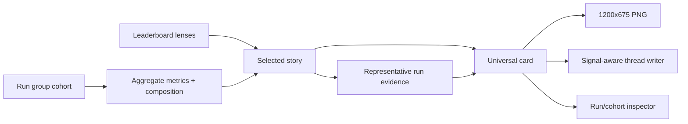

# Universal observatory cards for shareable benchmark stories

## Summary

Turn the observatory from a data browser into a benchmark-story studio. Run groups are the default aggregate scope; the leaderboard selects a story, and one universal card grammar renders aggregate, pairing, and run scopes with a split terminal/code proof panel. The card remains honest about sample size, provenance, and whether a proof is representative.

The visual direction extends the existing dark instrument-panel language rather than replacing it: dense, technical, and editorial at share scale, with one strong claim per card and progressive disclosure for evidence.

## Problem Frame

The observatory already has the raw material for compelling benchmark stories: run groups, repeated pairings, mechanical results, judge states, cost, confidence intervals, task coverage, failure reasons, and stored run artifacts. The current Cards surface presents those facts as compressed dashboard screenshots, while the leaderboard is primarily a table and scatter plot.

That makes three user jobs harder than they should be:

- understanding what a run group actually measured;
- identifying the most interesting or cost-efficient pairing;
- sharing a visually credible result with a real terminal/code proof rather than a bare score.

The first redesign should establish one recognizable card format and make the leaderboard the place where users choose the story to tell.

## Requirements

**Cohorts and scope**

- R1. A run group is the default aggregate scope, and every aggregate card states its total runs, orchestrators, workers, tasks, repeats, and finished-run count.
- R2. Users can drill from a run-group aggregate to a model pairing and then to an individual run without losing the originating cohort context.
- R3. Aggregate cards support arbitrary role composition inside the selected run group; they do not assume one orchestrator or one worker per cohort.

**One universal card**

- R4. Aggregate, pairing, and run scopes use one card frame, type hierarchy, metric language, and action set; only the evidence module and context density change.
- R5. The card has a clear story headline, two or three hero metrics, a bounded evidence region, and a provenance/caveat footer.
- R6. The card offers a selected lens: best overall setup, best code at highest cost, best code at lowest cost, quality/cost sweet spot, or an interesting divergence.
- R7. Mechanical pass and judge interpretation remain visually and semantically distinct; the first slice does not hide them inside an opaque composite score.

**Proof and sharing**

- R8. A card’s proof region defaults to a split panel with a terminal/test transcript on one side and a code diff or generated artifact on the other.
- R9. Aggregate and pairing cards label their proof as representative and link it to the source run; they never imply that one run is the cohort average.
- R10. Cards preserve bounded previews for long transcripts, diffs, HTML, images, and video, with a clear path to the full inspector.
- R11. Every card supports a 1200×675 PNG export, copyable caption/thread output, and a direct link to the underlying run or cohort.
- R12. A thread is automatically framed around a real signal when one exists: axis divergence, cost-performance frontier, task specialization, unusually high quality, unusually low cost, or weak confidence. Without a signal, the UI offers an honest context thread rather than manufactured drama.

**Interface quality**

- R13. The Cards page becomes a visual story studio with previews, filters, selection state, and clear routes to inspect or share.
- R14. The leaderboard makes cohort scope, ranking lens, low-sample state, cost, and proof availability scannable before opening a card.
- R15. The redesign remains usable at desktop and mobile widths, with keyboard focus, semantic controls, readable contrast, and no card-content overflow at export size.

## Key Technical Decisions

- **Run-group-first aggregation:** Use the existing run-group metadata and run records as the cohort boundary. Extend the current payload layer rather than introducing a second benchmark database or changing scoring semantics.
- **One card grammar, three scopes:** Keep one renderer and one visual token system. Scope-specific modules are explicit content slots, not separate card designs.
- **Descriptive lenses before composite ranking:** The first slice surfaces named lenses over existing mechanical, judge, and cost measures. It does not invent a single score that hides the two axes.
- **Proof before polish:** A card without a real terminal, diff, or artifact uses an honest proof-unavailable state; decorative code blocks are not acceptable substitutes.
- **Deterministic story signals:** The UI and thread writer consume the same computed signal set so a card headline, follow-up prompt, and exported caption cannot disagree.
- **Vanilla frontend:** Extend the existing HTML/CSS/JS architecture. No charting or component-library dependency is introduced; inline SVG and CSS remain the visual primitives.
- **Bounded evidence:** Preview excerpts are capped by bytes/lines and always retain a route to the complete stored run evidence.
- **No social-network coupling:** The first slice exports images and copyable text locally. Direct X publishing and account integrations are deferred.

## High-Level Technical Design

The card data contract is a story envelope: cohort identity and composition, selected scope and lens, headline claim, mechanical/judge metrics, cost and confidence, proof references, story signals, and caveats. The renderer consumes the envelope; the thread writer receives the same envelope with raw run contents excluded.

## Implementation Units

### U1. Lock the visual language and audit current surfaces

- **Goal:** Establish a reference-locked redesign direction before changing the interface.
- **Files:** `ui/app.css`, `ui/app.js`, existing screenshots/card exports under `reports/`, and the design notes for this plan.
- **Approach:** Compare the current observatory against benchmark-reporting, terminal-transcript, code-diff, and developer-tool references. Preserve the existing dark instrument-panel tokens, cyan interaction accent, semantic green/red/blue axes, and monospace data role. Define the card’s type scale, spacing rhythm, proof-panel treatment, bounded-preview rules, and focus states.
- **Patterns to follow:** Existing CSS custom properties in `ui/app.css`; existing card and axis classes; existing 1200×675 capture route.
- **Test scenarios:** Desktop and narrow viewport captures of overview, leaderboard, Cards index, aggregate card, pairing card, and run card; verify the primary claim, proof panel, and footer remain legible without opening the inspector.
- **Verification:** A reference lock and before/after screenshots exist before the renderer rewrite.

### U2. Build the cohort and story-envelope payloads

- **Goal:** Make run-group aggregates, pairing slices, and run proof references available to the UI without changing benchmark scoring.
- **Files:** `orchestral/web/state.py`, `orchestral/stats.py`, `orchestral/storage.py` only if an existing run field is insufficient, `tests/test_serve.py`, and a new focused card payload test module if needed.
- **Approach:** Extend the current `card_payload` and leaderboard data to include cohort composition, selected lens, mechanical/judge/cost metrics, confidence, best/worst task evidence, proof candidates, and deterministic story signals. Keep run-group filtering explicit and preserve low-sample, unmetered-cost, and judge-state honesty.
- **Patterns to follow:** `pairing_leaderboard`, `aggregate`, `_wilson`, `card_payload`, and the existing `LAUNCH_FIELDS`-style thin API layer.
- **Test scenarios:** Empty run group; mixed orchestrators/workers; repeated runs; low-sample rows; judged and unjudged mixes; metered and unmetered workers; missing artifact; representative-run selection; stable signal output across repeated payload reads.
- **Verification:** Seeded API payloads expose the same composition, metrics, proof references, and story signals shown by the card.

### U3. Turn the leaderboard into a story-selection studio

- **Goal:** Let a user choose a meaningful card story from real benchmark evidence.
- **Files:** `ui/app.js`, `ui/app.css`, `orchestral/web/state.py`, and browser/state tests.
- **Approach:** Add run-group scope selection, named lens controls, and a clear “make card” action to leaderboard rows and scatter points. Keep the existing mechanical/judge axes and low-sample partition visible. Make cost-per-pass, cost, confidence, task coverage, and proof availability understandable before the card opens.
- **Patterns to follow:** Existing `viewLeaderboard`, `lbScatter`, `sort_leaderboard`, `flagWidget`, and `data-go` navigation.
- **Test scenarios:** Select each lens; switch run groups; open a card from a table row and scatter point; low-n rows remain visibly lower-confidence; a lens with no eligible result produces an honest empty state; keyboard navigation reaches card actions.
- **Verification:** A user can go from a run group to a selected lens to the correct aggregate or pairing card in one continuous flow.

### U4. Implement the universal card renderer and split proof panel

- **Goal:** Render one high-quality card grammar for aggregate, pairing, and run scopes.
- **Files:** `ui/app.js`, `ui/app.css`, `orchestral/web/server.py` only if a bounded evidence endpoint is missing, and card/browser tests.
- **Approach:** Replace the current dense card composition with a story headline, hero metrics, bounded split proof, cohort context, provenance footer, and explicit actions. Use terminal transcript and code diff/artifact as the default proof pair. Add honest fallbacks for non-code artifacts, oversized evidence, and missing proof.
- **Patterns to follow:** Existing `.xcard`, `.xc-hero`, `.xc-compare`, `/api/shot.png`, artifact previews, and escaped DOM construction.
- **Test scenarios:** Aggregate card with representative proof; pairing card with task comparison; run card with terminal and diff; no artifact; long transcript; long diff; HTML/image/video fallback; unjudged and low-confidence states; 1200×675 no-overflow check.
- **Verification:** Exported PNGs remain readable at native size, contain no clipped text, and link back to the source cohort/run.

### U5. Add signal-aware captions and thread follow-ups

- **Goal:** Make the thread writer a follow-up tool for real findings rather than a generic marketing generator.
- **Files:** `orchestral/judge.py`, `orchestral/web/server.py`, `ui/app.js`, `ui/app.css`, and thread/card tests.
- **Approach:** Feed the shared story envelope and signal list to the existing writer. Add clear controls for “write follow-up” versus “copy context.” Keep the deterministic fallback, 270-character limit, real-number grounding, calibration caveat, and no-hype rules.
- **Patterns to follow:** `_THREAD_PROMPT`, `_thread_template`, `draft_thread`, `/api/thread`, and existing copy buttons.
- **Test scenarios:** Divergence signal; cost-frontier signal; task-specialist signal; no-signal context thread; missing writer credentials; writer error fallback; copied text remains under the platform limit; no invented statistics.
- **Verification:** Card headline, signal badge, generated follow-up, and copied caption describe the same result.

### U6. Rework the Cards index and sharing flow

- **Goal:** Make discovering, comparing, and exporting cards a first-class observatory workflow.
- **Files:** `ui/app.js`, `ui/app.css`, `orchestral/web/server.py`, and browser/state tests.
- **Approach:** Replace the list-only Cards page with preview tiles, cohort/lens filters, selection state, flagged stories, and clear download/copy/inspect actions. Preserve annotations and existing capture endpoints.
- **Patterns to follow:** Existing `viewCards`, `flagWidget`, `/api/shot.png`, and report card export flow.
- **Test scenarios:** Empty gallery; flagged and unflagged stories; filter by run group and scope; preview thumbnail loads; download produces a file; copy action works; mobile layout stacks without losing actions.
- **Verification:** A complete local flow works: select run group -> choose lens -> open universal card -> export PNG -> draft/copy follow-up.

### U7. Visual QA, accessibility, and documentation

- **Goal:** Prove the redesign works with real data and remains maintainable.
- **Files:** `tests/test_serve_browser.py`, `tests/test_serve.py`, `tests/test_gallery.py`, `README.md`, and the plan’s implementation notes.
- **Approach:** Run browser checks at desktop and mobile widths, inspect real seeded run-group data, verify keyboard focus and contrast, and document the card scopes, lenses, proof fallbacks, and local export flow.
- **Patterns to follow:** Existing browser smoke tests and screenshot capture utilities.
- **Test scenarios:** Real run-group aggregate; high-cardinality cohort; failed/inconclusive/unjudged data; desktop/mobile layouts; keyboard-only navigation; reduced-motion preference; export and copy actions.
- **Verification:** Screenshots and automated checks show a coherent visual system, not merely a CSS patch.

## Scope Boundaries

### Deferred to follow-up work

- Direct X API publishing, account authentication, and scheduled posting.
- A composite quality score that collapses mechanical and judge axes.
- Arbitrary user-defined cohort builders beyond the existing run-group/all-runs selection.
- Full transcript search, syntax-highlighting infrastructure, or a code playground inside the card.
- TUI redesign.

### Outside this product's identity

- Changing benchmark execution, judge prompts, scoring, or run storage semantics.
- Treating a representative run as an aggregate result.
- Generating social copy without the underlying real metrics and caveats.

## Risks & Dependencies

| Risk | Mitigation |
|---|---|
| High-cardinality cohorts overflow the fixed card canvas | Bound proof excerpts, prioritize hero metrics, and test the largest seeded cohort at export size. |
| “Best” language overstates noisy evidence | Keep named lenses, confidence intervals, low-sample markers, and judge calibration visible. |
| Representative proof is mistaken for the aggregate | Label it explicitly and link to the source run; never use it as the aggregate numerator. |
| Leaderboard becomes harder to scan after adding lenses | Use a compact lens selector and preserve the existing table/scatter as secondary exploration. |
| Existing vanilla JS becomes difficult to maintain | Keep rendering modules cohesive, avoid new dependencies, and add payload/UI contract tests. |
| Screenshot capture depends on browser state | Reuse the settled marker and existing capture route; verify the route after every card-state change. |

## Sources / Research

- `docs/plans/2026-09-22-001-feat-observatory-explainability-plan.md` — existing explainability, judge-state, leaderboard, and card decisions.
- `ui/app.js`, `ui/app.css`, `orchestral/web/state.py`, `orchestral/stats.py`, and `orchestral/judge.py` — current card, leaderboard, cohort, proof, and thread behavior.
- [Benchmark dashboard design system](https://github.com/li-langverse/benchmarks/blob/main/docs/dashboard/design-system.md) — scientific-instrument density, explicit uncertainty, and honest status language.
- [Evaluation Cards](https://evalevalai.com/projects/eval-cards/) — benchmark cards as interpretive records with provenance and comparability signals.
- [Hugging Face Evaluate](https://huggingface.co/docs/evaluate/main/index) — leaderboard/model-card separation and evaluation metadata patterns.
- [CodeCast](https://code-cast.dev/) — transcript-first evidence presentation and collapsible tool detail.
- [atrium chat pane](https://getatrium.dev/docs/panes/chat) — split transcript/diff treatment and capability-aware rendering.
- [Benchmark Bar](https://www.framer.com/marketplace/components/benchmark-bar/) — publication-grade uncertainty bars and benchmark comparison treatment.

## Reference Lock

- **Primary foundation:** the existing `orchestral` dark instrument workbench,
  interpreted through the benchmark-dashboard reference. Preserve the near-black
  canvas, hairline borders, restrained cyan interaction accent, semantic
  green/red/blue verdict axes, compact monospace numerics, and explicit
  uncertainty.
- **Borrow only:** CodeCast's transcript-first evidence hierarchy and atrium's
  transcript/diff split, adapted as bounded same-origin proof panels.
- **Reject:** glassmorphism, decorative glow, marketing-scale hero typography,
  an opaque composite score, fabricated code, and gradients that compete with
  verdict semantics.
- **Media strategy:** use code-native terminal and artifact previews. Render a
  stored image or video only when the representative run contains that media;
  otherwise show a typed, honest proof-unavailable state.
- **Token commitments:** reuse the existing `--bg`, `--bg-raised`,
  `--bg-inset`, `--line`, `--text`, and semantic axis roles. Keep the 6px
  application radius and use restrained 8–12px framing for the 1200×675 card.

## Assumptions

- Run groups remain the authoritative aggregate boundary; the first slice uses existing run-group and all-runs selectors.
- “Best code at highest/lowest dollar” are named lenses over existing evidence, not a new scoring formula.
- The first card proof panel favors terminal/SWE evidence and falls back cleanly for other task types.
- The current local server, vanilla frontend, and Python payload architecture remain the implementation surface.
