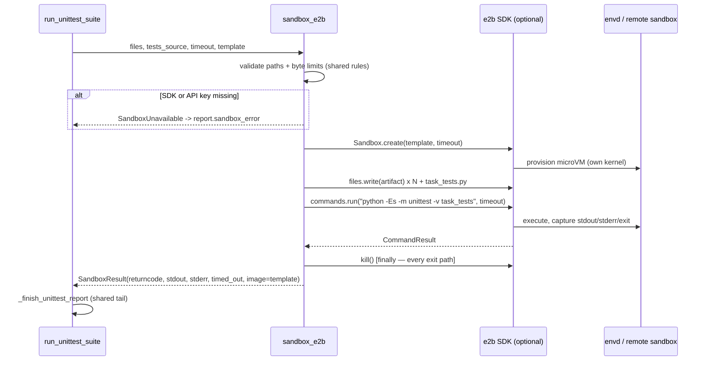

# feat: E2B-compatible remote sandbox backend (CubeSandbox-ready)

## Summary

Add a third execution backend for artifact verification: a remote microVM sandbox spoken over the E2B-compatible API (CubeSandbox self-hosted or hosted E2B — same client contract). Model-generated filesets and hidden unittests run inside a hardware-isolated guest kernel instead of a shared-kernel Docker container. Docker stays the default backend; the remote backend is opt-in via `--sandbox e2b` and gated on an optional `e2b` SDK extra, matching the repo's `tui`/`shots` extras convention.

## Problem Frame

`orchestral/sandbox.py` was written anticipating this: its docstring reserves "a future remote backend [implementing] the same command/result contract with Firecracker, Kata, Harbor, or another microVM provider." Today only two backends exist — `docker` (shared-kernel container, the default) and `local` (trusted dev only, real host exec of model code). The residual gap is the shared-kernel escape class and, looking ahead, `agentexec` — external coding-agent CLIs run with the user's OS privileges and can read the open filesystem; env scrubbing and transcript scanning detect but do not prevent. A per-sandbox dedicated kernel is the proportionate next boundary, and Tencent's open-source CubeSandbox (RustVMM+KVM, <60ms cold start) exposes exactly the E2B protocol this backend should speak.

## Requirements

- R1. A remote backend runs the verifier unittest suite inside a disposable remote sandbox and returns the same `SandboxResult` contract as `run_docker_unittest`, so `_finish_unittest_report` needs no changes.
- R2. The backend is opt-in: `--sandbox e2b` on `run`, `revalidate`, and any other command that exposes `--sandbox`; `docker` remains the default everywhere.
- R3. The client speaks the E2B-compatible API so both hosted E2B (`api.e2b.app`/`E2B_API_KEY`) and self-hosted CubeSandbox (URL swap via `E2B_DOMAIN`) work without code changes. **Confidentiality clause:** `--sandbox e2b` transmits the worker's fileset *and the hidden `task_tests.py` verifier source* to the configured endpoint — hosted E2B means third-party disclosure of evaluation oracles that local/Docker keep on-host; self-hosted CubeSandbox keeps them on owned infrastructure. Docs must state this plainly (the `agentexec.py` honesty-notes convention).
- R4. The remote sandbox is destroyed on every exit path — success, failure, timeout — same cleanup discipline as the Docker `--rm` + `finally` pattern.
- R5. Existing input safety invariants carry over unchanged: workspace-relative path validation, per-file and total byte limits, bounded output capture, host-enforced timeout, and **environment isolation** — the sandbox command environment is the template default plus an explicit allowlist only (mirroring `env={"PATH": "/usr/bin:/bin"}` local and the Docker `--env` list); the adapter never forwards `os.environ`, and `E2B_API_KEY` is a control-plane secret that is never written into the sandbox.
- R6. The `e2b` SDK is an optional extra (`pip install orchestral[e2b]`); selecting `--sandbox e2b` without the SDK fails fast with a `SandboxUnavailable`-shaped error, not a stack trace.
- R7. The sandbox template is configurable (env var, sensible default), because remote templates are the image-analog of `--sandbox-image`.

---

## Key Technical Decisions

- **KTD-1: E2B Python SDK behind an optional extra, not a hand-rolled Connect-RPC client.** The envd data plane is Connect-RPC plus HTTP bulk endpoints; reimplementing it in raw httpx is disproportionate and fragile. The repo already isolates optional dependencies (`textual` → `[tui]`, `playwright` → `[shots]`); `e2b` → `[e2b]` follows that pattern and keeps the core stack (pyyaml/httpx/rich) untouched. Rejected alternative: vendoring a minimal envd client — protocol drift risk for zero runtime benefit.
- **KTD-2: SDK-native env vars for the endpoint contract.** `E2B_API_KEY` + `E2B_DOMAIN` are the variables the SDK reads natively, and CubeSandbox's documented drop-in is literally "swap one URL environment variable." Honoring that convention gives both providers for free. Rejected alternative: bespoke `ORCHESTRAL_SANDBOX_URL` — works, but silently diverges from the drop-in contract every E2B-compatible provider documents.
- **KTD-3: Same `SandboxResult` contract, new module.** `orchestral/sandbox_e2b.py` owns the remote lifecycle; `orchestral/codeexec.py::run_unittest_suite` gains an `e2b` dispatch arm beside `docker`/`local`. The report's `sandbox`/`sandbox_image` fields already record which backend ran — `sandbox_image` carries the template ID for provenance. Rejected alternative: a parallel `run_e2b_unittest_suite` entry point — duplicates the report plumbing and drifts from the single funnel both validators already share.
- **KTD-4: Bootstrap by file write + command run, not tar stdin.** envd accepts plain file writes and command execution; the Docker path's in-memory tar bootstrap exists because `docker run -i` has no file API. Remote path: `files.write` each artifact + `task_tests.py`, then `commands.run("python -Es -m unittest -v task_tests", cwd=…, timeout=…)`. Same `-Es` interpreter hardening as the local backend.
- **KTD-5: Docker stays the default.** No CubeSandbox node is provisioned yet and hosted E2B is a paid dependency; remote must never be required for a green eval. `--sandbox e2b` selects it explicitly per invocation.
- **KTD-6: Egress parity via create-time `allow_internet_access=False`, template config as fallback.** The Docker verifier runs `--network none`; the E2B SDK's `Sandbox.create` accepts per-sandbox `allow_internet_access`/`network` options, so the adapter requests no-egress at create time. Whether CubeSandbox's E2B gateway honors those flags (vs only CubeEgress template-level config) is unverified — the egress-restricted-template fallback via `ORCHESTRAL_E2B_TEMPLATE` remains documented, and `sandbox_image` records the template so cross-backend score comparisons can detect asymmetry. Rejected alternative: silently accepting `base`-template network access — it widens untrusted-code privileges beyond what the Docker backend enforces, invisibly.

## Assumptions

- Template default `base` (E2B's stock Python-capable template); overridable via `ORCHESTRAL_E2B_TEMPLATE` (env) — mirroring `ORCHESTRAL_DOCKER_IMAGE`'s role. If `base` lacks Python ≥3.11 stdlib needs, tasks can pin a template; verification catches it. `base` carries outbound network — egress restriction is an operator/template concern (KTD-6), not something the adapter can enforce from the client API.
- One sandbox per verifier call (create → exec → kill), matching the Docker one-shot shape — no pooling or reuse in v1. CubeSandbox pause/resume and snapshots are deliberately unused for now.
- Per-call resource limits (memory/CPU) are template-level in the E2B API, not per-sandbox args — the plan does not fake parity with Docker's `--memory`/`--cpus` flags; the report records which backend ran instead.
- No CubeSandbox node is provisioned as part of this work — the adapter is verified against a stubbed SDK; live verification is a follow-up once a host exists.
- The `base` template may expose `python3` only (exit 127, not a unittest failure) — the bootstrap should try `python3` with `python` fallback, or the command is resolved at implementation time against the pinned SDK docs. `kill()` on a TTL-expired sandbox must be tolerated (best-effort cleanup, same as Docker's force-rm).

---

## Scope Boundaries

**In scope:** the adapter, dispatch arm, CLI plumbing, optional extra, unit tests against a stubbed SDK, and docs for configuring the endpoint/template.

**Out of scope (true non-goals):** provisioning a CubeSandbox deployment (Hetzner dedicated, Tencent CVM, or local arm64 KVM — unresolved infra decision); hosted-E2B account setup; `agentexec` workspace-in-VM (the bigger security payoff, but a separate integration); snapshot/clone/resume features; egress allowlist configuration (CubeEgress is control-plane config, not client code).

### Deferred to Follow-Up Work

- `agentexec` backend where the agent workspace is the microVM — closes the documented "child runs with user OS privileges" gap; needs this adapter's lifecycle proven first.
- Stand up a CubeSandbox node and run a live `--sandbox e2b` verifier pass end-to-end; record timing vs Docker.
- Sandbox pooling or snapshot-reuse if per-run latency ever matters (60ms boot already makes it cheap).

---

## High-Level Technical Design

---

## Implementation Units

### U1. `orchestral/sandbox_e2b.py` — remote backend adapter

**Goal:** Implement the E2B-compatible backend behind the `SandboxResult` contract.

**Requirements:** R1, R3, R4, R5, R6, R7

**Dependencies:** none

**Files:**
- `orchestral/sandbox_e2b.py` (new)
- `tests/test_sandbox_e2b.py` (new)

**Approach:**
- Guarded import: `try: from e2b import Sandbox` → on `ImportError`, or missing `E2B_API_KEY` when the endpoint requires auth, raise `SandboxUnavailable` with an install hint (`pip install orchestral[e2b]`), not `ImportError`.
- Reuse `_safe_relative_path`, `_MAX_FILE_BYTES`, `_MAX_WORKSPACE_BYTES` from `orchestral.sandbox` unchanged — same input invariants, remote transport.
- Lifecycle: `Sandbox.create(template=…, timeout=…)` → `files.write` per artifact + `task_tests.py` → `commands.run` unittest invocation with `-Es` and cwd → map `exit_code`/`stdout`/`stderr` into `SandboxResult(image=<template>)`; `sandbox.kill()` in `finally` on every path including SDK exceptions.
- Timeout discipline: pass the task timeout to `commands.run`; map its timeout outcome to `SandboxResult(timed_out=True, returncode=124)` mirroring the Docker path. The sandbox-level TTL (`Sandbox.create(timeout=…)`) is set slightly above the command timeout so a hung suite is reaped even if the run call misbehaves.
- Bounded output: truncate/transfer stdout+stderr consistently with `SandboxResult` expectations (the shared `_finish_unittest_report` already tails to 2000 bytes — adapter need not re-truncate but must not drop stderr).

**Patterns to follow:** `run_docker_unittest` in `orchestral/sandbox.py` (result shape, cleanup-in-finally, unavailable-vs-error split); `_minimal_env`/preflight error typing in `orchestral/agentexec.py` for the unavailable-backend style.

**Test scenarios:**
- Happy path: stub SDK returns a fake sandbox; files written per artifact; command result maps to `SandboxResult(returncode=0)`; `kill()` called once.
- Missing SDK: import-guard path raises `SandboxUnavailable`, and the message names the `e2b` extra.
- Missing `E2B_API_KEY` (where required): `SandboxUnavailable`, not a downstream 401.
- Create failure: SDK raises → `SandboxError` surfaces, `kill()` still attempted/absent cleanly (no sandbox exists).
- Command timeout: fake run reports timeout → `timed_out=True, returncode=124`.
- Path rejection: `../x.py`, absolute path, >4MB file, >32MB total → `SandboxError` before any SDK call (no sandbox created — assert zero SDK calls).
- Kill-on-error: `files.write` raises → `kill()` still invoked; original error propagates.
- Idempotent kill: `kill()` raising does not mask the run result.

**Verification:** the stubbed-SDK suite proves the full lifecycle without an endpoint — files written in artifact order, command result mapped, `kill()` observed on every path including failure and timeout; `SandboxUnavailable` (not a traceback) is what `run_unittest_suite` sees when the extra is absent.

### U2. Backend dispatch + CLI plumbing

**Goal:** `run_unittest_suite` accepts `sandbox="e2b"`; `harness.py` exposes it and the template env.

**Requirements:** R2, R5, R7

**Dependencies:** U1

**Files:**
- `orchestral/codeexec.py` (dispatch arm)
- `harness.py` (`--sandbox` choices in `_add_run_flags` — shared by `run`/`grid`/`batch`/`ablate` — plus the standalone `revalidate` tuple; drop the `ORCHESTRAL_DOCKER_IMAGE` argparse default on `--sandbox-image` so an unset flag is `None`)
- `tests/test_codeexec.py` or the file that already covers `run_unittest_suite` dispatch (extend)
- `tests/test_dataset.py`-adjacent CLI coverage only if a CLI-arg test file already exists — follow the repo's existing flag-test location

**Approach:**
- Add `elif sandbox == "e2b":` arm calling `sandbox_e2b.run_e2b_unittest(files, tests_source, timeout_seconds=…, template=…)`; `SandboxUnavailable`/`SandboxError` land in `report["error"]` + `report["sandbox_error"] = True` exactly like the Docker arm; `report["sandbox"]`/`report["sandbox_image"]` record `e2b`/template.
- Template resolution: **inside the adapter** (`template or os.environ.get("ORCHESTRAL_E2B_TEMPLATE") or "base"`), mirroring `run_docker_unittest`'s `image or env or DEFAULT` pattern — direct `run_unittest_suite(sandbox="e2b")` callers get the same resolution as CLI callers. `--sandbox-image` doubles as the e2b template selector (documented in `--help`; docker meaning unchanged).
- **Flag-default collision fix:** `--sandbox-image` currently defaults to `os.environ.get("ORCHESTRAL_DOCKER_IMAGE")` (harness.py ~1514, ~1679), which would smuggle a docker image name into the "explicit param" slot and make `ORCHESTRAL_E2B_TEMPLATE` unreachable for docker-image-pinning operators. Drop the env default from argparse (the docker backend already applies its own `ORCHESTRAL_DOCKER_IMAGE` fallback internally, sandbox.py:241) so `sandbox_image` is `None` unless the user actually passed the flag.
- Extend the `--sandbox` `choices=` tuple in `_add_run_flags` (one edit covers `run`, `grid`, `batch`, `ablate`) and the separate `revalidate` flag with `"e2b"`; keep `docker` default.

**Test scenarios:**
- `sandbox="e2b"` dispatches to the e2b adapter (stub the adapter call; assert dispatch + report fields set).
- `sandbox="bogus"` still returns `unknown code sandbox` + `sandbox_error` (regression guard).
- `sandbox="e2b"` with adapter raising `SandboxUnavailable` → report carries `sandbox_error: true`, `executed: false`, no traceback.
- CLI acceptance: `harness.py run --sandbox e2b` parses (arg-level test matching the repo's existing flag tests, or dry-run end-to-end if that pattern exists for `--sandbox docker`).

**Verification:** `--sandbox e2b` is accepted by `run` and `revalidate`, `docker` remains the default, and a `sandbox="e2b"` dispatch reaches the adapter with the template resolved from flag/env/default in that order — observable in `report["sandbox"]`/`report["sandbox_image"]`.

### U3. Packaging + documentation

**Goal:** Installable optional extra; operator-facing setup docs.

**Requirements:** R3, R6, R7

**Dependencies:** U1, U2

**Files:**
- `pyproject.toml` (`[project.optional-dependencies] e2b = ["e2b>=…"]` — pin a floor at least 7 days old per repo dependency policy)
- `README.md` (backend section: prerequisites, env vars, `--sandbox e2b` usage, CubeSandbox pointer)
- `AGENTS.md` — the `What not to do` "Optional extras only" allowlist (`textual`/`playwright`) must gain `e2b`, regardless of whether `--sandbox` is documented there today

**Approach:**
- One `e2b` extra; floor-pin the SDK version. Note in README that no SDK is needed for `docker`/`local`.
- Docs content: what the backend is (hardware-isolated microVM vs shared-kernel container), env vars (`E2B_API_KEY`, `E2B_DOMAIN`, `ORCHESTRAL_E2B_TEMPLATE`), `--sandbox e2b --sandbox-image <template>` usage, and three required honesty paragraphs: (1) Docker remains the default; remote is opt-in and unverified-live until a CubeSandbox/E2B endpoint exists; (2) the e2b backend sends the worker fileset AND the hidden `task_tests.py` oracle source to the configured endpoint — hosted E2B means third-party disclosure, self-hosted CubeSandbox stays on owned infra (R3); (3) the default `base` template has outbound network unless `allow_internet_access=False` is honored (KTD-6) or an egress-restricted template is configured — unlike Docker's `--network none`, and that asymmetry can skew cross-backend score comparisons.

**Test scenarios:**
- `Test expectation: none -- packaging/docs only.` (The U1 missing-SDK test already proves the extra contract.)

**Verification:** `pip install orchestral[e2b]` resolves the SDK; a fresh-clone reader can reach `--sandbox e2b` from the README alone; no new hard dependency enters `dependencies`.

---

## Open Questions

- Exact stub style for the SDK in tests (fake module via `sys.modules` injection vs monkeypatching a thin client wrapper) — implementation-time choice; keep the seam at module level either way.
- Whether E2B `commands.run` exposes per-call env/cwd in the pinned SDK version — verify against the installed SDK during implementation; worst case, run the command through a `cd` prefix and inline `env` vars.
- Live verification of CubeSandbox API parity (create/write/run/kill) — deferred to the node-provisioning follow-up.
- Does CubeSandbox's E2B gateway honor create-time `allow_internet_access`/`network` params, or must egress restriction live in CubeEgress template config? Determines whether KTD-6's primary mechanism works on the self-hosted path.
- Hosted E2B as an interim live-verification endpoint while the CubeSandbox hosting decision is pending — excluded from scope here; whether it's acceptable (cost, oracle confidentiality per R3) is an operator call, recorded so a future session doesn't have to re-derive it.

---

## Risks & Dependencies

- **SDK drift:** the `e2b` package moves fast; floor-pin and treat version bumps deliberately. Connect-RPC internals are the SDK's problem, not ours (KTD-1).
- **No live endpoint in CI:** unit tests stub the SDK; a live `--sandbox e2b` path is only exercisable with real credentials. CI stays green without it because the backend is opt-in — but record honestly that remote-path coverage is stub-level.
- **Template parity:** `base` template Python version vs `requires-python >=3.11` and `python:3.11-slim` Docker image parity — a mismatch would skew mechanical scores across backends; the report records `sandbox_image` so drift is detectable in evidence.
- **Dependency policy:** new optional dep is the only one added; justified by the no-Connect-RPC-by-hand decision (KTD-1).

---

## Sources & Research

- `TencentCloud/CubeSandbox` — architecture docs (RustVMM+KVM, <60ms boot, <5MB overhead, CubeEgress L7 filtering, E2B SDK drop-in compatibility, credential vault); validated at Tencent Cloud production scale before open-sourcing.
- E2B OpenAPI (`docs.e2b.dev/api-reference`) — platform endpoints: `POST /sandboxes` (`{templateID, timeout, autoPause}`), `POST /sandboxes/{id}/connect`, kill; envd data plane on port 49983 routed via `E2b-Sandbox-Id`/`E2b-Sandbox-Port` headers — the SDK wraps all of it.
- E2B SDK conventions — `Sandbox.create(template, timeout)`, `sandbox.files.write`, `sandbox.commands.run(timeout)`, `sandbox.kill()`; `E2B_API_KEY`/`E2B_DOMAIN` env contract.
- Repo seams verified this session: `orchestral/sandbox.py` backend contract + docstring reservation for a remote microVM provider; `orchestral/codeexec.py::run_unittest_suite` as the single funnel for both `code` and `swe-patch`/`bugfix` validators; `orchestral/runner.py` `sandbox`/`sandbox_image` fields flowing from CLI args; `harness.py` `--sandbox` flag in `_add_run_flags` (line ~1512, applied to run/grid/batch/ablate) and the standalone `revalidate` flag (line ~1677); `pyproject.toml` extras convention.

---

## Shipped shape (2026-09-27 reconciliation)

This plan predates the fail-closed merge that dropped `orchestral/sandbox.py`
and the `--sandbox`/`--sandbox-image` flags. As shipped, the selection seam is
`ORCHESTRAL_CODE_RUNTIME=isolated` (the env boundary `codeexec.py` already
carried), dispatching to `orchestral/cubeexec.py` — the E2B-compatible
adapter. `docker`/`local` backends no longer exist; default posture is
`disabled` fail-closed. The report contract gains `runtime`/`sandbox_image`
provenance fields as designed. Everything else in this plan (E2B SDK behind an
`[e2b]` extra, `E2B_DOMAIN`/`E2B_API_KEY` as the endpoint contract, file-write
+ `commands.run` bootstrap, `-Es` interpreter hardening, no-egress create flag,
destroy-on-every-exit, confidentiality clause) shipped as specified.
