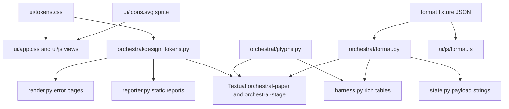
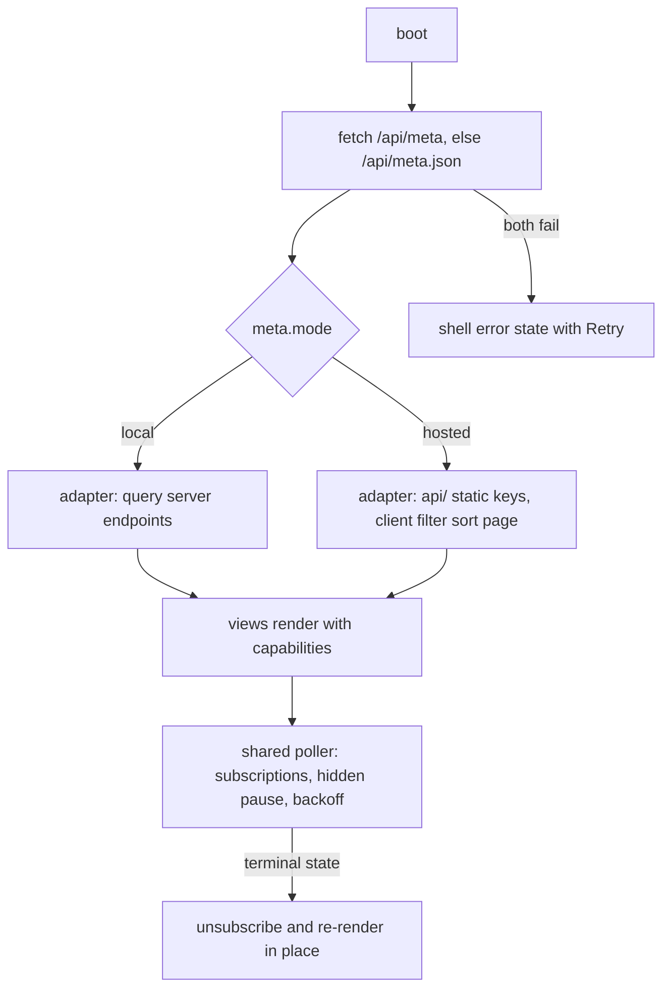
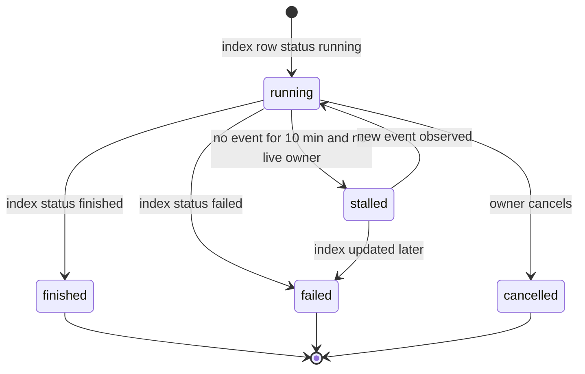
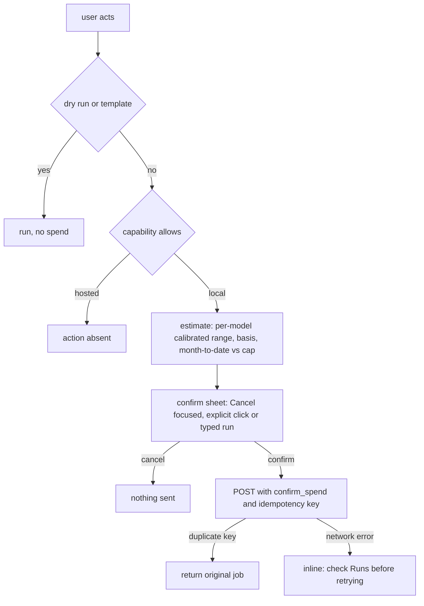
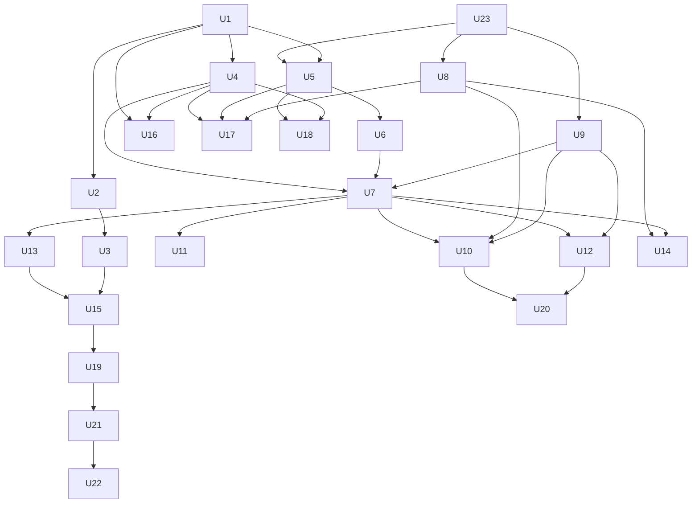

# The Score redesign - Plan

## Status (2026-10-04)

Verified against `gh pr list -R duketopceo/orchestral` and `git log origin/main` (main at `7f707bd`, PR #139). Nothing in this plan is on main yet: 0 of 23 units done. PR #120 (the prerequisite) merged, so the stop condition on U23 no longer applies. Merged and outside the unit set: #121 (this spec and plan), #122, #123 (Cloudflare hosted observatory), #139 (calibrate run ids stay strings).

**Done:** none.

**Open PRs carrying units (all drafts except #124):**
- #124 U23 + U8 cost truth (base main, ready for review)
- Foundation stack: #125 U1 tokens (base main) -> #126 U2 type (base #125 branch) -> #127 U3 mark (base #126 branch; needs mark approval). #128 U4 icons (base #125 branch). #136 U16 error pages (base #128 branch).
- Format stack: #129 U5 formatter (base main) -> #133 U18 CLI tables and #135 U17 TUI (both base #129 branch) and #130 U6 SPA runtime (base #129 branch) -> #131 U9 liveness (base #130 branch) -> #132 U7 shell (base #131 branch) -> #134 U11 Runs, #137 U13 charts, #138 U10 Now, #140 U12 Run detail (all base #132 branch).

**In progress:** U10 to U13 are being integrated on local branch `feat/score-u10-u13-integration` (not on the remote as of this check); the four PRs above stay open until it lands. U3 logo: option A "ictus" is decided and being applied to #127.

**Next:** U14 (needs U7, U8), U15 (needs U3 and U13), U19 (needs U15), U20 (needs U10, U12), U21 (needs U19).

**Blocked on the user:** U22 (Open Question: Remotion home, music license, spend). Mark approval for #127 is resolved by the logo decision once applied. Open Questions listed below still await answers; the ROADMAP.md Cut-section conflict must be settled in the U1 PR (#125).

**Recommended merge order:** #124; then #125 and #129 (both base main); then retarget and merge #126, #128, #130, #133, #135; then #127 (after the logo is applied), #136, #131; then #132; then the integration branch result for U10 to U13 (replacing #134, #137, #138, #140 or merging them in order #134, #138, #140, #137). Each stacked PR must be retargeted to main after its parent merges.

## Goal Capsule

- **Objective:** An operator, a hosted-observatory reviewer, a terminal user and a reader of a published card all see one recognisable orchestral: every surface is legible at 390px and 1440px in both themes, every number is honest about sample size and spend, every empty, loading, partial and error state tells the reader what to do next, and nothing on screen can spend money without a calibrated estimate and an explicit act.
- **Means:** Implement `DESIGN.md` direction "The Score" (KTD1) on a shared token, glyph and formatter foundation (KTD2, KTD3), then rebuild each surface on it in PR-sized units.
- **Authority:** `DESIGN.md` owns visual and interaction specification. This plan owns sequencing, contracts and the deltas recorded under Key Technical Decisions. Where they conflict, the Requirements below win on product behavior and the KTDs win on mechanism.
- **Execution profile:** Deep. 23 units, about 14 PRs. Each unit lands behind green CI plus the per-surface ship gate (R30).
- **Stop conditions:** Stop and report if any step would need a paid model call, an AI-generated image, a new runtime Python dependency, an npm build inside this repo, or creating the `launch-kit` repo. Stop if PR #120 has not merged when the first unit (U23) starts.
- **Who finishes:** `ce-work` (or a human) executes units in dependency order. Merge follows the repo merge gate in `AGENTS.md` (green CI plus an independent agent's check report).

---

## Product Contract

### Summary

Replace the five unrelated visual languages (dark cyan SPA, light Tailwind reports, olive social card, default Textual, raw ASCII CLI) with one system: paper and ink chrome, Okabe-Ito evidence colors, hatch for low sample, Instrument Sans plus IBM Plex Mono, the Downbeat mark, a 32-glyph icon set with terminal equivalents, and five "Rests" empty states.
Fix the data truths the redesign would otherwise dress up: cost displays read billed spend, live runs come from the index, polling notices run endings, and the hosted read-only build knows what it cannot do.
Finish with a README and social image rendered from real data and a 45-second launch video captured from seeded fixtures.

### Problem Frame

`DESIGN.md` section 2 audits today's state: no shared tokens, AA failures on the most-read text (partly fixed by PR #120), undesigned empty states, click-only charts, a card that clips at 1440, and two one-click paid paths (fixed by PR #120).
Research for this plan found problems underneath the visuals.
Every cost display reads `runs.total_cost_usd`, which is the rate-card sum; billed spend lives in `calls.api_cost_usd`, and failed runs record about $0.11 against $0.74 billed.
The PR #120 launch estimate uses that same rate-card figure.
The Live band only sees jobs launched by the server process, so CLI-launched experiments are invisible, and five orphaned `running` rows from 2026-09-30 never resolve.
Opening the Events tab cancels the poll that notices a run finished.
The Cloudflare-hosted observatory (`docs/plans/2026-10-02-001-feat-cloudflare-hosted-observatory-plan.md`) will serve `ui/` verbatim from R2 snapshots, but the SPA calls endpoints that snapshot list does not cover and has no way to know it is hosted.
At 390px five routes scroll horizontally (Overview 877px, Compare 1469px) because `.panel` tables cannot shrink.

### Key Decisions

- **No AI-generated imagery; every brand, icon, empty-state and OG asset is hand-authored SVG or rendered from real data** (session-settled: user-directed — chosen over Recraft/flux/gpt-image generation at $0.01-0.08 per image: AI imagery is not approved). Governs R6, R7, R8, R9, R27.
- **No paid model calls during implementation or verification; all verification runs against no-key fixtures** (session-settled: user-directed — chosen over live paid smoke runs: spend is capped and real spend already ran above estimates). Governs R31.
- **The `launch-kit` repo is not created by this work** (session-settled: user-directed — chosen over the proposed standalone Remotion repo: the proposal is not approved). Governs R29.
- **Calibrate spend estimates per model from billed calls, not by a flat multiplier.** The request said estimates ran about 5x low; measured billed/rate-card ratios run from 0.99x to 13.25x by model (2.07x overall on 830 priced calls), so a constant would overstate cheap pairings and understate `deepseek/deepseek-v4-flash-0731`. Governs R19, R20.
- **PR #120 is the baseline.** Its spend gates, placeholder favicon, contrast fix and readable errors are kept and extended, not redone. Governs R19, R21.
- **Routes stay stable; rail labels change** ("Leaderboard" to "Pairings", "Cards" to "Publish", "About" to "Guide", new "Experiments"). Default pending confirmation (Open Questions). Governs R11.

### Requirements

**Foundation and identity**

- R1. One token file, `ui/tokens.css`, defines every color, type, spacing, radius, elevation and motion value for paper (default) and stage themes per `DESIGN.md` 6.1-6.7. No raw hex appears in any other CSS, HTML template, reporter style or TUI theme.
- R2. Theme follows `prefers-color-scheme` locally, defaults to paper on hosted and published surfaces, and a rail toggle overrides and persists per device. `color-scheme` and both `theme-color` metas flip with the toggle.
- R3. Every text pair meets WCAG 2.2 AA (4.5:1) and every meaningful graphic and control border meets 3:1 in both themes, enforced by a test that reads `ui/tokens.css`.
- R4. Instrument Sans (variable) and IBM Plex Mono are self-hosted, subset, at most 4 woff2 files and 110KB total, with size-adjusted fallbacks so font swap causes no layout shift.
- R5. Color is never the sole carrier of meaning: every verdict carries its glyph and word, and low sample carries hatch plus the words "low n".
- R6. The Downbeat mark (`DESIGN.md` A1), wordmark (A2) and lockups exist as SVG and read correctly at 16, 24, 32 and 512px in both themes.
- R7. A complete favicon and app-icon set (A3) replaces the PR #120 placeholder, served locally and by the hosted Worker.
- R8. The "Engraved 16" icon set (A4, all glyphs listed there) ships as one SVG sprite, and every glyph with a verdict or state meaning has a TUI/CLI equivalent with an ASCII fallback (`DESIGN.md` 6.8).
- R9. Five "Rests" empty-state drawings (A7) ship in the sprite, each paired with a one-line explanation and one action.
- R10. No emoji and no em or en dash appear in any UI string, API string rendered as UI text, card, report, TUI or CLI output; ranges use a hyphen and null renders as the null glyph (`DESIGN.md` 6.9 #11, section 10).

**Shell, runtime and modes**

- R11. The rail follows `DESIGN.md` section 5: icon rail at 1100px and below, bottom tab bar at 640px and below, `g` key sequences, `/` focuses the page filter, `?` opens the key map, and a `cmd/ctrl-K` palette jumps to runs, tasks, pairings and groups.
- R12. No route scrolls horizontally at 390px or at 200% zoom. Wide tables scroll inside their container with a sticky header and sticky first column, and low-priority columns hide first.
- R13. The SPA knows its mode (local or hosted), data freshness and capabilities from one capabilities document. Local-only affordances (launch, cancel, flag write, thread, PNG capture, live stream) are absent or shown read-only on hosted, never broken.
- R14. Every data view has designed empty, loading, partial, error and stale states per the quality checklist (`DESIGN.md` 6.10; state matrix in Appendix). Errors say what happened, what it means and what to do, offer Retry or another action, and never dead-end. Transient failures retry with backoff before showing manual Retry.
- R15. A persistent status line reports offline or reconnecting (local), and sync age (hosted), escalating when a snapshot is older than 24 hours.
- R16. One shared poller drives all live data: it pauses when the tab is hidden, backs off on failure, stops on terminal states and never misses a run's transition to finished.
- R17. Live runs come from the index, not the server's job registry. A run with no event for 10 minutes and no live owner is shown as `stalled`. Cancel appears only for jobs this server owns; other runs say where to stop them.
- R18. Keyboard reaches every action in `DESIGN.md` 2.5 with a visible focus ring, tabs and dialogs use correct ARIA patterns, charts expose `role="img"`, a description and a "View as table" toggle, heatmap cells and chart marks are focusable links, and phase-level live changes are announced politely.

**Spend truth and safety**

- R19. Every cost display (run header, Runs column, cost per pass, Now "cost spent", experiment spend, card economics) reads billed cost from `calls`, including failed runs, falling back to calibrated rate card only for unpriced calls and saying so.
- R20. Launch and thread estimates use per-model billed/rate-card ratios (Key Decisions), show a range and a one-sentence basis, and show month-to-date billed spend recorded in this index against the eval key's $50 monthly cap.
- R21. Paid launches and thread drafts keep the PR #120 server gate and add an idempotency key so a retried request never starts a second paid run. Enter alone never confirms a paid action.
- R22. The TUI cannot start a paid run without the same estimate and an explicit typed confirm.

**Screens**

- R23. Now, Runs, Run detail, Pairings, Compare, Experiments, Publish, New run, Models and Guide each meet their `DESIGN.md` section 7 P1 specification, with the deltas recorded in the KTDs.
- R24. Clicking a heatmap cell lands on Runs with both task and pairing facets set, and all filters, tabs and selections live in the URL.
- R25. Published cards follow the "Program note" layout (A6): fluid in the app, fixed 1200x675 at 2x only when captured, no "Unavailable" panels, claims and numbers taken from the same population and basis as the leaderboard (`docs/solutions/publish-surface-evidence-contract.md`), with generated, editable alt text that never includes model-authored text.
- R26. PNG download never saves an error as an image: capture fails on error views, and download failures show an inline reason and a next step (install Playwright, install Chromium, Retry).

**Other surfaces**

- R27. Error pages, static reports (`report --html`, `dashboard`, gallery), the TUI and CLI tables use the same tokens, glyphs and formatter. Reports never plot unjudged runs on the judge axis.
- R28. CLI tables honor `NO_COLOR`, degrade to plain stable columns when stdout is not a TTY, fit 80 columns by dropping low-priority columns, and print errors as summary, cause and a copyable fix command.
- R29. The README header uses the lockup with light and dark sources and a real paper-theme observatory screenshot; `docs/assets/social.png` and a hosted `og-default.png` are rendered from scrubbed real data. A 45-second "The Score" launch video storyboard and deterministic capture kit live in this repo; composition and render wait on a location decision.

**Process**

- R30. Each surface ships only after its ship gate: screenshots at 1440 and 390 in both themes (or 80 and 120 columns for terminal surfaces), keyboard pass, contrast test, and all P0 items of the quality checklist passing.
- R31. All verification runs with no provider keys in the environment against fixture data.

### Success Criteria

- A screenshot from any surface (web, PNG card, report, TUI, CLI) is recognisably orchestral without the wordmark: same type, glyphs, verdict encodings and evidence colors.
- On the fixture corpus, every route reports `document.body.scrollWidth == 390` at 390px in both themes.
- A run's displayed cost equals the sum of its calls' `api_cost_usd` when every call is priced.
- Held-out backtest on priced history: for each cell, an estimate computed with that cell's own runs excluded has a range containing the cell's observed mean billed cost for at least 80% of cells, with `high_usd / low_usd` at most 4.
- Performance budgets in `DESIGN.md` section 9 hold: fonts at most 110KB, CSS at most 45KB, icon and brand sprite at most 20KB, 1x OG and social PNGs at most 150KB, Runs table at most 1,500 DOM nodes, CLS under 0.02.

### Scope Boundaries

- The Cloudflare Worker, sync push, R2 layout and AI Gateway work stay in the Cloudflare plan. This plan delivers the SPA side of that contract (capabilities document, data-source adapter, read-only affordances) and records the snapshot keys the Worker must add.
- `DESIGN.md` P2 "supreme ceiling" items not named in a unit are out: zoomable small multiples, sequential-analysis view, replicate stepping with artifact diff, Pareto overlay, column chooser, saved views, bulk export, TUI lane timeline.
- No hand-refined custom `t` wordmark glyph in this pass; the plain Instrument Sans wordmark ships first (Open Questions).
- In-browser SVG-to-PNG card export is not built; local capture uses Playwright and hosted serves pre-synced PNGs (KTD9).
- Considered and not built: a strict Content-Security-Policy for the SPA shell. The shell serves only first-party static files and inline `style=` widths are pervasive; a CSP would need a refactor with no current threat it closes. Revisit when the hosted Worker sets response headers.
- Considered and not built: server-side keyset pagination for Runs. 163 runs today; client-side pagination gives one code path for local and hosted. Revisit above 5,000 runs.

#### Deferred to Follow-Up Work

- Video composition and render (U22) until the composition location is decided.
- Moving `experiment.py` replicate planning to the billed basis, after the running jev-ab matrix completes (Open Questions).

Not part of this plan: rotating the OpenRouter and E2B keys visible in `ps` for the running jev-ab driver (found during research).

---

## Planning Contract

### Key Technical Decisions

- KTD1. **Adopt `DESIGN.md` as the specification and commit it in U1 with its stale audit lines corrected against PR #120.** It is untracked today and four of its findings (contrast, favicon, dry-run default, thread writer) are already fixed. Units cite its sections rather than restating them.
- KTD2. **`ui/tokens.css` is the only token source; Python reads it.** A small parser module (`orchestral/design_tokens.py`) extracts the paper and stage custom-property blocks for `render.py`, `reporter.py` and the Textual themes, with a minimal embedded fallback if `ui/` is absent. Chosen over a Python dict that generates CSS because that needs a build step and makes the CSS a generated artifact; this choice is cheap to reverse, so it did not warrant a bake-off.
- KTD3. **One formatter contract, two implementations, one fixture.** `orchestral/format.py` and `ui/js/format.js` implement money, percent, score, duration, token, `shortSlug`, null glyph and the two low-n thresholds (n<3 for cells, n<10 for "best"). A shared JSON fixture of inputs and expected outputs drives the Python unit test and the browser test, and the capabilities document publishes the thresholds so JS cannot drift.
- KTD4. **Split `ui/app.js` into native ES modules under `ui/js/` with no build step.** It is 78.5KB against a 90KB budget before the redesign adds charts, palette and states. `app.html` loads one `type="module"` entry; static-source tests read all `ui/**/*.js`. The `/static/` URL prefix stays so the hosted Worker serves the same paths.
- KTD5. **Capabilities document plus data-source adapter, selected by `meta.mode`.** The SPA fetches `/api/meta`, falling back to `/api/meta.json` on 404 or network failure, and picks its adapter from the document's `mode` field, never from the HTTP status: the hosted Worker maps `/api/*` to R2 keys, so `/api/meta` returns 200 there too. The document carries mode, `synced_at`, source commit, capability flags and low-n thresholds. The local adapter queries the server. The hosted adapter fetches static keys under the Worker's `api/` prefix and filters, sorts and paginates client-side, ignoring query parameters the Worker would drop. Runs pagination is client-side in both modes (Scope Boundaries). One snapshot writer (`orchestral/web/snapshot.py`) renders the hosted key tree from the existing `state.py` payload functions; the Cloudflare plan's `sync` reuses it.
- KTD6. **Static serving gets an explicit MIME map and version-busting.** CPython 3.11 and 3.12 without `/etc/mime.types` serve woff2 as `application/octet-stream`. Add `woff2`, `webmanifest`, `ico`, and `charset=utf-8` for css and js, mirroring `_ARTIFACT_TYPES`. `app.html` references assets with a `?v=<short sha or mtime>` query; no `Cache-Control` policy is load-bearing because the Worker sets its own.
- KTD7. **Billed cost reads from `calls`; estimates calibrate per model.** A run's cost is `SUM(COALESCE(api_cost_usd, cost_usd * ratio(model)))` over its calls. `ratio(model)` is `SUM(api_cost_usd) / SUM(cost_usd)` over that model's priced non-dry-run calls when it has at least 20, else the same ratio over all priced calls (as `budget.read_billed_cost` computes it), else unknown. The ratio uses the stored `cost_usd` it multiplies, so it stays correct after a rate-card correction; `pricing.pricing_drift` is used only to flag stale rate cards in Needs a look.
  - `RunMeta` gains `billed_cost_usd` and `cost_basis` ("billed", "calibrated" or "mixed"), filled by one grouped query over `calls` in `list_runs`. `total_cost_usd` and every `--json`, export and dataset output stay unchanged. `stats.py` cell aggregates, `state.py` payloads, `reporter.py`, the TUI and CLI tables read the new field.
  - New billed-basis estimate helpers include failed runs and feed `launch_estimate` and `thread_estimate`.
  - `group_spend` moves to the billed basis, so the experiment driver's budget stop and the Experiments spend gauge use billed spend.
  - `experiment.py` replicate planning (`estimate_pair_cost`, `rep_target`) keeps its current basis in this plan, so the running jev-ab matrix's replicate targets do not shift mid-experiment (Open Questions).
- KTD8. **Live is derived, not registered.** Live rows are index `running` rows; liveness comes from the last event time in `events.jsonl` (file mtime as fallback) and registry ownership. `stalled` is a derived display state, never written to the index. Threshold is 10 minutes, a named constant. A local-only "Mark abandoned" action on stalled, unowned rows writes a run annotation with flag `aborted` (the existing `set_annotation` path), which every live surface treats as terminal, so orphans can be retired without touching run status.
- KTD9. **Card PNGs: Playwright capture locally, pre-synced PNGs on hosted.** Capture uses a `capture=1` hash flag that `shot_name` ignores, `device_scale_factor=2`, and fails on `#view[data-ready="error"]`. Optimization runs `oxipng` when it is on PATH and is skipped otherwise; it is never a Python dependency. The 150KB budget applies to 1x outputs (`social.png`, `og-default.png`, any 1200x675 export), as in `DESIGN.md` section 9; 2x card captures get a regression ceiling recorded from the first optimized fixture capture (today's 1x cards already measure 248-269KB). The `.xcard` selector name is kept so `server.py`, `shots.py`, `harness.py cmd_cards` and their tests keep their contract; the internals are rebuilt as the Program note layout.
- KTD10. **Paid POSTs carry a client-generated idempotency key; the server dedupes in memory for 10 minutes.** Passes the build test because it concerns money and a network drop after acceptance is otherwise invisible until the bill.
- KTD11. **The no-dash copy rule applies to every string a reader sees,** including `state.py` verdict lines, captions and caveats and `harness.py` CLI output. Tests that assert those strings verbatim are updated in the same unit. A lint test rejects `—`, `–` and emoji code points in every file under `ui/`, and in non-docstring string literals (found with `tokenize`, argparse help included) in `orchestral/web/`, `orchestral/reporter.py`, `orchestral/tui/` and `harness.py`. Comments and docstrings are exempt.
- KTD12. **Fonts are subset at authoring time with `pyftsubset` and committed as woff2 with their OFL licenses.** fonttools is a dev-time tool invoked by `scripts/subset-fonts.sh`, not a runtime or dev-extra dependency.
- KTD13. **Browser verification gets a non-required CI job.** A `browser` job installs `.[dev,tui,shots]` plus Chromium and runs the Playwright tests that skip today. The required `test` context and `.github/required-checks.json` are unchanged until the user decides otherwise (Open Questions).
- KTD14. **One fixture corpus for every visual and browser test.** A deterministic synthetic index and run tree under `tests/fixtures/observatory/` covers 0 runs, 1 run, 1,000+ runs, a 92-character group key, an orphaned `running` row, a failed run with spend, a dry run, a holdout run, a 1-pairing group and an all-low-n group. No provider key is ever read while building or serving it.
- KTD15. **Video capture lives in this repo; composition does not yet.** `demo/` holds the storyboard, Playwright capture scripts that emit video plus an `events.json` of target rectangles, and a VHS tape for the CLI scene. Remotion composition needs npm, which this repo's stack rule forbids and whose proposed home (`launch-kit`) is not approved.

### High-Level Technical Design

Token and glyph sources and their consumers:

Mode and data path in the SPA:

Run liveness as displayed:

Paid action gate (launch and thread):

Unit dependency order:

### Assumptions

- PR #120 merges to `main` before U23 starts; units are written against `origin/main` plus #120.
- Local default theme follows the OS preference, paper when none is set.
- Nav labels are renamed as in `DESIGN.md` section 5 with routes unchanged.
- The hosted build stays Access-gated (Cloudflare plan non-goal), so OG tags target link unfurls for authenticated viewers and `social.png` targets GitHub.
- Two low-n thresholds stay (n<3 cells, n<10 "best"); the UI shows them in the Guide but does not let the user change them.
- `report --html` and `dashboard` stay separate single-file reports that share tokens and chart rules, not a static export of the SPA.
- The paid "Write thread" feature stays local-only with templates as the default.
- Month-to-date spend in the confirm sheet comes from the local index only, labeled "recorded in this index"; no OpenRouter key endpoint call.
- Instrument Sans and IBM Plex Mono sources are downloaded once from their upstream repositories under SIL OFL 1.1 at no cost.

### Sequencing and PR grouping

Money and liveness ship first because they are the only items with evidence of real harm: U23 and U8, then U9, need only the fixture corpus and PR #120. Then the identity foundation and screens. Units are atomic commits; PRs group adjacent units: (U23, U8), (U9), (U1, U2), (U3, U4), (U5), (U6, U7), (U10), (U11), (U12), (U13), (U14), (U15), (U16, U17, U18), (U19, U20, U21). U22 waits on its Open Question.

---

## Implementation Units

| U-ID | Title | Key files | Depends on | Status |
|---|---|---|---|---|
| U1 | Design spec, tokens, themes, static serving | `DESIGN.md`, `ui/tokens.css`, `ui/app.css`, `orchestral/web/server.py` | PR #120 | in-PR #125 |
| U2 | Self-hosted typefaces | `ui/fonts/`, `scripts/subset-fonts.sh` | U1 | in-PR #126 |
| U3 | Downbeat mark, wordmark, favicon set | `ui/brand/`, `ui/favicon.svg`, `server.py` | U2 | in-PR #127 (logo A "ictus" being applied) |
| U4 | Icon sprite, Rests, glyph parity | `ui/icons.svg`, `orchestral/glyphs.py` | U1 | in-PR #128 |
| U23 | Observatory fixture corpus | `tests/fixtures/observatory/`, `scripts/build-fixture-corpus.py` | PR #120 | in-PR #124 |
| U5 | Formatter and copy rules | `orchestral/format.py`, `ui/js/format.js`, `state.py` | U1, U23 | in-PR #129 |
| U6 | SPA runtime: modules, meta, adapter, poller, snapshot writer | `ui/js/`, `ui/app.html`, `server.py`, `state.py`, `web/snapshot.py` | U5 | in-PR #130 |
| U7 | Shell, IA, layout primitives, live indicator, browser CI | `ui/js/shell.js`, `ui/app.css`, `.github/workflows/ci.yml` | U4, U6, U9 | in-PR #132 |
| U8 | Cost truth and spend safety | `storage.py`, `stats.py`, `state.py`, `budget.py`, `server.py`, `tui/` | U23 | in-PR #124 |
| U9 | Liveness and orphan retirement | `state.py`, `server.py` | U23 | in-PR #131 |
| U10 | Now and Experiments | `ui/js/views/now.js`, `ui/js/views/experiment.js` | U7, U8, U9 | in-PR #138 (integration in progress) |
| U11 | Runs | `ui/js/views/runs.js` | U7 | in-PR #134 (integration in progress) |
| U12 | Run detail | `ui/js/views/run.js` | U7, U9 | in-PR #140 (integration in progress) |
| U13 | Chart kit, Pairings, Compare | `ui/js/charts.js`, `ui/js/views/pairings.js`, `compare.js` | U7 | in-PR #137 (integration in progress) |
| U14 | New run, Models, Guide, command palette | `ui/js/views/new.js`, `models.js`, `guide.js`, `palette.js` | U7, U8 | todo |
| U15 | Publish: Program card, capture, alt text, OG | `ui/js/views/publish.js`, `orchestral/shots.py`, `ui/og/` | U3, U13 | todo (blocked on U3 merge) |
| U16 | Error pages and static reports | `orchestral/web/render.py`, `orchestral/reporter.py` | U1, U4 | in-PR #136 |
| U17 | TUI theme, glyphs, spend parity | `orchestral/tui/` | U4, U5, U8 | in-PR #135 |
| U18 | CLI tables | `harness.py`, `orchestral/cli_table.py` | U4, U5 | in-PR #133 |
| U19 | README visuals and social image | `README.md`, `docs/assets/` | U15 | todo |
| U20 | Motion polish | `ui/tokens.css`, `ui/js/motion.js` | U10, U12 | todo |
| U21 | Launch video storyboard and capture kit | `demo/` | U19 | todo |
| U22 | Launch video compose and render | outside this repo | U21, Open Question | blocked: Open Question (Remotion home, music, spend) |

### U1. Design spec, tokens, themes, static serving

- **Goal:** Land the specification and the token foundation every later unit consumes.
- **Requirements:** R1, R2, R3
- **Dependencies:** PR #120 merged
- **Files:**
  - `DESIGN.md` (commit; correct section 2 lines made stale by #120; record KTD deltas as a short "Implementation notes" section)
  - `ui/tokens.css` (new)
  - `ui/app.css`, `ui/app.html`
  - `orchestral/design_tokens.py` (new)
  - `orchestral/web/server.py`
  - `tests/test_design_tokens.py` (new), `tests/test_web_spend_gate.py`, `tests/test_serve.py`
- **Approach:**
  1. Write `ui/tokens.css` from `DESIGN.md` 6.1-6.7 with `:root` paper values, a stage block under `prefers-color-scheme: dark` guarded by `:root:not([data-theme="paper"])`, and `[data-theme]` overrides.
  2. Map existing `app.css` variables onto the new roles so today's screens keep rendering while later units restyle them; remove raw hex from `app.css`.
  3. Add `color-scheme` and paired `theme-color` metas to `app.html`. A tiny inline pre-paint script sets `data-theme` from the stored choice, else from a `data-default-theme` attribute on the shell: the local server renders `system`, the hosted Worker serves `paper`, so hosted readers on a dark OS get paper with no flash.
  4. Add the static MIME map and `?v=` asset versioning (KTD6).
  5. Add `design_tokens.py` (KTD2).
  6. Move `TestMutedTextContrast` to read `tokens.css` and cover the full `DESIGN.md` 6.1 contrast table for both themes.
- **Patterns to follow:** `_ARTIFACT_TYPES` in `orchestral/web/server.py`; regex token parse in `tests/test_web_spend_gate.py`.
- **Test scenarios:**
  - Every text pair in the 6.1 table meets 4.5:1 and every graphics pair meets 3:1, in paper and stage.
  - `app.css`, `app.html` and `orchestral/web/render.py` contain no `#rrggbb` or `rgb(` literals outside `tokens.css` (render.py enforced from U16).
  - `/static/fonts/x.woff2` is served as `font/woff2`, `/static/site.webmanifest` as `application/manifest+json`, css and js with `charset=utf-8`, on a Python with no system MIME table (patch `mimetypes`).
  - `design_tokens.py` returns both themes' `--canvas` and `--ink`; with `ui/` missing it returns the embedded fallback and does not raise.
  - Browser: setting the toggle to stage persists across reload and flips `color-scheme`.
  - Browser: a shell with `data-default-theme="paper"`, no stored choice and an emulated dark OS preference renders paper on first paint.
- **Verification:** Existing screens render under both themes with no AA failures and no visual regressions beyond palette changes; 1440 and 390 screenshots of Overview in both themes attached.

### U2. Self-hosted typefaces

- **Goal:** Give every surface the Instrument Sans and IBM Plex Mono identity with no layout shift.
- **Requirements:** R4
- **Dependencies:** U1
- **Files:** `ui/fonts/` (woff2 files plus `OFL.txt` per family), `scripts/subset-fonts.sh` (new), `ui/tokens.css`, `ui/app.html`, `tests/test_design_tokens.py`
- **Approach:** Subset to Latin, punctuation, arrows and math per KTD12. Declare `@font-face` with `font-display: swap` and local-alias fallback faces using `size-adjust` and ascent/descent overrides. Preload only Instrument Sans regular. Set `tabular-nums` globally on numerals and `"zero"` on Plex Mono ids.
- **Test scenarios:**
  - Total size of `ui/fonts/*.woff2` is at most 110KB and the file count is at most 4.
  - Each `@font-face` `src` resolves to an existing file under `ui/fonts/`.
  - License files exist for both families.
  - Browser: after `document.fonts.ready` the computed family of `body` is Instrument Sans and of `.mono` is IBM Plex Mono.
- **Verification:** CLS under 0.02 on Overview cold load against the fixture corpus.

### U3. Downbeat mark, wordmark, favicon set

- **Goal:** Replace the placeholder favicon and the `◆` text brand with the hand-drawn mark system.
- **Requirements:** R6, R7
- **Dependencies:** U2
- **Files:** `ui/brand/mark.svg`, `ui/brand/mark-16.svg`, `ui/brand/mark-24.svg`, `ui/brand/wordmark.svg`, `ui/brand/lockup-horizontal.svg`, `ui/brand/lockup-stacked.svg`, `ui/favicon.svg`, `ui/favicon.ico`, `ui/brand/apple-touch-icon.png`, `ui/brand/icon-512.png`, `ui/site.webmanifest`, `scripts/build-icons.sh` (new), `ui/app.html`, `orchestral/web/server.py`, `tests/test_brand_assets.py` (new), `tests/test_web_spend_gate.py`
- **Approach:** Draw A1 geometry on the 24-unit grid by hand; the 16px variant snaps strokes to whole pixels. Wordmark is outlined Instrument Sans SemiBold (custom `t` deferred). `favicon.svg` carries a `prefers-color-scheme` swap. Rasters are produced by a script using `resvg`/`rsvg-convert`, ImageMagick and `oxipng`, all already present or one `omarchy pkg add` away. `/favicon.ico` serves the real ICO; update the #120 favicon test to expect `image/x-icon` there and `image/svg+xml` for the SVG.
- **Test scenarios:**
  - Every brand SVG has a `viewBox`, a `<title>`, no raster `<image>`, no gradient, and only `currentColor` or token-documented ink.
  - `favicon.ico` contains 16, 32 and 48px images.
  - `site.webmanifest` parses as JSON and its icon paths exist.
  - `/favicon.ico` returns `image/x-icon`; `/static/favicon.svg` returns `image/svg+xml`; the shell links both plus the apple-touch icon and manifest.
- **Verification:** Rendered previews at 16, 24, 32 and 512px in both themes attached to the PR and read correctly; the mark stays one color.

### U4. Icon sprite, Rests, glyph parity

- **Goal:** Ship the "Engraved 16" set and the five Rests as one sprite, with the terminal glyph table.
- **Requirements:** R5, R8, R9
- **Dependencies:** U1
- **Files:** `ui/icons.svg` (new), `orchestral/glyphs.py` (new), `tests/test_icons.py` (new)
- **Approach:** Hand-author every glyph listed in `DESIGN.md` A4 on a 16px grid with 1.5px strokes and `currentColor`, plus a `<pattern id="hatch">` and the Rests `#r-empty`, `#r-nomatch`, `#r-starting`, `#r-missing`, `#r-error` (A7). `glyphs.py` holds the 6.8 table: meaning, Unicode glyph, ASCII fallback, word and color role. Add a `stalled` row for KTD8 (glyph chosen during drawing; it must differ from running by shape).
- **Test scenarios:**
  - The sprite contains a `<symbol>` for every id in the required list and every Rest; each has a `viewBox` and no hard-coded fill or stroke colors.
  - Sprite file size is at most 20KB including brand symbols.
  - Every verdict and state in `glyphs.py` has a non-empty glyph, ASCII fallback and word, and no two verdicts share a glyph.
  - No glyph in `glyphs.py` is an emoji code point.
- **Verification:** A sprite contact sheet at 16 and 32px in both themes and in grayscale is attached; verdict glyphs stay distinguishable in grayscale.

### U23. Observatory fixture corpus

- **Goal:** Deterministic, key-free data that every cost, liveness, browser and capture test renders.
- **Requirements:** R31
- **Dependencies:** PR #120 merged
- **Files:** `tests/fixtures/observatory/` (new), `scripts/build-fixture-corpus.py` (new), `tests/test_fixture_corpus.py` (new)
- **Approach:** Implement KTD14 with a script that writes a SQLite index through `RunStore` and run directories (with `events.jsonl`, `report.json`, priced and unpriced `calls`) with no network and no keys. Include priced call history across at least three models with differing billed/rate-card ratios, so the calibration backtest has material.
- **Patterns to follow:** existing test fixtures that build a `RunStore` in a temp dir (`tests/test_serve.py`).
- **Test scenarios:**
  - Building the corpus twice yields byte-identical index content.
  - The corpus contains every KTD14 shape (asserted by query).
  - Serving it with an empty environment reaches no network host.
- **Verification:** `harness.py serve` against the corpus renders every current route.

### U5. Formatter and copy rules

- **Goal:** One formatting and copy contract across web, TUI, CLI and payload strings.
- **Requirements:** R10
- **Dependencies:** U1, U23
- **Files:**
  - `orchestral/format.py` (new), `ui/js/format.js` (new), `tests/fixtures/format_cases.json` (new)
  - `orchestral/web/state.py`, `harness.py` (strings only where they are payload copy)
  - `tests/test_format.py` (new), `tests/test_copy_rules.py` (new), `tests/test_serve.py`, `tests/test_observatory.py`, `tests/test_observatory_cards.py`, `tests/test_web_models_catalog.py`
- **Approach:**
  1. Implement KTD3; `format_cases.json` covers money tiers, null, negative deltas, sub-second and multi-hour durations, 92-character slugs.
  2. Replace dashes in `state.py` verdict lines, captions and caveats per KTD11 and update the ~30 asserting tests in the same commit.
- **Patterns to follow:** `tui/state.py` `fmt_*` helpers (fold into `format.py` and re-export).
- **Test scenarios:**
  - Every case in `format_cases.json` matches `format.py` output exactly.
  - `$0.0072`, `$0.187`, `$12.40` tiers; percent is an integer; score has two decimals; `None` yields the null glyph marker, never `—`.
  - `shortSlug("deepseek/deepseek-v4-flash-0731")` drops the vendor and keeps the version.
  - Copy lint (KTD11 scope) finds no `—`, `–` or emoji.
- **Verification:** Full unittest suite green with updated strings.

### U6. SPA runtime: modules, meta, adapter, poller

- **Goal:** Give the SPA a modular runtime that knows its mode, fetches through one adapter and never misses a live transition.
- **Requirements:** R13, R14, R15, R16
- **Dependencies:** U5
- **Files:**
  - `ui/js/main.js`, `ui/js/router.js`, `ui/js/api.js`, `ui/js/data.js`, `ui/js/poller.js`, `ui/js/status.js` (new), existing views moved into `ui/js/views/*.js` unchanged in behavior
  - `ui/app.html`, `ui/app.js` (removed after the move)
  - `orchestral/web/server.py`, `orchestral/web/state.py` (`meta_payload`)
  - `orchestral/web/snapshot.py` (new), `scripts/build-static-snapshot.py` (new)
  - `docs/plans/2026-10-02-001-feat-cloudflare-hosted-observatory-plan.md` (append the snapshot keys, the `meta.mode` contract, and that `sync` reuses `snapshot.py`)
  - `tests/test_web_meta.py` (new), `tests/test_snapshot.py` (new), `tests/test_web_spend_gate.py` (read all `ui/**/*.js`), `tests/test_serve.py`, `tests/test_serve_browser.py`
- **Approach:**
  1. Mechanical move of `app.js` into modules first, no behavior change, then the new runtime pieces.
  2. `GET /api/meta` per KTD5.
  3. The adapter exposes one call per resource; hosted mode maps to keys under `api/` (`meta.json`, `overview.json`, `runs.json`, `matrix.json`, `run/<id>.json`, `card/<kind>/<target>.<lens>.json`, `pairings.<group>.json`, `compare.<a>.<b>.json` for every pair while groups number under 30) and does filtering client-side.
  4. `snapshot.py` writes that key tree for a given index by calling the existing payload functions; hosted tests run against its output for the U23 corpus.
  5. The poller replaces `pollTimer`, `stopPolling` and the rail `setInterval`.
  6. `route()` sets `data-ready="ok"` or `"error"`; transient failures retry after 1s, 2s and 4s, then show Retry; responses carry an `AbortController` so stale responses never render.
  7. Status line per R15; on hosted a fetch `TypeError` offers "Sign in again" because Access expiry looks like offline.
  8. A deep link to a local-only route on hosted (for example `#/new`) renders a "Not available on this read-only build" state with Rest `#r-missing`, one sentence on running it locally, and a link to Now.
- **Execution note:** Land the module move as its own commit with the existing browser tests green before adding behavior.
- **Test scenarios:**
  - `/api/meta` returns `mode: "local"`, capability flags all true locally, and both low-n thresholds equal to `format.py` constants.
  - Static-source spend-gate assertions still find exactly four `confirm_spend` sets across `ui/**/*.js`.
  - Browser: on a running run, switching to the Events tab and then marking the run finished in the fixture re-renders the header as finished within two poll intervals.
  - Browser: with `document.hidden` true no poll request fires.
  - Browser: when the API returns 503 on four consecutive requests (first try plus the 1s, 2s and 4s retries) the view shows an error with Retry and `#view[data-ready="error"]`; Retry after recovery renders data.
  - Browser: hosted simulation serves the `snapshot.py` output behind a Worker-like mapping (`/api/<name>` to `api/<name>.json`, query parameters ignored, `/api/meta` returning 200 with `mode: "hosted"`). Overview renders, Runs filtered by `?status=failed` shows only failed runs, and launch and flag-write controls are absent.
  - Browser: in hosted simulation `#/new` renders the read-only state with `data-ready="ok"`.
  - `snapshot.py` output for the corpus contains a key for every resource the hosted adapter requests (asserted against the adapter's key list).
  - Browser: two quick filter changes render only the second response.
- **Verification:** Every existing route behaves as before in local mode; hosted simulation passes; no unconditional timers remain.

### U7. Shell, IA, layout primitives, browser CI

- **Goal:** Rebuild the rail and shared layout so every route fits 390px and is keyboard-complete.
- **Requirements:** R11, R12, R18, R30, R17
- **Dependencies:** U4, U6, U9
- **Files:**
  - `ui/js/shell.js`, `ui/js/keys.js`, `ui/js/live.js`, `ui/js/components/table.js`, `ui/js/components/states.js`, `ui/js/components/dialog.js`, `ui/js/components/tabs.js` (new)
  - `ui/app.html`, `ui/app.css`
  - `.github/workflows/ci.yml`, `tests/test_required_check_contract.py` (confirm `test` still emitted)
  - `scripts/capture-ui-matrix.py` (new)
  - `tests/test_serve_browser.py`, `tests/test_shell_browser.py` (new)
- **Approach:**
  1. Rail per `DESIGN.md` 5 and 6.6 with sprite icons, `aria-label`s and the theme toggle; New run hidden when capabilities forbid launch. At 640px and below, "More" opens a bottom sheet (dialog pattern, focus trapped, Escape closes) listing Compare, Experiments, Models, Guide, New run (when allowed), the Activity list, the theme toggle and a Search row that opens the palette.
  2. Rail Activity renders U9's `live_runs` with the baton indicator (replacing the opacity pulse; a static dot plus "live" under reduced motion), "Started from the CLI. Stop it there." for unowned rows, and "Running at last sync" with no motion on hosted.
  3. Table component: overflow container, sticky head and first column, `data-pri` column hiding with row expand, 32/28/40px densities. This is the fix for the 390px overflow measured in `.panel` tables.
  4. State components render the five states with Rests and one action each.
  5. Skip link, one `h1` per view, `aria-live` region, focus ring tokens, `?` key map, `g` sequences, `/` filter focus.
  6. Add the KTD13 `browser` job.
  7. `capture-ui-matrix.py` captures every route at 1440 and 390 in both themes against the corpus for PR evidence.
- **Test scenarios:**
  - Browser: every route has `body.scrollWidth == 390` at 390px in both themes, including `/compare` with 92-character group keys.
  - Browser: at 1100px the rail shows icons with accessible names; at 640px the bottom bar shows Now, Runs, Pairings, Publish, More.
  - Browser: at 390px every route, the theme toggle and the palette are reachable by tap alone through the bottom bar and More sheet.
  - Browser: reduced motion shows no animation on the live indicator.
  - Browser: `g r` navigates to Runs; `?` opens the key map and Escape closes it with focus restored.
  - Browser: Tab from page load reaches the skip link first and it moves focus to `main`.
  - Browser: a table with priority-3 columns hides them at 390px and the row expand reveals their values.
  - CI contract test still finds the `test` context.
- **Verification:** The capture matrix for all routes is attached; keyboard pass recorded in the PR.

### U8. Cost truth and spend safety

- **Goal:** Make every dollar on screen billed truth and every paid action calibrated, confirmed and idempotent.
- **Requirements:** R19, R20, R21, R22
- **Dependencies:** U23
- **Files:**
  - `orchestral/storage.py` (`RunMeta` billed fields, `list_runs` grouped query, billed-basis estimate helpers, `group_spend`), `orchestral/stats.py`, `orchestral/budget.py`, `orchestral/reporter.py` (cost reads only)
  - `orchestral/web/state.py` (`launch_estimate`, `thread_estimate`, cost fields in payloads), `orchestral/web/server.py` (idempotency)
  - `ui/app.js` (extend the #120 confirm dialog and spend line with range, basis and month-to-date rows; restyled as a component in U14)
  - `harness.py` (cost columns read `billed_cost_usd`)
  - `orchestral/tui/screens.py`, `orchestral/tui/app.py` (estimate and typed confirm)
  - `tests/test_cost_truth.py` (new), `tests/test_replicates.py`, `tests/test_observatory.py`, `tests/test_web_spend_gate.py`, `tests/test_tui.py`, `tests/test_experiment.py`
- **Approach:**
  1. Implement KTD7 in storage and `stats.py`; fix the `mean_cell_cost` docstring that calls the rate card "billed".
  2. Estimates return `low_usd`, `high_usd`, `per_run_usd`, `basis_label` naming the ratio source and n, and `month_to_date_billed_usd` with the cap.
  3. Payload cost fields switch to `billed_cost_usd` with `cost_basis`.
  4. KTD10 idempotency for `POST /api/run`, legacy `/run` and `/api/thread`.
  5. The #120 dialog keeps Cancel focus and Escape behavior and adds the new estimate rows; the spend action stays disabled while the estimate loads.
  6. TUI: unchecking dry run shows the same estimate payload and requires typing `run`.
- **Execution note:** Start with characterization tests of current `estimate_pair_cost`, `rep_target` and `group_spend` behavior on the corpus, then change the basis.
- **Test scenarios:**
  - A failed run whose calls billed $0.74 displays $0.74, not its `total_cost_usd`.
  - Cost per pass in the leaderboard payload uses billed cost, including failed runs' spend.
  - A model with 20 or more priced calls uses its own ratio; one with 19 uses the global ratio; with no priced calls anywhere the estimate is unknown and the spend action still requires confirm.
  - After a model's yaml rate changes, its calibrated cost for old unpriced calls is unchanged (ratio and multiplier share the stored basis).
  - A run mixing priced and unpriced calls reports `cost_basis: "mixed"`.
  - Held-out backtest (Success Criteria) passes on the corpus.
  - `rep_target` output on the corpus is identical before and after this unit.
  - A group whose billed calls exceed its budget while rate-card spend stays under it stops the experiment driver.
  - `--json` output of `report` and `history` is unchanged.
  - Two `POST /api/run` with the same idempotency key start one job and both return its id; a different key starts a second only after confirm.
  - `POST /api/run` without `confirm_spend` still returns 409 with the new estimate shape.
  - TUI: paid launch without typing `run` starts nothing; dry-run launch needs no confirm.
- **Verification:** No provider is constructed in any test; estimate copy reviewed in confirm-sheet screenshots at 1440 and 390.

### U9. Liveness and orphan retirement

- **Goal:** Show what is really running, including CLI-launched experiments, and let the operator retire orphans.
- **Requirements:** R17
- **Dependencies:** U23
- **Files:** `orchestral/web/state.py` (`live_runs`, liveness helper; overview `jobs` built from it), `orchestral/web/server.py` (cancel ownership, abandon action), `ui/app.js` (rail activity shows stalled and unowned rows; restyled in U7), `tests/test_liveness.py` (new), `tests/test_serve.py`
- **Approach:** Implement KTD8. The rail activity list and the Now Live band consume one `live_runs` payload with phase, elapsed, spend so far, `owned` and `stalled`. Cancel renders only when `owned`. "Mark abandoned" is local-only, shown on stalled unowned rows, and writes the `aborted` run annotation.
- **Test scenarios:**
  - A `running` row with an event 2 minutes ago and no registry job is live and not owned.
  - The corpus orphan (`running`, last event 2 days ago, no owner) is `stalled`.
  - A registry-owned job appears once even though it is also an index row.
  - `POST` cancel for a run not owned by this server returns a readable 409 and changes nothing.
  - Marking the orphan abandoned removes it from `live_runs` and the stalled set and leaves its `status` column unchanged.
  - Abandon on a run with a recent event is refused with a readable 409.
- **Verification:** On a copy of the real index, the five 2026-09-30 orphans show as stalled and the running jev-ab driver's runs appear live.

### U10. Now and Experiments

- **Goal:** Put what is running, what changed and what needs a look above the fold, and move the A/B ledger to its own route.
- **Requirements:** R23, R24, R14
- **Dependencies:** U7, U8, U9
- **Files:** `ui/js/views/now.js`, `ui/js/views/experiment.js` (new route `#/experiment`), `ui/js/charts.js` (heatmap only, shared with U13), `orchestral/web/state.py` (`experiments_list`, group auto-labels, needs-a-look items), `tests/test_web_experiment.py`, `tests/test_now_browser.py` (new)
- **Approach:** Bands per `DESIGN.md` 7.1 P1. "Changed since you last looked" uses a per-device watermark, falls back to the last 24 hours, and says "on this device". Needs a look lists inconclusive judges, infra errors, flagged items, stalled runs and pricing drift. Heatmap per 6.9 #4 with `<a>` cells carrying task and pairing facets. Groups table uses auto-labels (`experiment · task · orch / worker · arm`) when `label` is absent. Experiments shows the ledger with pending collapsed, per-arm interval dumbbells and a spend gauge that shows spend only with "No budget recorded" when the driver's budget is unknown.
- **Test scenarios:**
  - Covers R24. Clicking a heatmap cell opens Runs with `task` and `pairing` facets set.
  - A cell with n=1 renders hatch and the "low n" word, not a warning color.
  - A never-attempted cell renders empty with the diagonal rule and an accessible "not attempted" name.
  - Task titles render in sentence case, not uppercase.
  - First visit with no watermark shows the last 24 hours; a second visit shows only newer runs.
  - Matrix fetch failure shows an inline band error while the other bands render.
  - Empty corpus shows Rest `#r-empty` with "New dry run" locally and a CLI line on hosted.
  - `#/experiment` with no matrices shows the empty state; an unknown matrix id shows a readable 404 state.
- **Verification:** Now fits its three bands in the first viewport at 1440 on the real-index copy; capture matrix attached.

### U11. Runs

- **Goal:** A fast, faceted, URL-synced run list that survives 1,000+ rows and very long keys.
- **Requirements:** R23, R24, R12, R14
- **Dependencies:** U7
- **Files:** `ui/js/views/runs.js`, `ui/js/components/facets.js` (new), `tests/test_runs_browser.py` (new)
- **Approach:** One search box debounced 200ms, facet chips (group, task, pairing, verdict, judge state, stalled, type, difficulty) in the URL, client-side pagination at 200 rows with a total count, `j`/`k` row navigation, group column shows labels with full key in a tooltip and copy action. Unknown facet values from a deep link render as an error-styled chip with "Not found in current data". New rows arriving while reading show a "3 new runs. Show" banner instead of inserting above the reading position.
- **Test scenarios:**
  - 1,000-row corpus renders at most 1,500 table DOM nodes and pages with a correct total.
  - Zero matches says which facet to remove; zero runs total uses the no-runs copy.
  - A 92-character group key truncates with tooltip and copy, and the page stays 390px wide.
  - `?status=stalled` lists the orphan.
  - Typing quickly sends one request per 200ms quiet period locally.
- **Verification:** Capture matrix attached; keyboard row navigation recorded.

### U12. Run detail

- **Goal:** Make one run legible in one screen, with a failure summary and honest evidence states.
- **Requirements:** R23, R14, R18
- **Dependencies:** U7, U9
- **Files:** `ui/js/views/run.js`, `ui/js/components/timeline.js`, `ui/js/components/json-viewer.js`, `ui/js/components/artifact-viewer.js` (new), `orchestral/web/state.py` (failure summary fields), `tests/test_run_detail.py` (new), `tests/test_run_detail_browser.py` (new)
- **Approach:** Single-column header and stat row per 7.3 P1. Failure summary shows taxonomy reason, failing check and first error event; when none exist (infra failure before the first event) it says so and links the raw report. Lane timeline per 6.9 #7. Tabs with `role="tab"` and counts. Event rows are buttons with `aria-expanded`. Artifact viewer with viewport toggle, open raw and copy path; images get alt from the task title. Each tab distinguishes "not yet" (running), "empty by design" (dry run), "missing", "withheld on hosted" (holdout, zip, `plan.md`) and fetch error. Resolve `DESIGN.md` question 8 (empty artifacts for `ca10bd3f61e4`) against the real runs dir before writing the "missing" copy.
- **Test scenarios:**
  - A failed run with a failing check shows the check name and a link to its event.
  - A failed run with no events shows the no-detail summary, not an empty box.
  - A dry run's Calls tab shows the empty-by-design copy.
  - Hosted simulation of a holdout run shows the withheld copy on Artifact.
  - Report, Plan and Manifest render as collapsible trees with copy; Plan renders as a subtask list with a JSON toggle.
  - Browser: arrow keys move between tabs and the URL `?tab=` updates.
- **Verification:** Capture matrix for passed, failed, running, stalled and dry runs attached.

### U13. Chart kit, Pairings, Compare

- **Goal:** The signature lane strip plot and honest comparisons, on one accessible chart kit.
- **Requirements:** R23, R5, R18
- **Dependencies:** U7
- **Files:** `ui/js/charts.js` (interval bar, lane strip plot, ramp, hatch, axes, table toggle), `ui/js/views/pairings.js`, `ui/js/views/compare.js`, `orchestral/web/state.py` (default scope, compare summary), `tests/test_charts_browser.py` (new), `tests/test_observatory.py`
- **Approach:** Charts follow `DESIGN.md` 6.9 rules 1-11 with fixed heights and SVG sized in CSS pixels so labels do not scale with width. Below 640px the strip plot stacks its pass-rate panel above its cost panel with the row label above each row; heatmaps scroll inside their own container with a sticky task column and a caption naming the scroll. Pairings defaults to all groups or the most recent group with at least 3 pairings; a lens with one eligible row says so. Degenerate cohorts: 0 metered pairings, all low-n ("No pairing has n≥10 yet"), 0 passes ("no passes", sorted last), unmetered pairings excluded from the cheapest lens and labeled. Compare is baseline-first with improved, regressed, stable and one-sided counts, rows sorted by regression, dumbbells with both intervals, and a cost delta; `a == b` is blocked with a message.
- **Test scenarios:**
  - Strip plot rows equal ranking table rows in the same order for each lens.
  - Cost axis shows labeled ticks at $0.001, $0.01 and $0.1 when the data spans them.
  - Every chart has `role="img"`, a `<title>`, a `<desc>` containing the leading numbers, and a working "View as table".
  - A group with one pairing shows the single-row statement instead of five identical lens selections.
  - Compare with disjoint task sets reports 0 shared cells and lists the one-sided cells.
  - Browser: chart marks are focusable and Enter opens the pairing's runs.
  - Browser: at 390px the stacked strip plot and the matrix keep `body.scrollWidth == 390` and their marks stay focusable.
- **Verification:** Capture matrix attached, including grayscale captures showing verdicts survive without color.

### U14. New run, Models, Guide, command palette

- **Goal:** Finish the remaining P1 screens and the global palette.
- **Requirements:** R23, R11
- **Dependencies:** U7, U8
- **Files:** `ui/js/views/new.js`, `ui/js/views/models.js`, `ui/js/views/guide.js`, `ui/js/palette.js`, `ui/js/components/combobox.js`, `ui/js/components/spend.js` (new: spend button with price segment and the `DESIGN.md` 6.10 confirm sheet, replacing the U8-extended #120 dialog), `orchestral/web/state.py` (task picker metadata), `tests/test_web_spend_gate.py`, `tests/test_palette_browser.py` (new)
- **Approach:** New run uses a task combobox grouped by type and family with difficulty and expected cost, role-qualified model pickers, and the `spend.js` button and confirm sheet; on hosted the route shows the U6 read-only state. Inline validation on blur, first invalid field focused on submit, input kept on error. Models adds capability icons, role usage bars and a provider-sync stamp ("Never synced" when `provider-catalog.json` is absent). Guide keeps the About copy as `body-l` prose with the glyph, hatch and Rests legend and anchors as `#/about?s=judge`; the same definitions appear as `?` popovers. Palette searches runs, tasks, pairings and groups (server query locally, static payloads on hosted), caps at 50 results, ranks exact run-id prefix first and keeps recent items per device.
- **Test scenarios:**
  - The #120 dry-run default, estimate line and confirm dialog tests still pass against the new form.
  - Submitting with no task focuses the task field and announces the error.
  - Combobox filters 150 tasks by typed text and is operable with arrows and Enter.
  - Palette: typing a run-id prefix lists that run first; no results links to Runs search.
  - Guide `?s=judge` scrolls to the judge definition without breaking the hash router.
- **Verification:** Capture matrix attached for all four.

### U15. Publish: Program card, capture, alt text, OG

- **Goal:** Cards that read as one series, never clip, never publish "nothing", and never download a broken PNG.
- **Requirements:** R25, R26, R13
- **Dependencies:** U3, U13
- **Files:** `ui/js/views/publish.js`, `ui/js/components/program-card.js` (new), `ui/app.css`, `orchestral/shots.py`, `orchestral/web/server.py` (`_shot_png`), `orchestral/web/state.py` (alt text template), `ui/og/default.html` (new), `harness.py` (`cmd_cards`), `tests/test_shots.py`, `tests/test_serve.py`, `tests/test_observatory_cards.py`, `tests/test_serve_browser.py`
- **Approach:** Rebuild `.xcard` internals as the A6 Program note per KTD9. Gallery becomes a list with a large preview; the editor shows a 600px feed-size preview. Alt text and caption are templates from the card payload's story fields (claim, number, n, interval, caveat, pairing), editable with a 1,000-character counter, and never include judge reasoning or descriptions. Download fetches the PNG as a blob and shows inline states for Playwright missing, Chromium missing and timeout. On hosted, Download links to the pre-synced PNG or is absent. Add OG and Twitter meta for the hosted shell pointing at `og-default.png`, rendered from `ui/og/default.html` through `shots.py`.
- **Test scenarios:**
  - `shot_name` for a card route with `capture=1` equals the name without it.
  - `capture_page` raises a capture error when `#view[data-ready="error"]` and never returns error-page bytes as a PNG.
  - Card PNG is 2400x1350 at 2x and stays under the regression ceiling recorded per KTD9; `og-default.png` is 1200x630 and at most 150KB.
  - With `oxipng` absent from PATH, capture still succeeds and returns the unoptimized PNG.
  - A card with no proof has no proof row and no "Unavailable" text.
  - Alt text for a low-sample subject says "not ranked, thin sample" and contains no model-authored string from the fixture.
  - Browser: card at 1440 and 390 has no clipping and the page stays 390px wide.
  - Server: `/api/shot.png` with Playwright unavailable returns a readable 503 and the UI shows the install command.
- **Verification:** A set of five exported cards (pairing, run group, run, with and without proof) attached and visibly one series.

### U16. Error pages and static reports

- **Goal:** Bring server error pages and the HTML reports onto the system.
- **Requirements:** R27, R10, R9
- **Dependencies:** U1, U4
- **Files:** `orchestral/web/render.py`, `orchestral/reporter.py`, `tests/test_render.py` (new), `tests/test_gallery.py`, `tests/test_history.py`
- **Approach:** `render.py` inlines tokens through `design_tokens.py` and the Rest `#r-error` or 404 drawing, with a search link and a way home. `reporter.py` replaces `STYLE` and `_SCATTER_PALETTE` with inlined tokens, paper only, Okabe-Ito categorical order with direct labels, and plots only judged runs on the judge axis with unjudged runs counted in text. Reports stay single-file.
- **Test scenarios:**
  - 404 and 500 pages contain no raw hex outside the inlined token block, no em dash, and a link to `/`.
  - Dashboard scatter excludes unjudged runs from the judge axis and states how many were excluded.
  - Categorical colors come from the Okabe-Ito list and never exceed 7 series; an 8th pairing is labeled without a new hue.
  - Gallery and history tests updated to the new markup still assert one card per run and the iframe and video thumbs.
- **Verification:** Report and dashboard rendered from the corpus attached at 1440 and 390.

### U17. TUI theme, glyphs, spend parity

- **Goal:** The TUI looks and reads like the web observatory.
- **Requirements:** R27, R5, R22
- **Dependencies:** U4, U5, U8
- **Files:** `orchestral/tui/app.py`, `orchestral/tui/screens.py`, `orchestral/tui/widgets.py`, `orchestral/tui/state.py`, `tests/test_tui.py`
- **Approach:** Register `orchestral-paper` and `orchestral-stage` themes from `design_tokens.py`, default to stage, toggle with a binding. Tables render `glyphs.py` glyph plus word with the class color that `app.py` currently discards. Replace `·` joins and `→` in Rich markup per KTD11. Spend parity lands in U8; this unit restyles its screen.
- **Test scenarios:**
  - Both themes register and switching changes the app's background to the token value.
  - `pass_label` returns glyph, word and role, and the DataTable cell shows `■ pass`.
  - Status bar text contains no `·`.
  - With `NO_COLOR` set the TUI still shows glyph and word for every verdict.
- **Verification:** SVG screenshots at 80 and 120 columns in both themes attached.

### U18. CLI tables

- **Goal:** CLI output that fits, degrades cleanly and shares the vocabulary.
- **Requirements:** R28, R10
- **Dependencies:** U4, U5
- **Files:** `orchestral/cli_table.py` (new, wraps `rich.table.Table` and `Console`), `harness.py` (`cmd_report` tables, `_print_leaderboard`, `_print_pairing_table`, `_print_groups_table`, `_print_group_delta`, `cmd_history`, `cmd_coverage`, `cmd_prices`), `tests/test_cli_tables.py` (new)
- **Approach:** One helper builds tables with column priorities, `shortSlug`, the shared duration formatter and `low n` markers. Color only when stdout is a TTY and `NO_COLOR` is unset; non-TTY prints stable space-separated columns with no box drawing; glyphs fall back to ASCII words when encoding is not UTF-8 or `TERM=dumb`. Errors print summary, cause and a fix command on its own line. `--json` branches are unchanged.
- **Test scenarios:**
  - At width 80 the leaderboard drops latency and tokens first and keeps verdict, task, pairing, cost and n.
  - Piped output contains no ANSI escapes and no box-drawing characters.
  - `NO_COLOR=1` on a TTY prints no ANSI escapes but keeps glyphs.
  - A 4,008,538ms latency prints as `66.8m`.
  - `--json` output is byte-identical to before for `report` and `history` on the corpus.
- **Verification:** Terminal captures at 80 and 120 columns, piped and colored, attached.

### U19. README visuals and social image

- **Goal:** The repository front page and link previews show the real product and the real brand.
- **Requirements:** R29, R10
- **Dependencies:** U15
- **Files:** `README.md`, `docs/assets/lockup-light.svg`, `docs/assets/lockup-dark.svg`, `docs/assets/social.png`, `docs/assets/observatory-paper.png`, `ui/og/social.html` (new), `harness.py` (optional `og` subcommand deferred; capture via existing `shots.py` path)
- **Approach:** README header uses a `<picture>` with light and dark lockups, then a paper-theme Pairings screenshot captured from the scrubbed `runs-pub/` data. `social.png` (1280x640) is the A5 typographic composition with a real strip plot rendered by the U13 chart kit from `runs-pub/`, describing the product as an eval harness.
- **Test scenarios:**
  - `README.md` contains no emoji and no em dash, and every image path exists.
  - `social.png` is 1280x640 and at most 150KB.
- **Verification:** GitHub renders the README header correctly in light and dark (checked on the PR's rendered view).

### U20. Motion polish

- **Goal:** Motion that explains state changes and nothing else.
- **Requirements:** R14, R18
- **Dependencies:** U10, U12
- **Files:** `ui/tokens.css`, `ui/js/motion.js` (new), `ui/js/views/run.js`, `ui/js/views/now.js`, `tests/test_motion_browser.py` (new)
- **Approach:** Add phase-advance fill, number tick for live cost and tokens, row-insert wash for streamed events, and 120ms route crossfade with row-height skeletons, per `DESIGN.md` 6.7. Only `transform` and `opacity` animate; no `transition: all`.
- **Test scenarios:**
  - With reduced motion every animation duration computes to 0 and the baton shows the static dot plus "live".
  - Route change shows a skeleton whose row height equals the final row height (no layout shift measured).
  - Lint finds no `transition: all` in `ui/`.
- **Verification:** A short screen capture of a live fixture run attached.

### U21. Launch video storyboard and capture kit

- **Goal:** Everything needed to make "The Score" 45-second video reproducibly and for $0, inside this repo's stack.
- **Requirements:** R29, R31
- **Dependencies:** U19
- **Files:** `demo/README.md`, `demo/storyboard.md`, `demo/capture/observatory.py`, `demo/capture/cli.tape`, `demo/fixtures/` (seeded from the corpus and scrubbed `runs-pub/`), `tests/test_demo_capture.py` (new)
- **Approach:** `demo/storyboard.md` commits the "The Score" concept in full, since the research note it comes from lives outside the repo: hook (0-2s, staff lines draw and the baton forms the mark, "Which model pair is actually worth it?"), then beats at 2-8s (kinetic type on staves), 8-18s (run detail lanes, cost meter), 18-26s (mechanical vs judge axes), 26-35s (Pairings strip plot settles on cost per pass with n), 35-41s (a real published card) and 41-45s (end card, mark plus wordmark plus repo). On-screen text per beat, 48px minimum captions, bottom 15% clear, no emoji, gradients or stock. `demo/README.md` commits the pipeline (Remotion 4 verified on this aarch64 machine; VHS for terminal scenes; ffmpeg finishing) and the pre-posting QC checklist (muted playback complete, real UI within 3s, no static hold over 3s before the end card, -14 LUFS and -1 dBTP, H.264 High yuv420p 60fps at most 20 Mbps with faststart, end card held at least 2s). The capture script drives the paper-theme observatory with Playwright at 2x, records clean video with no cursor, and writes `events.json` with target rectangles and timestamps for a synthetic cursor and camera. The VHS tape renders the CLI scene as a PNG sequence (VHS outputs 25fps MP4 despite `Framerate 60`). Captures run with an empty environment.
- **Test scenarios:**
  - The capture script refuses to start if any `*_API_KEY` variable is set.
  - `events.json` validates against a small schema and every rectangle lies inside the viewport.
  - Test expectation for the VHS tape: none, it is a media script verified by viewing its output.
- **Verification:** A raw capture set and `events.json` produced locally and reviewed against the storyboard.

### U22. Launch video compose and render

- **Goal:** Compose, score and render the hero, 1:1 and loop cuts from U21 captures.
- **Requirements:** R29
- **Dependencies:** U21, Open Questions (composition location, music license)
- **Files:** none in this repo until the location is decided.
- **Approach:** Remotion 4 composition from U21 captures per `demo/README.md`, finished with ffmpeg into 1920x1080 hero, 1080x1080 feed and a 6-8s README loop.
- **Test expectation:** none in this repo; the QC checklist in `demo/README.md` is the gate.
- **Verification:** QC checklist passes on the final 1920x1080 and 1080x1080 files.

---

## Verification Contract

| Gate | Command or check | Applies to |
|---|---|---|
| Unit tests | `scripts/bootstrap-venv.sh /tmp/gate-venv` then `/tmp/gate-venv/bin/python -m unittest discover -s tests` | every unit |
| Lint | `/tmp/gate-venv/bin/python -m ruff check .` | every unit |
| Types | `/tmp/gate-venv/bin/python -m mypy orchestral harness.py` | every Python-touching unit |
| Spec integrity | `harness.py audit --strict` and `harness.py selfcheck --execute` | U5 and U8 (payload strings and cost basis) |
| Browser tests | the same suite in a venv with `.[dev,tui,shots]` and Chromium, run locally and in the KTD13 job | U1, U2, U6-U15, U20 |
| No-key environment | every server, capture and browser run starts with provider keys removed from the environment | every unit (R31) |
| Ship gate | `scripts/capture-ui-matrix.py` at 1440 and 390 in paper and stage, keyboard pass, quality checklist P0 items | every surface unit (R30) |
| Budgets | font, CSS, JS, sprite and PNG size tests | U2, U4, U7, U15, U19 |

---

## Definition of Done

- Every unit's Verification holds and its tests are green in a fresh gate venv.
- No route scrolls horizontally at 390px; contrast tests pass in both themes; copy lint finds no em dash, en dash or emoji in scanned paths.
- Every cost display reads billed truth and every paid path shows a calibrated estimate, requires an explicit act and is idempotent, in web and TUI.
- Hosted simulation renders every read-only route from static keys with local-only actions absent.
- No paid model call was made at any point; no AI-generated image exists in the repo.
- Abandoned-attempt code, unused CSS from the old theme, and the `ui/app.js` monolith are removed from the diff.

---

## Open Questions

**Blocking only U22**

- Where does the Remotion composition live, given `launch-kit` is not approved and this repo forbids npm? Options: approve `launch-kit`, a private scratch project outside any repo, or a scoped stack exception in this repo. Also: which music license (Uppbeat free tier or paid) and whether any spend is acceptable for it.

**Before U1 (does not block U23, U8, U9)**

- `ROADMAP.md` cuts "anything that is not the A/B experiment or the writeup" and calls the writeup the product. This plan's identity and screen units (U1-U7, U10-U22) contradict that rule. Either amend the Cut section in the U1 PR, or hold those units until the baseline writeup ships. The money, liveness and fixture units (U23, U8, U9) serve the running experiment and go first either way.

**Deferred, defaults applied**

- When should `experiment.py` replicate planning (`estimate_pair_cost`, `rep_target`) move to the billed basis? Moving it mid-matrix shrinks replicate targets for cells in flight (default: after the running jev-ab matrix completes, as a separate change).

- Approve the nav label renames (default: rename, routes unchanged).
- Wordmark custom `t` glyph (default: plain Instrument Sans now, custom glyph later).
- Local default theme (default: follow the OS).
- Will a public scrubbed read-only build exist? It would promote OG and SEO work and change hosted copy (default: Access-gated only).
- Should the KTD13 browser job become a required check? That needs `.github/required-checks.json` updated in the same change.
- Is a 10-minute stalled threshold right for long judge or sandbox phases (default: 10 minutes, one constant)?

---

## Appendix

### State matrix per screen

| Screen | Empty | Partial | Error | Live or stale | Hosted |
|---|---|---|---|---|---|
| Now | Rest plus "New dry run" (local) or CLI line (hosted) | failed band shows inline error, others render | page error with Retry | lanes update; stalled in Needs a look | sync stamp, no motion, "Running at last sync" |
| Runs | 0 total and 0 matching use different copy | facets degrade to free text if groups fail | inline banner with Retry, facets kept | "n new runs" banner | client-side filter, same URL facets |
| Run detail | per-tab copy (U12) | report present, events missing | unknown run vs fetch error | transitions in place | evidence payload, withheld copy, no cancel |
| Pairings | 0 metered pairings | plot fails, table renders | Retry | none | static |
| Compare | picker with latest two groups suggested | one-sided cells listed | 400 and 404 copy | none | precomputed pairs only |
| Experiments | no matrices or all pending | partial cells | unknown matrix | spend gauge updates | snapshot |
| Publish | no cards for scope or lens | proof missing collapses row | card 404 | none | no capture, thread or flag write |
| New run | no tasks or models configured | estimate unknown | launch error inline, form kept | none | read-only state (U6) |
| Models | catalog empty | catalog stale | Retry | none | snapshot |

### Sources

- `DESIGN.md` (specification, sections 2-12).
- `docs/plans/2026-10-02-001-feat-cloudflare-hosted-observatory-plan.md` (R1 read-only Worker, non-mirrorable endpoints, snapshot key list).
- `docs/solutions/publish-surface-evidence-contract.md` (card and alt-text population and basis).
- `docs/tui-observability-design.md` (low-n thresholds).
- `orchestral/web/server.py` `_static`, `_ARTIFACT_TYPES`, `_shot_png`; `orchestral/shots.py` `capture_page`, `shot_name`; `orchestral/storage.py` `mean_cell_cost`, `calls_pricing_summary`; `orchestral/budget.py` `read_billed_cost`; `orchestral/pricing.py` `pricing_drift`; `orchestral/web/state.py` `launch_estimate`, `overview_payload`.
- Measured on a copy of the local index: billed/rate-card ratio 2.07x overall, 0.99x to 13.25x per model; failed runs $0.11 recorded vs $0.74 billed; 390px overflow from `.panel` tables (Overview 877px, Runs 1060px, Pairings 897px, Models 1008px, Compare 1469px).
- PR #120 (`fix/quick-wins-spend-guards`): spend gates, placeholder favicon, `--text-3` contrast, readable errors, `tests/test_web_spend_gate.py`.
