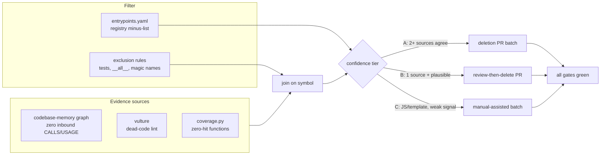

# refactor: Safe negative-diff code reduction program

## Summary

A program for removing dead code from orchestral at scale, structured so an
agent can execute each deletion batch without breaking the product. The core
artifact is not a list of deletions — it is an **evidence pipeline** that
triangulates three independent sources (call graph, lint heuristics, coverage)
against an explicit **entry-point registry**, then slices the survivors into
confidence-tiered, CI-gated PR batches.

Scope: `orchestral/` (~28.8k LOC), `harness.py` (2.8k), `tests/` (~37.9k),
`ui/js/` (~5.2k), `scripts/`, `demo/`.

## Problem Frame

The repo has absorbed ~170 merged PRs in six weeks. Fast vertical-slice
shipping leaves residue: superseded helpers, unreachable branches, unused
exports, view code orphaned by redesigns, and test helpers no test calls.
Today the only systematic dead-code signal is ruff's F-codes, which catch
unused imports but not unused functions.

The direct costs are real but secondary. The primary cost is agent
navigation: every dead symbol is a false lead for `ce-work`, `ce-debug`, and
any orchestrator reading the codebase. A smaller honest surface also shrinks
the diff-review burden on every future PR.

The hard part is not finding suspicious code — it is proving a symbol is
safe to delete. Python is dynamic (`getattr`, dispatch tables, template
strings), the web layer registers routes and views by name, and the public
CLI surface is entry points no static graph sees. This plan exists to make
"delete it" a decision backed by evidence, not vibes.

---

## Requirements

- R1. Every deletion candidate is backed by at least two independent
  evidence sources, recorded in the candidate report.
- R2. No symbol is deleted while reachable through a registered dynamic
  entry point (CLI command, web route, task-type dispatch, template/JS
  registry, unittest discovery, `__all__`, `pyproject` scripts).
- R3. Each deletion batch lands as its own PR with all CI gates green —
  ruff, mypy, unittest, browser tests, and JSON goldens unchanged unless a
  golden change is the intended deletion.
- R4. The candidate pipeline is reproducible: a re-run after merges yields
  an updated report with no hand-maintained state.
- R5. Tests are never deleted as "dead code" by zero-caller evidence alone;
  test-code reduction only happens alongside the dead code it covered.
- R6. Public API (`orchestral` package surface, `harness.py` subcommands,
  documented CLI flags) is removed only under an explicit deprecation note
  in the PR body.

## Key Technical Decisions

- **Codebase-memory graph is the primary evidence source, not grep.**
  `.codebase-memory/graph.db.zst` already indexes this repo (5,655 nodes,
  20,514 CALLS/USAGE edges as of `bd9c57b`); `query_graph` can list symbols
  with zero inbound edges directly. Grep sees text; the graph sees resolved
  calls. The index must be refreshed at census time — it is a week stale.
- **The entry-point registry is a checked-in artifact, not tribal
  knowledge.** `orchestral/entrypoints.yaml` (or a generated equivalent)
  enumerates every dispatch-reachable symbol. "Zero inbound" is only true
  *minus the registry* — without it the pipeline would flag every `cmd_*`
  handler and web route as dead.
- **Confidence tiers replace a binary dead/alive call.** Tier A deletes
  on two-source agreement; Tier B needs a human/agent read of the blast
  radius; Tier C (JS, templates) waits for corroboration because the graph
  and coverage both see it weakly.
- **Deletion PRs are sized for review, not completeness.** Each batch is
  one module cluster or ≤~200 removed lines, whichever is smaller, so a
  reviewer can verify "pure deletion" in one pass.
- **Coverage is corroboration, never sole evidence.** An uncovered symbol
  is a hint, not a verdict — the suite has known thin regions (TUI,
  sandbox paths).

## High-Level Technical Design

Two properties make this safe at agent scale: the pipeline emits *why* for
every candidate (evidence fields), and each batch PR's diff is pure
deletion — no edits interleaved — so CI green plus a skim is the full
review.

---

## Implementation Units

### U1. Baseline census and index refresh

- **Goal:** Current-truth numbers the program is measured against, plus a
  fresh graph to query.
- **Requirements:** R4
- **Dependencies:** none
- **Files:** `docs/analysis/code-census-2026-10.md` (new); `.codebase-memory/`
  (regenerated, stays gitignored if already ignored)
- **Approach:** Re-run `index_repository` (full + persistence) on current
  `main`. Record the census: LOC per top-level file/dir, test:src ratio,
  function/class counts from the graph, and the raw zero-inbound symbol
  count before any filtering. Commit the census doc — later units and
  follow-up agents diff against it.
- **Test expectation:** none — measurement artifact only.
- **Verification:** Census doc committed; `query_graph` returns current
  symbols (spot-check a symbol added in the last week, e.g. `horizon_fit`).

### U2. Entry-point registry

- **Goal:** The minus-list that turns "zero inbound edges" from a lie into
  evidence.
- **Requirements:** R2, R6
- **Dependencies:** U1
- **Files:** `orchestral/entrypoints.yaml` (new), `scripts/audit_entrypoints.py`
  (new), `tests/test_entrypoints.py` (new)
- **Approach:** Enumerate every reachability root the static graph cannot
  see: `cmd_*` argparse handlers and their subparser names in `harness.py`;
  web routes registered in `orchestral/web/server.py`; task-type dispatch
  tables; TUI/textual entry; `pyproject` `[project.scripts]`; module
  `__all__` exports; JS view/registry names referenced by template strings
  or `data-*` wiring; `unittest` discovery (`Test*`/`test_*`); dunder
  protocol methods (`__call__`, `__enter__`, etc.). The audit script
  regenerates the registry and the test fails when the code gains a new
  entry-point kind that the registry does not know — that is what keeps R2
  true as the codebase evolves.
- **Patterns to follow:** `tests/test_icons.py` glyph-parity test — same
  "enumerate both sides, fail on drift" shape.
- **Test scenarios:**
  - Every `cmd_*` function in `harness.py` appears in the registry or the
    test reports it missing.
  - Every route path registered in `server.py` appears in the registry.
  - A synthetic new `cmd_fake` handler added to `harness.py` makes the test
    fail (registry drift detection works).
- **Verification:** Registry exists, audit script reproduces it, drift test
  fails on a synthetic unregistered entry point.

### U3. Candidate report — tiered kill list

- **Goal:** A committed, machine-readable list of deletion candidates with
  per-candidate evidence and tier.
- **Requirements:** R1, R2, R4, R5
- **Dependencies:** U2
- **Files:** `docs/analysis/dead-code-report-2026-10.json` (new),
  `scripts/dead_code_report.py` (new)
- **Approach:** `scripts/dead_code_report.py` joins three sources per
  symbol: graph zero-inbound (via `query_graph` on the refreshed index),
  vulture output (run ad-hoc; not a new dependency), and coverage zero-hit
  from a full-suite `coverage run` (dev-extra only). Minus-list the
  registry, tests-as-callers subtleties, and magic names. Emit JSON:
  `{symbol, file, lines, tier, evidence[], note}` where tier is A (graph +
  one other source agree), B (single source), or C (JS/template surface).
  Tier B rows are **review-only** until a second independent source is
  recorded in `evidence[]` — a human/agent blast-radius read counts, and
  the read's conclusion must be written into the row before it graduates
  to a deletion sweep. R1's two-source rule applies to every deletion.
  The report is committed so worktree agents consume it without re-running
  the pipeline.
- **Execution note:** Treat the first full-suite coverage run as its own
  chore — it may need sandbox/TUI exclusions documented inline.
- **Test scenarios:**
  - Fixture: a module with one known-dead function and one live one yields
    exactly one candidate, tiered correctly.
  - Registry symbols never appear as candidates.
  - Report is deterministic: same inputs, byte-identical JSON (sorted
    output) — it will be diffed across runs.
- **Verification:** Report committed; spot-check 5 Tier-A candidates by
  hand — all truly unreachable; Tier counts recorded in census doc.

### U4. Deletion sweeps — batched PRs

- **Goal:** Convert the Tier-A list into landed negative diffs (Tier B
  joins only after its recorded second-source read — U3).
- **Requirements:** R1, R3, R5, R6
- **Dependencies:** U3
- **Files:** whichever modules the report names — expected hotspots
  `orchestral/web/state.py`, `harness.py`, `orchestral/planners.py`,
  `tests/` helpers
- **Approach:** One PR per module cluster or ≤~200 deleted lines. Each PR
  body lists the evidence rows for every deleted symbol (linking the
  report). Pure deletion only — no behavior edits ride along. This unit is
  sized for agent dispatch (ce-work or orca worktrees): each batch is
  self-contained, evidence-attached, and CI-verified. Tier C (JS) batches
  run last, gated on browser tests rather than graph confidence.
- **Patterns to follow:** the PR shape already used for #166–#171 — small,
  single-purpose, green CI before merge.
- **Test scenarios:**
  - Deleting a function also deletes its now-orphaned private helpers in
    the same PR (no second-order residue).
  - Test-code deletion is only permitted in the same PR that removes the
    dead code it covered (R5).
  - A golden-hash change caused by deleting an unused payload field is
    acceptable only when the PR body names that field.
- **Verification:** Every batch PR green on all CI gates; net LOC delta per
  PR is negative; census doc updated with running totals when the sweep
  completes.

### U5. Ratchet — keep it dead

- **Goal:** The codebase does not silently re-accumulate what the sweeps
  removed.
- **Requirements:** R4
- **Dependencies:** U3
- **Files:** `scripts/dead_code_report.py` (same), `docs/DEVELOPMENT.md` or
  `AGENTS.md` (document the audit), optionally `.github/workflows/` (only if
  the check proves fast enough for CI)
- **Approach:** Document the audit loop — refresh index, regenerate report,
  compare candidate count to baseline — in the developer docs so it runs
  on a cadence (weekly, or per release). A CI gate is deliberately *not*
  required: vulture and the graph both need the full repo context and a
  flaky gate would teach people to ignore it. Decide CI inclusion after
  the first sweep shows the report's runtime.
- **Test expectation:** none — process/documentation.
- **Verification:** A fresh report run produces a near-empty Tier-A list;
  the audit steps are documented where agents find them.

---

## Scope Boundaries

### Deferred to Follow-Up Work

- **Simplification of live code** (`ce-simplify-code` sweeps, consolidating
  near-duplicate helpers): adjacent but out of scope — this program is
  pure deletion; behavior-preserving merges need a different review bar.
- **Module-level deletions** (whole files, dead task types, retired
  observatory views): larger blast radius, individually planned.
- **Dependency pruning** in `pyproject.toml`: worth a pass, but needs
  import-graph care and optional-extra semantics reviewed per-dep.
- **A CI hard-gate on dead-code count**: deferred until report runtime and
  false-positive rate are known (see U5).

## Risks & Dependencies

| Risk | Mitigation |
|------|------------|
| Graph misses dynamic dispatch (getattr, template-registered names, route decorators) | U2 registry is subtracted before any candidate is emitted; drift test keeps registry honest |
| Coverage gaps make "zero-hit" noisy | Coverage is corroborating evidence only, never sole (KTD) |
| Tests die with their target inside a batch | R5 rule + pure-deletion diffs make the pairing visible in review |
| Stale index produces phantom candidates | U1 reindexes; report generation asserts index freshness against HEAD |
| Agents over-delete public API | R6: registry marks `__all__`/CLI surface; PR body must name any public removal |

## Verification

Program-level done condition: the committed census shows a measurable
negative delta (LOC and symbol count vs U1 baseline), every landed batch is
a pure-deletion PR that went through full CI, and a regenerated report on
`main` shows a near-empty Tier-A list. The repo's own gates — `ruff`,
`mypy`, `unittest discover`, browser tests, JSON goldens — are the
unchanged behavior contract throughout.

## Open Questions

- Does codebase-memory index `ui/js/`? If the graph sees only Python, Tier
  C stays manual-assisted or gains a JS-aware pass (`tsc --noEmit` /
  `unimported`-style tooling) — decide at U3 with the actual coverage.
- Does the coverage run need sandbox/TUI exclusion markers to stay honest,
  and where do those markers live?
- Should `entrypoints.yaml` live in-repo or be generated per-run? Default
  is committed (drift-tested), revisit if it churns.
